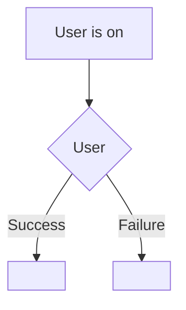
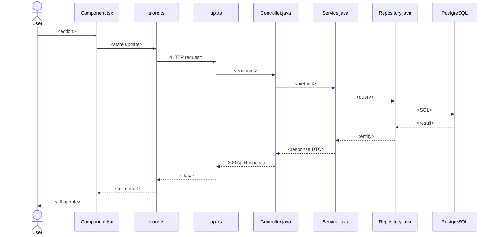

# <Flow Name>

## Simple Instructions *(for non-developers)*

### What happens here?
(Explain in plain English what this flow accomplishes from a user's perspective. One sentence: "This is how you log into the system." or "This is what happens when you save a record.")

### Step-by-step *(what the user sees)*

1. You are on the **<Page Name>** page.
2. You <action — e.g. "type your username and password, then click Sign In">.
3. The system <what happens — e.g. "checks your credentials">.
4. If everything is correct, you are taken to the **<Next Page>**.
5. If something is wrong, you will see **<error message>** telling you what to fix.

### Diagram *(overview for non-developers)*

### Common issues
| Problem | What to do |
|---------|-------------|
| <Symptom user sees> | <Action user should take> |

---

## Sequence Diagram *(technical)*

---

## Trigger
(What user action starts this flow)

---

## Preconditions
- (Required state, e.g. "User is on the Products page")
- (Required auth, e.g. "User has product:write permission")

---

## Flow Steps *(technical)*

### Step 1: <Frontend Action>
- **File:** `frontend/src/path/Component.tsx:line`
- **What happens:** <description of what the user does and what the code executes>

### Step 2: <API Request>
- **HTTP:** `POST /api/v1/...`
- **Called from:** `frontend/src/path/service.ts:line`
- **Request body:** `{ field: value }`
- **Auth header:** Bearer token (or None for public)

### Step N: <Backend — Repository / DB>
- **File:** `backend/.../Repository.java:line`
- **Query:** <SQL or JPA method description>
- **Tables hit:** <list of database tables>

### Step N+1: <Response>
- **Response:** `ApiResponse<ResponseDto>`
- **Status:** 200 OK

### Step N+2: <Frontend — Response Handling>
- **File:** `frontend/src/path/handler.ts:line`
- **What happens:** <state update, cache invalidation, navigation>

---

## Postconditions
- (What state the system is in after success)

---

## Error Flows

### <Error Scenario 1>
- **Condition:** <what triggers this error>
- **Backend response:** <status code + body>
- **Frontend behavior:** <what the user sees>

### <Error Scenario 2>
- **Condition:** <what triggers this error>
- **Backend response:** <status code + body>
- **Frontend behavior:** <what the user sees>
