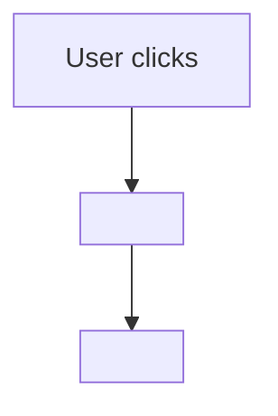

# <Module Name>

## Purpose
(2-3 lines describing what this module does)

---

## Simple Instructions *(for non-developers)*

### What is this?
(Explain in plain English — no code jargon — what this part of the system does. Think: "This is the part that handles logging in." or "This shows you the list of all tenants.")

### What can you do here?
(Describe the user-facing actions this module enables, e.g. "You can create, edit, or delete tenants from this page.")

### How to use it
(A short numbered list of steps a normal user follows. Use everyday language.)

1. Go to the **<Menu > Section** in the sidebar.
2. Click **<Page Name>**.
3. You will see ...
4. To <action>, click the **<Button Label>** button.
5. ...

### Diagram *(if helpful)*

### Common issues
| Problem | Solution |
|---------|----------|
| <What the user might see> | <What they should do> |

---

## Key Classes *(developers)*

| Class | Role |
|-------|------|

---

## API Endpoints *(if Controller)*

| Method | Path | Handler | Auth |
|--------|------|---------|------|

---

## Dependencies
(Injected services, repositories used by this module)

---

## Related Frontend
(Which frontend pages/components call endpoints served by this module)
