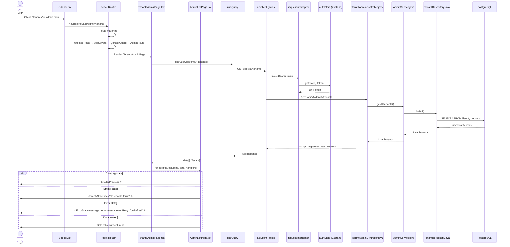

# Flow: Open List View (e.g., Tenants Admin)

## Simple Instructions *(for non-developers)*

### What happens here?
This is what happens when you click on a list page (like "Tenants" or "Users") in the admin sidebar. The system fetches all the records from the database and shows them in a table.

### Step-by-step *(what the user sees)*

1. You click a link in the **sidebar** (e.g., **Admin > Tenants**).
2. The page shows a **loading spinner** while data is being fetched.
3. After a moment, a **table** appears with all the records listed in rows.
4. Each row has action buttons: **Edit** (pencil) and **Delete** (trash).
5. At the top of the table, there is a **Create** button to add new records.
6. If there are no records, you will see a message: **"No records found"**.
7. If there is an error, you will see an **error message** with a **Retry** button.

### Diagram *(overview for non-developers)*

```mermaid
graph TD
  A[User clicks list link] --> B[Page starts loading]
  B --> C{Data fetched?}
  C -->|Loading| D[Show spinner]
  D --> C
  C -->|Success| E{Records found?}
  E -->|Yes| F[Show table with records]
  E -->|No| G[Show "No records found" message]
  C -->|Error| H[Show error message + Retry button]
  H --> I[User clicks Retry]
  I --> C
```

### Common issues
| Problem | What to do |
|---------|-------------|
| Table shows "No records found" | No records exist yet. Click the **Create** button to add one. |
| Table shows a spinner forever | The backend may be down. Try refreshing the page or contact support. |
| You see an error message instead of the table | Click the **Retry** button. If it still fails, the server may be down. |
| Some columns are missing from the table | The table shows a fixed set of columns. If you need different columns, contact your admin. |

---

## Sequence Diagram



## Trigger
User clicks on a navigation item in the sidebar that leads to an admin list page (e.g., "Tenants" under the Admin section).

## Preconditions
- User is authenticated (ProtectedRoute passed)
- Context is selected (ContextGuard passed)
- User has admin role — `sys_admin` or `tnt_admin` (AdminRoute passed)
- Backend accessible

## Flow Steps

### Step 1: Navigation via sidebar
- **File:** `frontend/src/components/layouts/Sidebar/`
- User clicks "Tenants" link → React Router navigates to `/app/admin/tenants`
- Route matches in `AppRoutes.tsx:92-94` → AdminRoute

### Step 2: AdminRoute guard check
- **File:** `frontend/src/core/router/guards/AdminRoute.tsx:5-12`
- Reads `user.roles` from authStore
- Checks for `sys_admin` or `tnt_admin` role
- If not admin → redirect to `/app/dashboard`

### Step 3: TenantsAdminPage mounts
- **File:** `frontend/src/modules/identity/admin/tenants/TenantsAdminPage.tsx:53-61`
- `useQuery<Tenant[]>({ queryKey: ['identity', 'tenants'] })`
- Query function: `apiClient.get(ENDPOINTS.identity.tenants)`

### Step 4: API request with auth token
- **File:** `frontend/src/core/api/interceptors.ts:7-18`
- `requestInterceptor` injects `Authorization: Bearer <token>` from authStore

### Step 5: Backend controller handles request
- **File:** `backend/src/main/java/com/erp/platform/identity/controller/TenantAdminController.java:25`
- `@GetMapping` on `/api/v1/identity/tenants`
- Delegates to `adminService.getAllTenants()`

### Step 6: Service queries repository
- **File:** `backend/src/main/java/com/erp/platform/identity/service/AdminService.java:49`
- `tenantRepository.findAll()` — unrestricted query (sys_admin bypasses filters)
- Returns all active and inactive tenant records

### Step 7: Response rendering
- **File:** `frontend/src/modules/identity/admin/tenants/TenantsAdminPage.tsx:101-113`
- `AdminListPage` receives `title="Tenants"`, column definitions, data array, loading/error state, CRUD handlers
- Data rendered in MUI Table with defined columns: Code, Name, Domain, Status (isActive), Created date

### Step 8: AdminListPage renders
- **File:** `frontend/src/modules/identity/admin/AdminListPage.tsx:40-145`
- Handles four states:
  - **Loading:** `<CircularProgress />` centered
  - **Error:** `<ErrorState message={} onRetry={} />`
  - **Empty:** `<EmptyState title="No records found" />`
  - **Data:** `<Table>` with configurable columns + action buttons (Edit/Delete)

## Postconditions
- User sees the admin list table with paginated data
- Data is cached in React Query under `['identity', 'tenants']` key
- Column definitions determine which fields are displayed

## Error Flows

### Authentication error (401)
- **Condition:** Token expired and refresh also fails
- **Backend:** 401 from SecurityConfig's `authenticationEntryPoint`
- **Frontend:** `responseErrorInterceptor` catches 401 → `authStore.logout()` → redirect to `/login`

### Authorization error (403)
- **Condition:** Token valid but user lacks required role/permission
- **Backend:** 403 from `accessDeniedHandler` or `@PreAuthorize`
- **Frontend:** Error propagated through React Query → `AdminListPage` shows `ErrorState`

### Server error (500)
- **Condition:** Backend exception
- **Frontend:** React Query `error` state → `AdminListPage` shows `ErrorState` with retry button

### Network error
- **Condition:** Backend unreachable
- **Frontend:** Axios throws network error → `parseApiError()` normalizes → `ErrorState` shown
