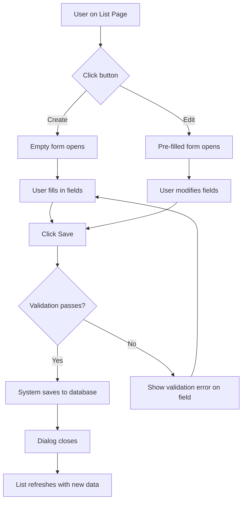
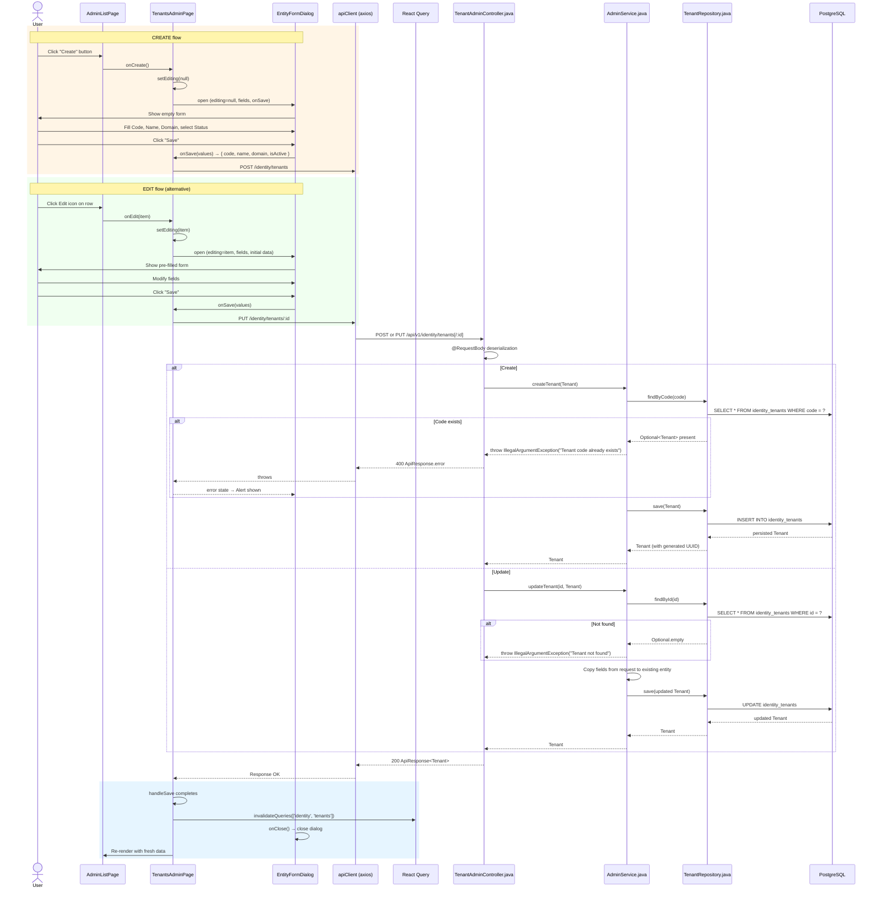

# Flow: Save Record (Create / Edit)

## Simple Instructions *(for non-developers)*

### What happens here?
This is what happens when you create a new record (like a tenant, user, or product) or edit an existing one. You fill in a form, click Save, and the system stores the data in the database.

### Step-by-step *(what the user sees)*

1. You are on a **list page** (e.g., Tenants, Users).
2. You click the **Create** button to add a new record, or the **Edit** (pencil) icon on an existing row.
3. A **form dialog** pops up with fields to fill in.
4. You type in the fields and click **Save**.
5. The system checks that all required fields are filled in.
6. If everything is correct, the dialog closes and the list refreshes with your new or updated record.
7. If something is wrong, an **error message** tells you what to fix.

### Diagram *(overview for non-developers)*

### Common issues
| Problem | What to do |
|---------|-------------|
| "This field is required" error | Fill in the required field (marked with an asterisk *) before saving. |
| "Code already exists" error | The code you entered is already taken. Use a different code. |
| Record not found when editing | The record may have been deleted by another user. Refresh the list. |
| Save button does nothing | Check that all required fields are filled. If it still does nothing, try refreshing the page. |

---

## Sequence Diagram

## Trigger
User clicks "Create" button on an admin list page to create a new record, or clicks the Edit icon on an existing row to modify it.

## Preconditions
- User is on an admin list page with data loaded
- User has admin role (`sys_admin` or `tnt_admin`)
- For edit: a record exists and was clicked

## Flow Steps

### Step 1: Open the form dialog
- **File (create):** `frontend/src/modules/identity/admin/tenants/TenantsAdminPage.tsx:66-69`
  - `handleCreate()` sets `editing=null`, `dialogOpen=true`
- **File (edit):** `frontend/src/modules/identity/admin/tenants/TenantsAdminPage.tsx:71-73`
  - `handleEdit(item)` sets `editing=item`, `dialogOpen=true`

### Step 2: EntityFormDialog renders form
- **File:** `frontend/src/components/dialogs/EntityFormDialog.tsx:50-60`
  - If `data` is provided (edit mode), initializes form state from existing values
  - If `data` is null (create mode), uses `initialValue` from field definitions
  - Renders MUI form controls based on `FieldDef.type`:
    - `text` → `<TextField>`
    - `select` → `<TextField select>` with `<MenuItem>` options
    - `checkbox` → `<FormControlLabel>` with `<Checkbox>`
    - `email`, `password`, `number`, `url`, `tel`, `textarea`, `date`, `datetime`, `time`

### Step 3: User fills and submits
- **File:** `frontend/src/components/dialogs/EntityFormDialog.tsx:139-149`
  - Form submit handler calls `props.onSave(form)` where `form` is `Record<string, string>`
  - Sets `saving=true` while awaiting the async `onSave`
  - On error, catches and displays `<Alert severity="error">`

### Step 4: Page component sends API request
- **File:** `frontend/src/modules/identity/admin/tenants/TenantsAdminPage.tsx:86-98`
  - Maps form string values to the API body shape (e.g., `isActive: values.isActive === 'true'`)
  - **Create:** `apiClient.post(ENDPOINTS.identity.tenants, body)`
  - **Edit:** `apiClient.put(ENDPOINTS.identity.tenant(editing.id), body)`

### Step 5: Backend validates and persists
- **File:** `backend/src/main/java/com/erp/platform/identity/controller/TenantAdminController.java:27-28`
  - `create` → `adminService.createTenant(t)` — checks duplicate code before saving
  - `update` → `adminService.updateTenant(id, t)` — loads existing, copies fields, saves

### Step 6: BaseEntity JPA lifecycle
- **File:** `backend/src/main/java/com/erp/common/base/BaseEntity.java:38-49`
  - `@PrePersist`: auto-sets `createdAt`, `updatedAt`, `isActive=true`
  - `@PreUpdate`: refreshes `updatedAt`
  - UUID `id` auto-generated by Hibernate `@UuidGenerator`

### Step 7: Response and cache invalidation
- **File:** `frontend/src/modules/identity/admin/tenants/TenantsAdminPage.tsx:98`
  - `queryClient.invalidateQueries({ queryKey: ['identity', 'tenants'] })`
  - This triggers React Query to refetch the tenants list, updating the table

### Step 8: Dialog closes
- Dialog's internal `setSaving(false)` and `props.onClose()` fires
- `TenantsAdminPage` sets `dialogOpen=false`

## Postconditions
- New/updated record persisted in database
- React Query cache invalidated → fresh data fetched and displayed in table
- Form dialog closed

## Error Flows

### Duplicate Code (Create)
- **Condition:** Tenant with same `code` already exists
- **Backend:** `adminService.createTenant()` → `IllegalArgumentException("Tenant code already exists")`
- **Frontend:** 400 error → EntityFormDialog catches → displays Alert

### Entity Not Found (Update)
- **Condition:** Record deleted between list load and edit submission
- **Backend:** `adminService.updateTenant()` → `IllegalArgumentException("Tenant not found")`
- **Frontend:** Error alert in dialog

### Validation Error
- **Condition:** Required field empty
- **Frontend:** EntityFormDialog checks `required` fields, shows `FormHelperText` error

### Network Error
- **Condition:** Backend unreachable during save
- **Frontend:** Axios network error → dialog error alert
