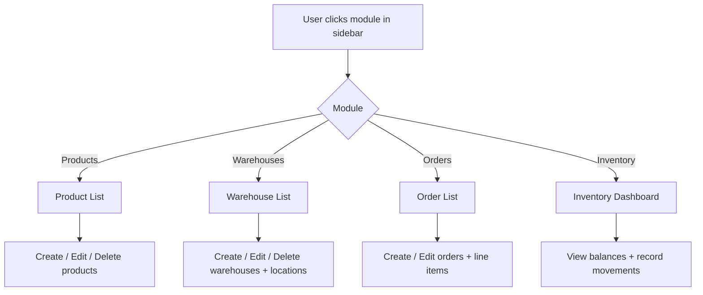
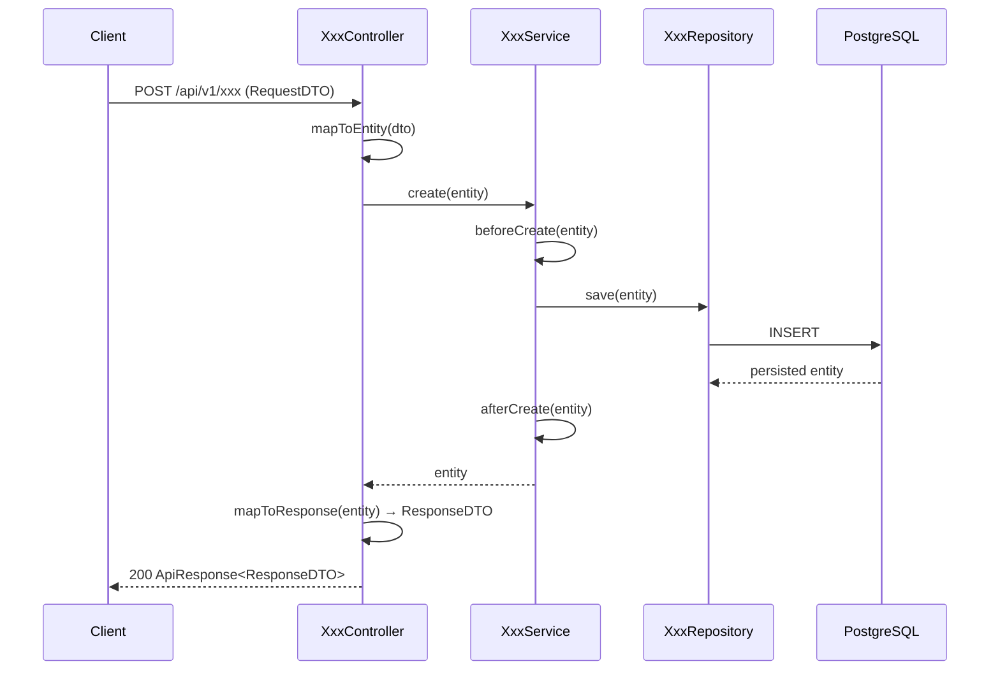

# Backend Business Modules

## Purpose
Thin CRUD layers for core ERP business entities: Products, Warehouses, Orders, and Inventory. Each follows the same pattern — entity extends `BaseEntity`, service extends `BaseService<T>`, and controller maps between DTOs and entities using `ApiResponse<T>`.

---

## Simple Instructions *(for non-developers)*

### What is this?
These are the core business modules that handle the day-to-day data of the ERP system. They let you manage your products, warehouses, orders, and inventory movements.

### What can you do here?
- **Products** — Create and manage the items you sell or stock (name, SKU, barcode, category, price)
- **Product Categories** — Organize products into categories
- **Warehouses** — Define storage locations (physical warehouses with aisles, racks, bins)
- **Orders** — Create and track sales or purchase orders with line items
- **Inventory** — Track stock levels, movements in and out, and current balances

### How to use it

1. Depending on which module is available in your sidebar, click the section you need.
2. For **Products**: view the product list, click **Create** to add a new product, or click **Edit** to modify one.
3. For **Warehouses**: define your storage locations and their sub-locations.
4. For **Orders**: create orders with line items for products, track order status.
5. For **Inventory**: view stock balances and record movements (receipts, issues, transfers).

### Diagram

### Common issues
| Problem | What to do |
|---------|-------------|
| Product/Order pages show "Coming Soon" | These modules may not have dedicated frontend pages yet. They are available via the API. |
| Cannot find a product | Check that it has not been soft-deleted (deactivated). |
| Inventory balance seems wrong | Stock movements must be recorded accurately. Check the transaction history for errors. |

---

## Entity Overview

### Product Module
| Entity | Table | Key Fields |
|--------|-------|------------|
| `Product` | `products` | code, name, description, sku, barcode, uom, productType, isStocked, isSold, isPurchased, categoryId |
| `ProductCategory` | `product_categories` | Category hierarchy for products |

### Warehouse Module
| Entity | Table | Key Fields |
|--------|-------|------------|
| `Warehouse` | `warehouses` | code, name, address, location type |
| `Location` | `locations` | Sub-locations within a warehouse (aisle, rack, bin) |

### Order Module
| Entity | Table | Key Fields |
|--------|-------|------------|
| `Order` | `orders` | orderNumber, orderType, status, partner, dates, totals |
| `OrderLine` | `order_lines` | product, quantity, unit price, line total, line status |

### Inventory Module
| Entity | Table | Key Fields |
|--------|-------|------------|
| `StockMovement` | `stock_movements` | product, warehouse, location, movementType, quantity, direction |
| `InventoryBalance` | `inventory_balances` | product, warehouse, quantityOnHand, reservedQty, availableQty |
| `InventoryTransaction` | `inventory_transactions` | transactionType, reference, date |
| `InventoryTransactionLine` | `inventory_transaction_lines` | product, warehouse, location, quantity |

## API Endpoints

### Products (`/api/v1/products`)

| Method | Path | Handler | Description |
|--------|------|---------|-------------|
| GET | `/` | `ProductController.getAll()` | List all active products |
| GET | `/{id}` | `ProductController.getById()` | Get single product |
| POST | `/` | `ProductController.create()` | Create product |
| PUT | `/{id}` | `ProductController.update()` | Update product |
| DELETE | `/{id}` | `ProductController.delete()` | Soft-delete product |

### Warehouses (`/api/v1/warehouses`)

| Method | Path | Handler | Description |
|--------|------|---------|-------------|
| GET | `/` | `WarehouseController.getAll()` | List all warehouses |
| GET | `/{id}` | `WarehouseController.getById()` | Get single warehouse |
| POST | `/` | `WarehouseController.create()` | Create warehouse |
| PUT | `/{id}` | `WarehouseController.update()` | Update warehouse |
| DELETE | `/{id}` | `WarehouseController.delete()` | Soft-delete warehouse |

### Locations (`/api/v1/locations`)

| Method | Path | Handler | Description |
|--------|------|---------|-------------|
| GET | `/` | `LocationController.getAll()` | List all locations |
| GET | `/{id}` | `LocationController.getById()` | Get single location |
| POST | `/` | `LocationController.create()` | Create location |
| PUT | `/{id}` | `LocationController.update()` | Update location |
| DELETE | `/{id}` | `LocationController.delete()` | Soft-delete location |

### Orders (`/api/v1/orders`)

| Method | Path | Handler | Description |
|--------|------|---------|-------------|
| GET | `/` | `OrderController.getAll()` | List all orders |
| GET | `/{id}` | `OrderController.getById()` | Get single order |
| POST | `/` | `OrderController.create()` | Create order |
| PUT | `/{id}` | `OrderController.update()` | Update order |
| DELETE | `/{id}` | `OrderController.delete()` | Soft-delete order |

### Inventory (`/api/v1/inventory`)

| Method | Path | Handler | Description |
|--------|------|---------|-------------|
| GET | `/` | `InventoryController.getAll()` | List inventory balances |
| GET | `/{id}` | `InventoryController.getById()` | Get single balance |
| POST | `/` | `InventoryController.create()` | Create inventory record |

### Inventory Transactions (`/api/v1/inventory-transactions`)

| Method | Path | Handler | Description |
|--------|------|---------|-------------|
| GET | `/` | `InventoryTransactionController.getAll()` | List transactions |
| GET | `/{id}` | `InventoryTransactionController.getById()` | Get single transaction |
| POST | `/` | `InventoryTransactionController.create()` | Create transaction |

## Common Pattern

All business module controllers follow this DTO mapping pattern:

The service layer uses `BaseService<T>` generic CRUD:
- `findAll()` → filtered to `isActive=true` records
- `findById()` → returns `Optional<T>` filtered to active
- `create()` → sets `isActive=true`, calls `beforeCreate`/`afterCreate` hooks
- `update()` → loads existing, preserves `isActive`, calls `beforeUpdate`/`afterUpdate`
- `delete()` → calls `entity.softDelete()` → sets `isActive=false`, `deletedAt=now`

## Related Frontend
- `routes/AppRoutes.tsx:113-131` — placeholder pages for Products, Orders, Users, Settings
- No dedicated frontend pages exist yet for these modules (placeholders only)
- Future: metadata-driven runtime pages would render these using the registry system
