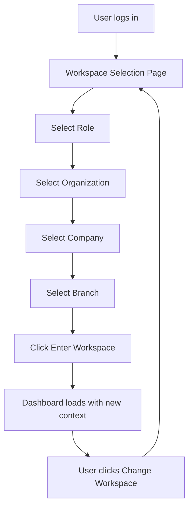
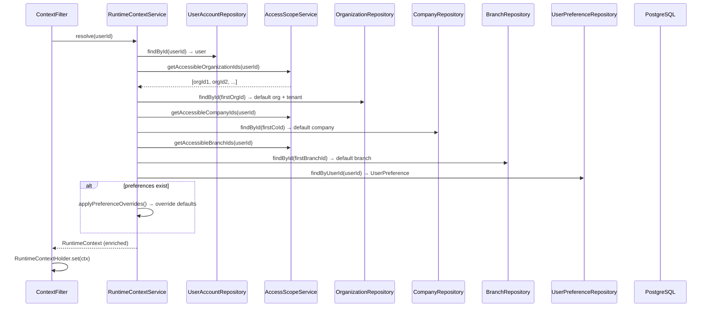

# Backend Context

## Purpose
Multi-tenant context resolution and switching. After authentication, resolves the user's active tenant/organization/company/branch/department/role from their preferences (or defaults). Provides available options scoped by the user's role access, and persists context selection to `UserPreference`.

---

## Simple Instructions *(for non-developers)*

### What is this?
After you log in, this module helps you choose your "workspace" — which organization, company, and branch you want to work in. It remembers your choice so you don't have to pick every time.

### What can you do here?
- **Choose your workspace** after logging in — pick the role, organization, company, and branch you want to work in.
- **Switch workspaces** at any time from the user menu.
- The system remembers your last choice so you don't have to re-select every time.

### How to use it

1. After logging in, you will see the **Select Your Workspace** page.
2. Pick your **Role** from the dropdown (this determines what you can see and do).
3. Select your **Organization**, **Company**, and **Branch** from the cascading dropdowns (each choice filters the next one).
4. Click **Enter Workspace**.
5. To switch later, click your user icon in the top bar and choose **Change Workspace**.

### Diagram



### Common issues
| Problem | What to do |
|---------|-------------|
| No options in the dropdowns | You may not have any roles assigned. Contact your system administrator. |
| Stuck on "Select Your Workspace" | If only one option is available, it should auto-select. If not, try refreshing the page. |
| "Failed to set workspace" error | You may have selected a company or branch outside your allowed scope. Choose a different option. |
| The wrong company/branch is selected | Go back to the workspace selection page and pick the correct ones. |

---

## API Endpoints

| Method | Path | Handler | Auth |
|--------|------|---------|------|
| GET | `/api/v1/context/current` | `ContextController.current()` | Authenticated |
| GET | `/api/v1/context/options` | `ContextController.options()` | Authenticated |
| POST | `/api/v1/context/switch` | `ContextController.switchContext()` | Authenticated |

## Key Classes

| Class | Role |
|-------|------|
| `ContextController` | REST endpoints for current context, available options, and context switching |
| `RuntimeContextService` | Resolves full context tree from user preferences and access scopes; manages switch logic with scope validation; persists to `UserPreference` |
| `AccessScopeService` | Computes which organization/company/branch IDs a user can access based on role assignments |
| `ContextFilter` | Servlet filter after JWT filter — resolves `RuntimeContext` from `JwtPrincipal.userId` and stores in thread-local `RuntimeContextHolder` |
| `RuntimeContext` | DTO holding tenantId, organizationId, companyId, branchId, departmentId, roles, locale prefs |
| `RuntimeContextHolder` | Thread-local holder for current request's `RuntimeContext` |
| `ContextOptionsResponse` | Available tenants, orgs, companies, branches, departments, roles, and per-role scopes |

## Context Resolution Flow



## Context Switch Flow

1. Frontend POSTs `{ organizationId, companyId, branchId, departmentId, roleCode }`
2. `RuntimeContextService.switchContext()` resolves current context, then overlays requested fields
3. Each field is validated against the user's `AccessScopeService` scopes (throws `SecurityException` if out of scope)
4. Role is validated against `UserRoleRepository` assignments
5. Selection persisted to `UserPreference` (active IDs + role)
6. Updated context returned and stored in `RuntimeContextHolder`

## Hierarchy

```
Tenant (top-level, multi-tenant boundary)
 └── Organization (belongs to Tenant; can be hierarchical via parent)
      └── Company (belongs to Organization; legal entity)
           └── Branch (belongs to Company; physical location)
                └── Department (belongs to Branch; can be hierarchical)
```

## Related Frontend
- `modules/identity/context/ContextSelectPage.tsx` — cascading dropdown UI for selecting role → org → company → branch, auto-routes single-option profiles, calls `POST /context/switch`
- `core/router/guards/ContextGuard.tsx` — checks `GET /context/current` and `GET /context/options` to decide if redirect to `/select-context` is needed
