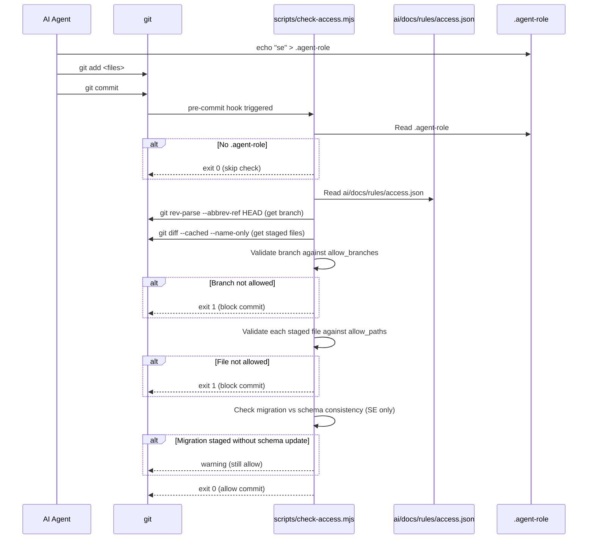

# Core: Access Control

## Purpose
Prevents AI agents from modifying files or committing from branches they are not authorized for. Enforced by a pre-commit hook that reads centralized access rules. Keeps agent prompts smaller by moving file-scope rules into a single reference file.

---

## Simple Instructions *(for non-developers)*

### What is this?
This is the "security guard" for the codebase. Each AI agent (Software Engineer, QA Engineer, Product Manager, Technical Writer) has a specific role with specific permissions about which files they can change and which branches they can commit from. When an agent tries to commit changes, the guard checks that the files match their role. If not, the commit is blocked.

### What can you do here?
- Each agent automatically identifies itself by writing a `.agent-role` file at startup
- The pre-commit hook checks every staged file against the agent's allowed paths
- The hook also checks the current branch name matches the agent's allowed branches
- If a Software Engineer modifies database migration files, the hook warns if the schema DDL files weren't also updated
- Humans (no `.agent-role` file) are not affected — the hook skips the check

### How to use it

1. Each agent writes its role at startup: `echo "se" > .agent-role` (or `qa`, `pm`, `tw`)
2. When you run `git commit`, the hook `scripts/check-access.mjs` runs automatically
3. If everything matches your role, the commit proceeds normally
4. If you try to commit files outside your allowed paths, the commit is rejected with a clear error message
5. If you need to see what files you can modify, read `ai/docs/rules/access.md`

### Diagram

```mermaid
graph TD
  A[Agent starts] --> B[Write role to .agent-role]
  B --> C[Work on files]
  C --> D[git commit]
  D --> E[pre-commit hook runs]
  E --> F{Has .agent-role?}
  F -->|No (human)| G[Allow commit]
  F -->|Yes| H{Check branch against allowed branches}
  H -->|Not allowed| I[Block: wrong branch]
  H -->|OK| J{Check each staged file against allowed paths}
  J -->|Some files not allowed| K[Block: wrong files]
  J -->|All files OK| L{Migration staged without schema update?}
  L -->|Yes| M[Warn but allow]
  L -->|No| G
```

### Common issues

| Problem | What to do |
|---------|-------------|
| Commit blocked with "Branch not allowed" | You are on a branch type that doesn't match your role (e.g., QA on `main`). Switch to a `prd/*` branch. |
| Commit blocked with "File not allowed" | You tried to stage a file that isn't in your allowed paths. See `ai/docs/rules/access.md` for what your role can modify. |
| You are human but commit is blocked | Delete the `.agent-role` file if it exists. If it doesn't, check your branch and files match default rules. |
| Warning: "Migration files staged but no schema update" | You committed DB migrations but didn't update the corresponding `ai/schema/*.sql` file. |

---

## Key Files *(developers)*

| File | Role |
|------|------|
| `ai/docs/rules/access.json` | Machine-readable rules — maps each role to allowed paths and branches |
| `ai/docs/rules/access.md` | Human-readable version for agents to read at startup |
| `scripts/check-access.mjs` | Node.js pre-commit hook script — validates branch + staged files against rules |
| `.agent-role` | Written by each agent at startup (e.g., `echo "se" > .agent-role`). Gitignored. |
| `frontend/.husky/pre-commit` | Husky pre-commit hook — runs `node scripts/check-access.mjs` before lint-staged |

---

## Access Rules Structure (rules/access.json)

| Role | Label | Allowed Paths | Allowed Branches |
|------|-------|---------------|------------------|
| `se` | Software Engineer | `backend/**`, `frontend/**`, `ai/tasks/**`, `ai/changes/**`, `ai/schema/**`, `ai/PROJECT_BOARD.md`, `ai/docs/changelog.md`, `ai/failures/**` | `feature/*`, `bugfix/*`, `enhancement/*`, `prd/*` |
| `qa` | QA Engineer | `ai/tasks/**`, `ai/tests/**`, `ai/scripts/**`, `ai/schema/**`, `ai/PROJECT_BOARD.md`, `ai/docs/changelog.md`, `ai/failures/**` | `prd/*` |
| `pm` | Product Manager | `ai/prd/**`, `ai/tasks/**`, `ai/docs/*.md`, `ai/PROJECT_BOARD.md`, `ai/docs/changelog.md`, `ai/schema/**`, `ai/failures/**` | `main` |
| `tw` | Technical Writer | `ai/modules/**`, `ai/flows/**`, `ai/schema/**`, `ai/failures/**` | `*` |

Shared paths that multiple agents can modify: `ai/PROJECT_BOARD.md`, `ai/docs/changelog.md`.

---

## How the Hook Works



---

## Dependencies
- `Node.js` (>=18) — runs the check script
- `git` — for branch detection and staged file listing
- `husky` — manages the pre-commit hook installation
- `ai/docs/rules/access.json` — the single source of truth for permissions

---

## Related Frontend
- `frontend/.husky/pre-commit` — the hook that invokes the check

## Related Backend
- The access control protects all backend and frontend source files, ensuring only the SE agent can modify them.
