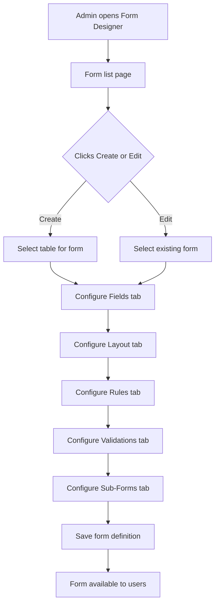

# Core Metadata Form Designer

## Purpose
Backend APIs for the Form Designer admin UI. Enables System Admins and Tenant Admins to create and configure dynamic forms through CRUD operations on all metadata tables: form definitions, fields, layout sections, rules, validations, sub-forms, and tenant role access.

---

## Simple Instructions *(for non-developers)*

### What is this?
This is the tool that administrators use to create and edit dynamic forms. Instead of writing code, an admin can configure a form through a visual designer — adding fields, arranging them into sections, setting validation rules, and controlling who can see what. The forms created here are then rendered by the runtime form engine.

### What can you do here?
- Create new forms and link them to database tables
- Add fields to forms (text boxes, dropdowns, dates, checkboxes)
- Arrange fields into tabs and columns
- Set field rules (show/hide fields based on other values)
- Configure validations (required, min/max, regex patterns)
- Add sub-forms (related records shown as tabs)
- Control which user roles can access each form

### How to use it
1. Go to **Admin > Form Designer** in the sidebar.
2. Click **Create Form** to define a new form.
3. Select the **Table** the form will work with.
4. Add **Fields** — choose their type, label, and position.
5. Arrange **Layout** — organize fields into sections/tabs.
6. Add **Rules** — configure conditional visibility or requirements.
7. Add **Validations** — set data quality rules.
8. Click **Save** — the form is now available to users.

### Diagram

### Common issues
| Problem | Solution |
|---------|----------|
| Table not available in the dropdown | The table must be registered in `sys_metadata_models` first. Use the Table Designer. |
| Field type options are limited | Only the field types registered in the frontend field registry are available. |
| Rule or validation not working | Check that the rule expression syntax is correct. Boolean expressions use the expression engine. |

---

## Key Classes *(developers)*

| Class | Role |
|-------|------|
| `FormDesignerController` | CRUD for form definitions (create, read, update, delete form headers) |
| `MetadataController` | Lists available tables, columns, and existing forms |
| `FormRuleController` | CRUD for form field rules (show/hide, require based on conditions) |
| `FormValidationController` | CRUD for field validation rules (required, min/max, regex, custom) |
| `FormSubFormController` | CRUD for sub-form configurations (one2many child form links) |
| `FormTenantRoleController` | Per-tenant role assignment for form access control |
| `FormDesignerService` | Business logic: creates form definitions with versioning |
| `FormFieldService` | CRUD for form fields (field type, position, default values) |
| `FormLayoutService` | CRUD for layout sections (tabs, columns, field groups) |
| `FormRuleService` | Business logic for rule evaluation expressions |
| `FormSubFormService` | CRUD for sub-form relations and display configuration |
| `FormTenantRoleService` | CRUD for form-tenant-role access mappings |

---

## API Endpoints

| Method | Path | Handler | Auth |
|--------|------|---------|------|
| GET | `/api/v1/metadata/forms` | `FormDesignerController.listForms()` | JWT |
| POST | `/api/v1/metadata/forms` | `FormDesignerController.createForm()` | JWT |
| PUT | `/api/v1/metadata/forms/{id}` | `FormDesignerController.updateForm()` | JWT |
| DELETE | `/api/v1/metadata/forms/{id}` | `FormDesignerController.deleteForm()` | JWT |
| GET | `/api/v1/metadata/tables` | `MetadataController.listTables()` | JWT |
| GET | `/api/v1/metadata/columns/{tableId}` | `MetadataController.listColumns()` | JWT |
| GET/POST/PUT/DELETE | `/api/v1/metadata/forms/{id}/fields` | `FormDesignerController` field endpoints | JWT |
| GET/POST/PUT/DELETE | `/api/v1/metadata/forms/{id}/sections` | `FormDesignerController` layout endpoints | JWT |
| GET/POST/PUT/DELETE | `/api/v1/metadata/forms/{id}/rules` | `FormRuleController` | JWT |
| GET/POST/PUT/DELETE | `/api/v1/metadata/forms/{id}/validations` | `FormValidationController` | JWT |
| GET/POST/PUT/DELETE | `/api/v1/metadata/forms/{id}/sub-forms` | `FormSubFormController` | JWT |
| GET/POST/PUT/DELETE | `/api/v1/metadata/forms/{id}/tenant-roles` | `FormTenantRoleController` | JWT |

---

## Dependencies
- All metadata repositories: `MetadataModelRepository`, `TableColumnRepository`, `FormFieldRepository`, `FormLayoutSectionRepository`, `FormFieldRuleRepository`, `FormFieldValidationRepository`, `FormSubFormRepository`, `FormTenantRoleRepository`, `FormSectionFieldRepository`, `FormRoleFilterRepository`
- `ExpressionValidationService` — validates rule expression syntax
- `MetadataVersionRepository` — tracks form definition versions

---

## Related Frontend
- `frontend/src/modules/admin/forms/FormDesignerPage.tsx` — Main form designer UI (5 tabs: Fields, Layout, Rules, Validations, Sub-Forms)
- `frontend/src/modules/admin/forms/FormListPage.tsx` — Lists all forms with create/edit/delete
- `frontend/src/modules/admin/forms/hooks/useFormDesigner.ts` — Form designer state management
- `frontend/src/modules/admin/forms/hooks/useFormFields.ts` — Field tab management
- `frontend/src/modules/admin/forms/hooks/useFormLayout.ts` — Layout tab management
- `frontend/src/modules/admin/forms/hooks/useFormRules.ts` — Rules tab management
- `frontend/src/modules/admin/forms/hooks/useFormValidations.ts` — Validations tab management

## Related Module Docs
- `core-metadata-table-designer.md` — Table designer (prerequisite: tables must exist before forms can be created)
- `engine-form-renderer.md` — Frontend renderer that displays forms configured by this designer
