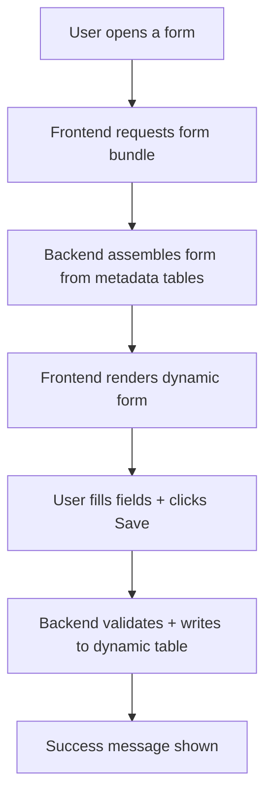

# Core Metadata Runtime

## Purpose
Runtime API layer that dynamically assembles form definitions from metadata tables and executes CRUD operations on dynamic tables. Serves as the backend for the metadata-driven form renderer — no JPA entities are needed for tables registered in `sys_metadata_models`.

---

## Simple Instructions *(for non-developers)*

### What is this?
This is the engine that brings dynamic forms to life. When you open a form (like "Create Product" or "Edit Order"), this part of the system reads the form configuration from the database and builds it on the fly. It also saves your data to whatever table the form is configured for — without needing a developer to write new code for each form.

### What can you do here?
- View any form that has been configured in the metadata tables
- Create, edit, and delete records through dynamic forms
- Navigate between records using Previous/Next buttons
- See sub-forms (child records) as tabs within the parent form
- Follow breadcrumb trails back to where you started

### How to use it
1. Navigate to any configured form via the sidebar menu.
2. The form loads automatically with fields arranged in sections.
3. Fill in the fields and click **Save** — the data is stored in the correct table.
4. Use the **Prev** / **Next** toolbar buttons to browse records.
5. Sub-form tabs at the bottom show related records (e.g., Order Lines inside an Order).

### Diagram

### Common issues
| Problem | Solution |
|---------|----------|
| Form does not load — "Model not found" error | The table is not registered in `sys_metadata_models`. A System Admin must configure it. |
| Field is not showing | The field may be hidden by a rule, or the user role doesn't have access. Check the form field configuration. |
| "Record not found" when clicking Next | You are on the last record in the list. Use Prev to go back. |

---

## Key Classes *(developers)*

| Class | Role |
|-------|------|
| `RuntimeFormController` | Exposes GET/POST/PUT/DELETE endpoints for dynamic records, form bundle assembly, breadcrumb resolution |
| `RuntimeController` | High-level CRUD dispatcher that delegates to DynamicCrudService |
| `DynamicCrudService` | Generic CRUD service — resolves `sys_metadata_models` table name, builds JPA criteria queries, handles pagination/sorting |
| `RecordCrudService` | Record-level CRUD with validation, soft-delete, multi-tenancy (tenant_id filter), and lifecycle hooks |
| `RecordValidationService` | Validates field values against `sys_form_field_validations` rules — type checks, required fields, min/max, regex |
| `FormDefinitionAssemblyService` | Assembles the form bundle JSON: model definition + column metadata + layout sections + fields + rules + validations + sub-forms + role filters |
| `BreadcrumbService` | Resolves parent breadcrumb trail for sub-form navigation |

---

## API Endpoints

| Method | Path | Handler | Auth |
|--------|------|---------|------|
| GET | `/api/v1/runtime/{tableName}/bundle` | `RuntimeFormController.getFormBundle()` | JWT |
| GET | `/api/v1/runtime/{tableName}` | `RuntimeController.list()` | JWT |
| GET | `/api/v1/runtime/{tableName}/{id}` | `RuntimeController.get()` | JWT |
| POST | `/api/v1/runtime/{tableName}` | `RuntimeController.create()` | JWT |
| PUT | `/api/v1/runtime/{tableName}/{id}` | `RuntimeController.update()` | JWT |
| DELETE | `/api/v1/runtime/{tableName}/{id}` | `RuntimeController.delete()` | JWT |
| GET | `/api/v1/runtime/breadcrumb/{tableName}/{id}` | `RuntimeFormController.getBreadcrumb()` | JWT |
| GET | `/api/v1/runtime/relations/{tableName}` | `RuntimeFormController.getAvailableRelations()` | JWT |

---

## Dependencies
- `MetadataModelRepository` — resolves table metadata
- `TableColumnRepository` — column definitions
- `FormFieldRepository` + `FormLayoutSectionRepository` — form layout
- `FormFieldRuleRepository` + `FormFieldValidationRepository` — rules & validation
- `FormSubFormRepository` — sub-form definitions
- `FormRoleFilterRepository` — row-level access filters
- `FormTenantRoleRepository` — per-tenant role access
- `EntityManager` — dynamic JPA criteria queries on runtime-registered tables

---

## Related Frontend
- `frontend/src/engine/forms/` — DynamicFormRenderer, FormFieldRenderer
- `frontend/src/core/runtime/hooks/useForm.ts` — hook that fetches bundle + data
- `frontend/src/core/runtime/hooks/useRecordList.ts` — hook for list view data
- `frontend/src/core/runtime/hooks/useSubFormGrid.ts` — hook for sub-form grids
- `frontend/src/routes/runtime/RuntimePage.tsx` — generic runtime page
