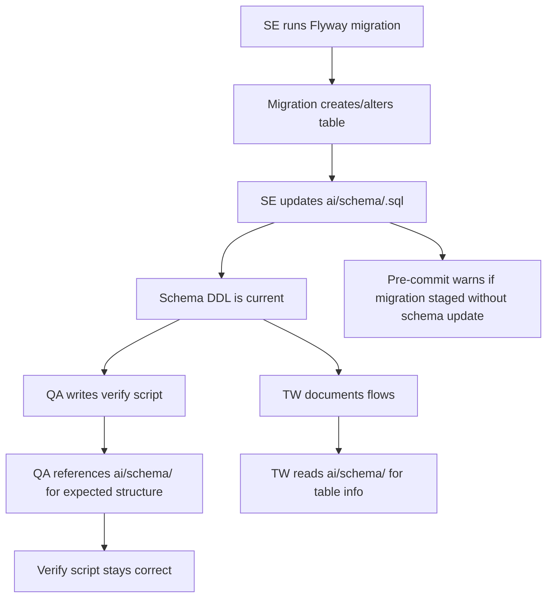

# Core: Schema DDL Reference

## Purpose
Centralized directory of full `CREATE TABLE` DDL for every table in the ERP system. This is the canonical source of truth for table structure. Whenever a migration creates or alters a table, the corresponding `.sql` file in `ai/schema/` must be updated. Verification scripts reference these files instead of hardcoding column lists.

---

## Simple Instructions *(for non-developers)*

### What is this?
This is a complete catalog of every database table in the system, written in a format that database tools can read. Each file contains the full instructions for creating a table — its name, columns, data types, and relationships to other tables. When the Software Engineer changes the database structure, they also update these files so everyone knows the current layout.

### What can you do here?
- **Software Engineers** update these files whenever they run database migrations
- **QA Engineers** read these files when writing verification scripts to check data correctness
- **Technical Writers** read these files when documenting how data flows through the system
- **Product Managers** read these files to understand what data the system stores

### How to use it

1. Go to the `ai/schema/` directory
2. Files are organized by category: `identity/`, `metadata/`, `master-data/`, `transactions/`
3. Each file is named after the database table it describes (e.g., `sys_table.sql` for the `sys_table` table)
4. The file header shows which Flyway migration created and last modified the table
5. Verification scripts under `ai/scripts/` reference these files for expected table structure

### Diagram

### Common issues

| Problem | What to do |
|---------|-------------|
| Verification script fails because columns don't match | The schema file is outdated. Run the migration, then update `ai/schema/<table>.sql` to match. |
| Schema file missing for a new table | The SE forgot to create it after the migration. Create the file following the existing pattern. |
| "Migration files staged but no schema update" warning | You staged migration files without updating `ai/schema/`. Add the schema changes or dismiss the warning. |

---

## Key Files *(developers)*

### Identity (V1-V2, V30-V31) — `ai/schema/identity/`

| File | Table | Created |
|------|-------|---------|
| `tenants.sql` | `identity_tenants` | V1 |
| `organizations.sql` | `identity_organizations` | V1 |
| `companies.sql` | `identity_companies` | V1 |
| `branches.sql` | `identity_branches` | V1 |
| `departments.sql` | `identity_departments` | V1 |
| `roles.sql` | `identity_roles` | V1 |
| `users.sql` | `identity_users` | V1 |
| `permissions.sql` | `identity_permissions` | V1 |
| `user_roles.sql` | `identity_user_roles` | V1 |
| `role_permissions.sql` | `identity_role_permissions` | V1 |
| `user_organizations.sql` | `identity_user_organizations` | V1 |
| `user_companies.sql` | `identity_user_companies` | V1 |
| `user_sessions.sql` | `identity_user_sessions` | V2 |
| `user_preferences.sql` | `identity_user_preferences` | V30 |
| `audit_events.sql` | `identity_audit_records` | V2 |

### Metadata (V24-V29) — `ai/schema/metadata/`

| File | Table | Created |
|------|-------|---------|
| `sys_table.sql` | `sys_table` | V24 |
| `sys_column.sql` | `sys_column` | V24 |
| `sys_window.sql` | `sys_window` | V24 |
| `sys_tab.sql` | `sys_tab` | V24 |
| `sys_window_field.sql` | `sys_window_field` | V24 |
| `sys_window_access.sql` | `sys_window_access` | V24 |
| `sys_menu.sql` | `sys_menu` | V24 |

### Master Data (V19) — `ai/schema/master-data/`

| File | Table | Created |
|------|-------|---------|
| `md_business_partner.sql` | `md_business_partner` | V19 |
| `md_product.sql` | `md_product` | V19 |
| `md_uom.sql` | `md_uom` | V19 |
| `md_uom_conversion.sql` | `md_uom_conversion` | V19 |
| `md_warehouse.sql` | `md_warehouse` | V19 |

### Transactions (V20) — `ai/schema/transactions/`

| File | Table | Created |
|------|-------|---------|
| `tx_order.sql` | `tx_order` | V20 |
| `tx_order_line.sql` | `tx_order_line` | V20 |
| `tx_invoice.sql` | `tx_invoice` | V20 |
| `tx_invoice_line.sql` | `tx_invoice_line` | V20 |
| `tx_payment.sql` | `tx_payment` | V20 |
| `tx_shipment.sql` | `tx_shipment` | V20 |
| `tx_shipment_line.sql` | `tx_shipment_line` | V20 |
| `tx_material_receipt.sql` | `tx_material_receipt` | V20 |
| `tx_mr_line.sql` | `tx_mr_line` | V20 |

---

## Maintenance Rules

1. **SE must update** the matching `ai/schema/*.sql` file whenever a migration creates or alters a table
2. **File naming** matches the physical table name exactly (e.g., `sys_table.sql` for table `sys_table`)
3. **Each file** contains full `CREATE TABLE` DDL with all columns, constraints, and indexes
4. **Header comments** document which Flyway migration created and last modified the table
5. **Verification scripts** should reference `ai/schema/` for expected structure instead of hardcoding column lists
6. **Pre-commit hook** warns if migration files are staged without corresponding schema updates

---

## Dependencies
- Flyway migrations in `backend/src/main/resources/db/migration/` — these are the source of truth that `ai/schema/` mirrors
- `scripts/check-access.mjs` — warns if SE stages migrations without schema updates

---

## Related Backend
- All Flyway migration files under `backend/src/main/resources/db/migration/`
- JPA entity files in `backend/src/main/java/com/erp/`

## Related Scripts
- `ai/scripts/verify-*.sql` — verification scripts that reference `ai/schema/` for expected structure
- `ai/scripts/run-all-regression.sh` — regression test suite that runs all verify scripts
