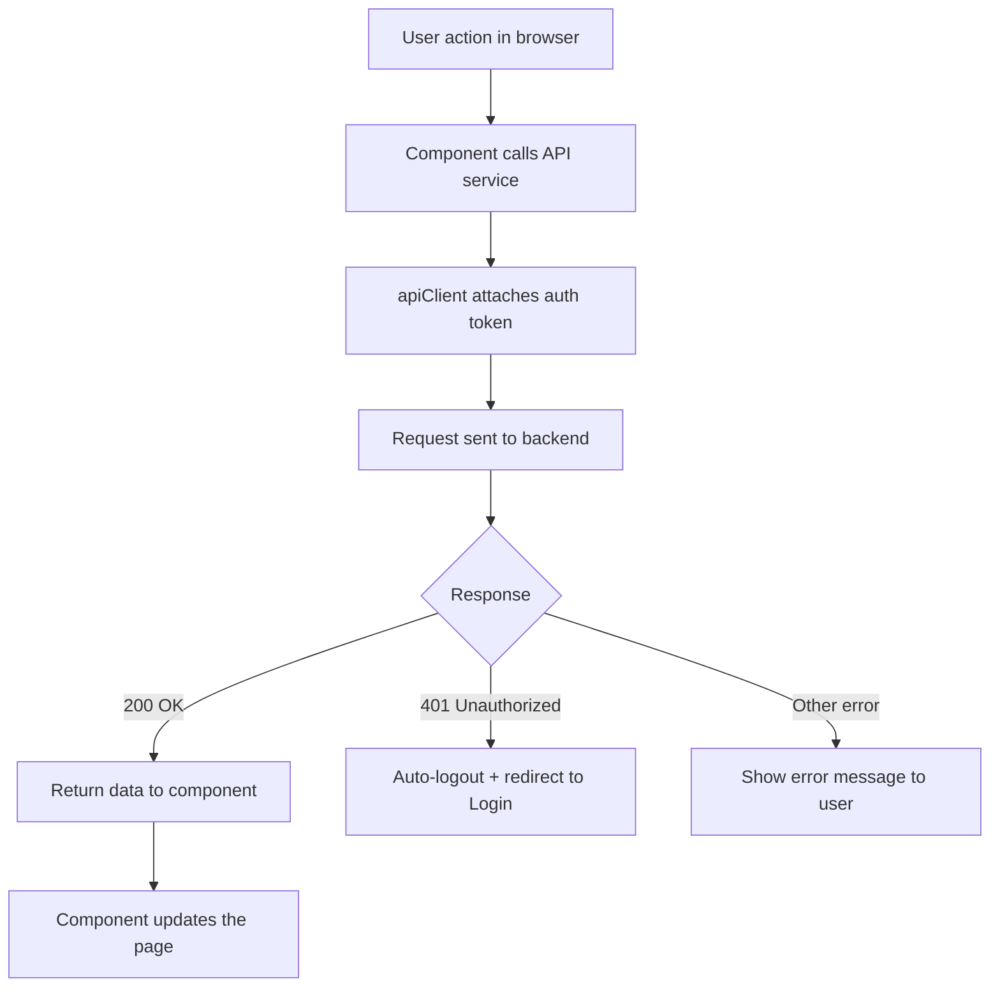
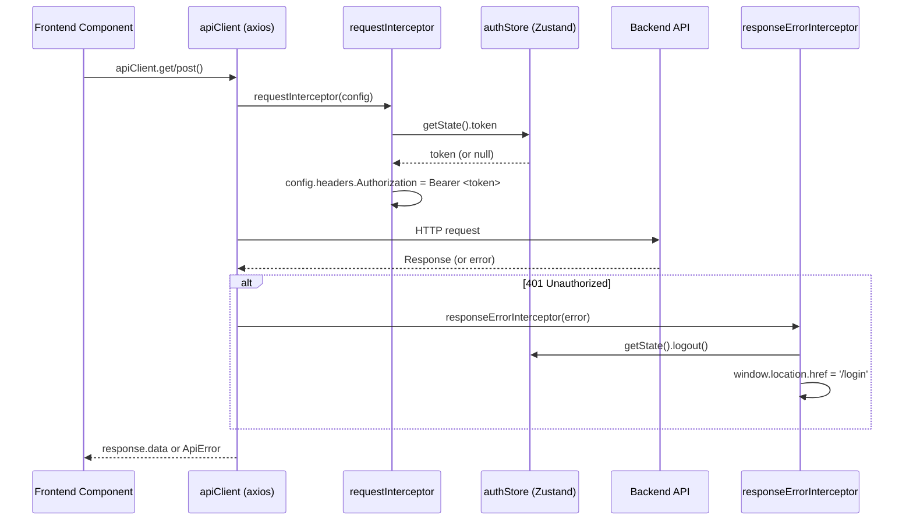

# Frontend Core API

## Purpose
Centralized HTTP client layer built on axios. Provides a pre-configured axios instance with interceptors for auth token injection, standardized error parsing, and 401 auto-logout. Central endpoint constants and type-safe service modules.

---

## Simple Instructions *(for non-developers)*

### What is this?
This is the communication layer that the frontend uses to talk to the backend. Every time you click a button, open a page, or save a record, this module sends the request to the backend and delivers the response back.

### What can you do here?
You don't interact with this directly — it works automatically:
- When you open a page, it fetches the data from the backend.
- When you save a record, it sends the data to the backend.
- It automatically attaches your authentication token to every request.
- If your session expires (401 error), it logs you out automatically.

### How to use it

1. As you use the ERP system, every action you take triggers API calls automatically.
2. If something goes wrong, you will see an error message — this module ensures the error is shown in a consistent format.
3. If your token expires during use, you will be redirected to the login page automatically.

### Diagram



### Common issues
| Problem | What to do |
|---------|-------------|
| Nothing happens when you click a button | Check your browser's developer console for errors. The backend may be down. |
| You see a generic error message | The API returned an unexpected error. Try refreshing the page or contact support. |
| You are sent to the login page unexpectedly | Your session expired. Just log in again. |
| Data is not updating after saving | Try refreshing the page. The API cache may need to be cleared. |

---

## Key Files

| File | Role |
|------|------|
| `apiConfig.ts` | Axios config: `baseURL` from `VITE_API_URL` (default `http://localhost:8081/api/v1`), 15s timeout, JSON headers |
| `client.ts` | Creates the singleton `apiClient` (axios instance) with request/response interceptors attached |
| `interceptors.ts` | **Request:** reads token from `useAuthStore.getState().token`, injects `Authorization: Bearer <token>`. **Response error:** on 401, calls `useAuthStore.getState().logout()` and redirects to `/login` |
| `endpoints.ts` | Central `ENDPOINTS` object with all API paths: `auth.*`, `context.*`, `identity.*`, `authz.*`, `metadata.*`, `customers`, `users` |
| `errors.ts` | `parseApiError()` — normalizes axios errors into a consistent `ApiError` shape with `{ status, message, code }` |
| `apiClient.ts` | Simple fetch-based `apiGet<T>()` wrapper (alternative to axios client) |

## Services

| Service | Location | Endpoints Called |
|---------|----------|-----------------|
| `authService` | `services/authService.ts` | `POST /auth/login`, `POST /auth/refresh`, `POST /auth/logout`, `GET /auth/me`, `POST /auth/change-password` |
| `customerService` | `services/customerService.ts` | CRUD for `/customers` |
| `metadataService` | `services/metadataService.ts` | All `/metadata/*` endpoints |

## AuthService Interface

```typescript
authService.login(payload: {username, password}): Promise<BackendLoginData>
authService.logout(): Promise<void>
authService.refreshSession(refreshToken): Promise<{accessToken, refreshToken}>
authService.getCurrentUser(): Promise<BackendLoginData['user']>
authService.changePassword(currentPassword, newPassword): Promise<void>
```

`BackendLoginData` maps to the backend `LoginResponse` DTO shape: `{ accessToken, refreshToken, expiresAt, sessionId, user: {...} }`.

## Interceptor Flow



## Related Backend
- All `@RestController` endpoints under `/api/v1/`
- `backend-common` — `ApiResponse<T>` envelope consumed by all services
- `backend-auth` — login/logout/refresh endpoints
- `backend-identity-admin` — all `/identity/*` CRUD endpoints
