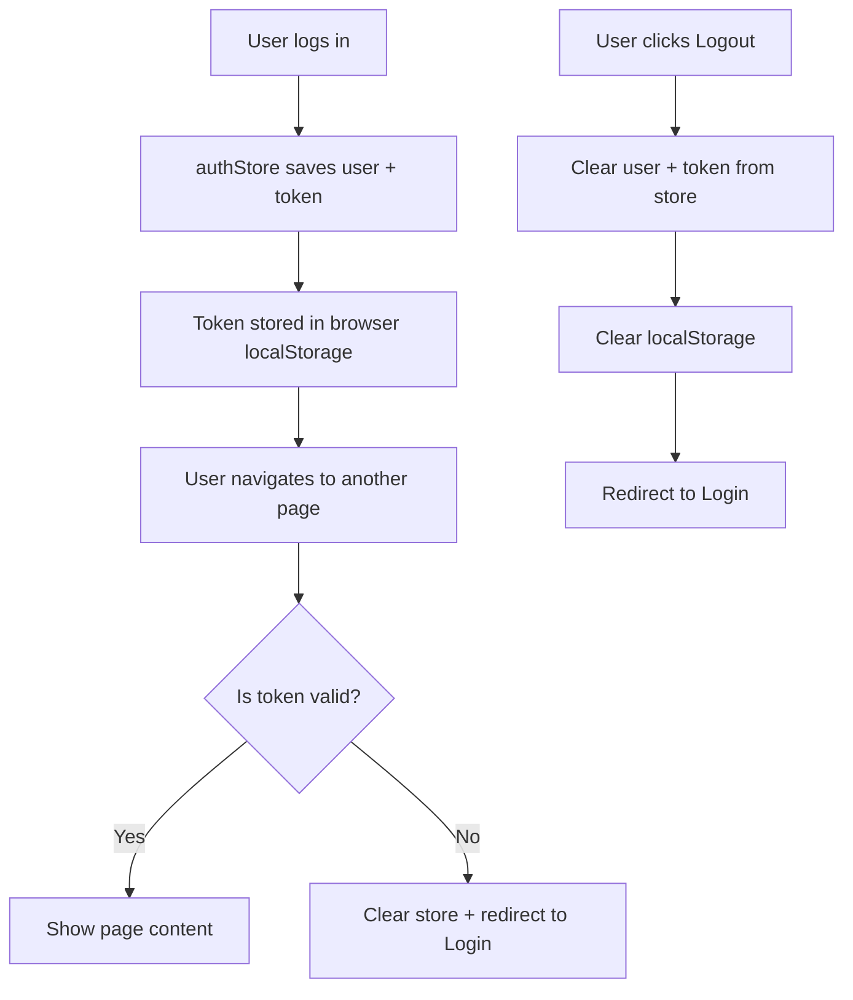
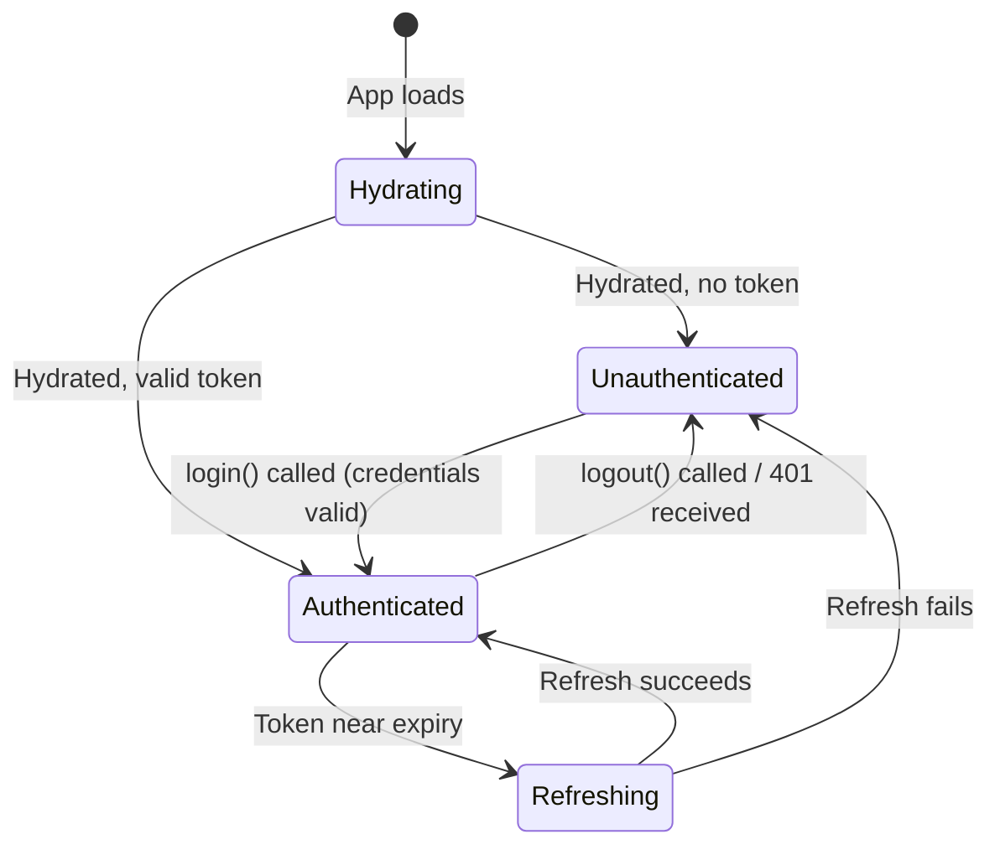

# Frontend Core Auth

## Purpose
Zustand-based authentication state management with localStorage persistence. Stores user profile, JWT tokens, and authentication status. Provides actions for login, logout, and token updates. Used by API interceptors and route guards.

---

## Simple Instructions *(for non-developers)*

### What is this?
This is the part of the frontend that remembers who you are after you log in. It stores your user information and access key (token) so you don't have to log in again every time you open a new page.

### What can you do here?
You don't interact with this directly — it works automatically in the background:
- When you log in, it saves your user details and token.
- When you open a new page, it checks if you are still logged in.
- When you log out, it clears everything and returns you to the login page.
- If your session expires, it automatically logs you out.

### How to use it

1. **Log in** through the login page — the auth store saves your session automatically.
2. As you navigate the system, the store checks that you are still authenticated.
3. To log out, click your user icon in the top-right and choose **Logout**.
4. If you close your browser and come back, you will need to log in again (unless you selected "Remember Me").

### Diagram



### Common issues
| Problem | What to do |
|---------|-------------|
| You are logged out unexpectedly | Your session token may have expired. Just log in again. |
| You see a white screen after login | The auth store may not have hydrated yet. Try refreshing the page. |
| Logging out on one tab logs you out everywhere | This is expected — the auth store is shared across tabs via localStorage. |

---

## Key Files

| File | Role |
|------|------|
| `authStore.ts` | Zustand store with `persist` middleware — holds `user`, `token`, `refreshToken`, `isAuthenticated`, `isRefreshing`. Actions: `login()`, `logout()`, `setUser()`, `setToken()`, `setRefreshing()`. Persisted to `localStorage` under key `erp-auth-session`. |
| `authTypes.ts` | TypeScript interfaces: `AuthUser`, `AuthState`, `AuthActions`, `AuthStore` |
| `authActions.ts` | Standalone action helpers using `useAuthStore.getState()` — useful outside React components |
| `authSelectors.ts` | Memoized selectors (e.g., `selectIsAuthenticated`, `selectUser`) |
| `authUtils.ts` | Utility functions for auth-related operations |
| `storage.ts` | `AUTH_STORAGE_KEY` constant and `authStorage` helper (`getToken()`, `clear()`) |

## State Shape

```typescript
interface AuthStore {
  user: AuthUser | null;         // { id, email, username, firstName, lastName, displayName, avatarUrl, status, roles[], permissions[] }
  token: string | null;          // JWT access token
  refreshToken: string | null;   // JWT refresh token
  isAuthenticated: boolean;
  isRefreshing: boolean;
  login(user, token, refreshToken): void;
  logout(): void;
  setUser(user): void;
  setToken(token, refreshToken?): void;
  setRefreshing(boolean): void;
}
```

## Persistence Strategy

- Uses Zustand `persist` middleware with `partialize` — only `user`, `token`, `refreshToken`, `isAuthenticated` are persisted to `localStorage`
- `isRefreshing` is NOT persisted (transient flag)
- On app startup, `AuthGuard` and `ProtectedRoute` wait for `useAuthStore.persist.hasHydrated()` before making auth decisions (2-second timeout fallback)

## Usage Across the App

| Consumer | How |
|----------|-----|
| `LoginPage.tsx` | Calls `useAuthStore(s => s.login)` on successful login |
| `apiClient` interceptor | `useAuthStore.getState().token` injected into every request |
| 401 interceptor | `useAuthStore.getState().logout()` on 401 → clears store + localStorage |
| `AuthGuard` | Reads `isAuthenticated` to gate routes |
| `ProtectedRoute` | Reads `isAuthenticated` to render layout or redirect |
| `GuestRoute` | Redirects authenticated users away from login/forgot-password pages |
| `AdminRoute` | Checks `user.roles` for `sys_admin` / `tnt_admin` |
| `ContextSelectPage` | Reads `user.displayName`/`user.username` for greeting |

## Lifecycle State Diagram



## Related Backend
- `backend-auth` — AuthController handles the actual credential validation and token issuance
- `backend-security` — JwtProvider, JwtAuthenticationFilter validate the token on each request
