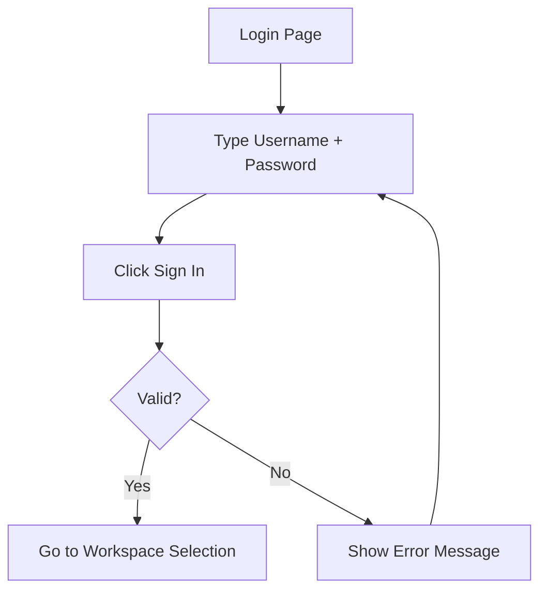
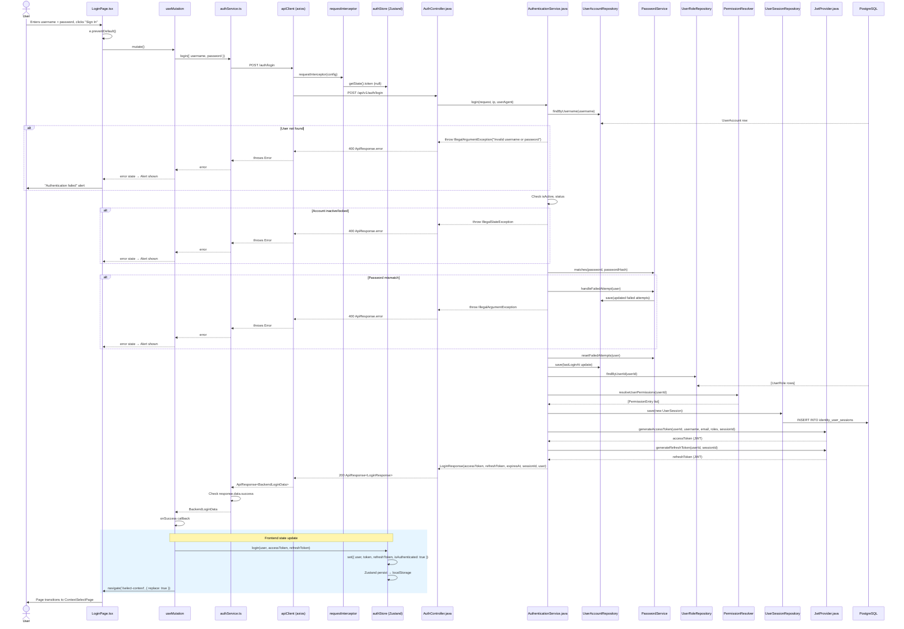

# Flow: Login

## Simple Instructions

### What happens here?
This is how you log into the ERP system. You type your username and password on the login screen, and if they are correct, the system lets you in and takes you to choose your workspace.

### Step-by-step (what the user sees)

1. You open the ERP system and see the **Login** page.
2. You type your **Username** and **Password** in the fields.
3. You click the **Sign In** button.
4. The button shows **"Authenticating..."** while the system checks your credentials.
5. If your credentials are correct, you are taken to the **Select Your Workspace** page.
6. If your credentials are wrong, a red **error message** appears telling you what went wrong.

### Diagram

### Common issues

| Problem | What to do |
|---------|-------------|
| "Invalid username or password" | Double-check your username and password. Passwords are case-sensitive. |
| "Account is temporarily locked" | You entered the wrong password too many times. Wait a few minutes and try again, or ask your admin to unlock your account. |
| Button stays on "Authenticating..." forever | The server may be down. Check your internet connection, or contact your system administrator. |
| Screen goes white after clicking Sign In | This is a bug. Try refreshing the page or clearing your browser cache. |

---

## Sequence Diagram

## Trigger
User navigates to `/login`, fills in their username and password, and clicks the "Sign In" button (or presses Enter).

## Preconditions
- User is NOT authenticated (GuestRoute allows access to `/login`)
- Backend is running at `http://localhost:8081`
- User exists in `identity_users` table with `is_active=true` and `status='ACTIVE'`

## Flow Steps

### Step 1: User submits credentials
- **File:** `frontend/src/routes/auth/LoginPage.tsx:114-118`
- User fills `username` and `password` fields, submits `<form>`
- `e.preventDefault()` prevents default form submission
- `mutate()` triggers the React Query `useMutation`

### Step 2: React Query invokes auth service
- **File:** `frontend/src/routes/auth/LoginPage.tsx:31-54`
- `useMutation` with `mutationFn: () => authService.login({ username, password })`
- `isPending` disables the form during submission
- `onSuccess` handler receives `data` of type `BackendLoginData`

### Step 3: AuthService sends login request
- **File:** `frontend/src/core/api/services/authService.ts:36-45`
- Calls `apiClient.post<ApiResponse<BackendLoginData>>('/auth/login', payload)`
- Checks `response.data.success` — throws error if false
- Returns `response.data.data` (the `BackendLoginData`)

### Step 4: Axios interceptor runs
- **File:** `frontend/src/core/api/interceptors.ts:7-18`
- `requestInterceptor` reads `useAuthStore.getState().token` — null on first login
- Sets `config.headers.Authorization = Bearer <token>` if token exists
- On login, there is no token yet, so no header is set (expected)

### Step 5: Backend AuthController receives request
- **File:** `backend/src/main/java/com/erp/platform/identity/controller/AuthController.java:30-38`
- `POST /api/v1/auth/login` mapped to `login()` method
- Extracts `LoginRequest` from body, IP from `HttpServletRequest`, User-Agent from header
- Delegates to `authenticationService.login(request, ip, userAgent)`

### Step 6: AuthenticationService validates credentials
- **File:** `backend/src/main/java/com/erp/platform/identity/service/AuthenticationService.java:45-121`
- `userRepository.findByUsername()` — queries `identity_users` table by username
- Checks `user.getIsActive()` — throws `IllegalStateException` if false
- Checks account lockout via `passwordService.isAccountLocked()`
- Validates status and lock expiration
- `passwordService.matches()` — bcrypt comparison of password vs hash

### Step 7: Failed attempt handling (if password wrong)
- **File:** `backend/src/main/java/com/erp/platform/identity/service/PasswordService.java`
- `handleFailedAttempt()` increments `failedAttempts` counter
- If attempts exceed threshold, sets `lockedUntil` timestamp and `status` to non-ACTIVE

### Step 8: Success — resolve roles and permissions
- **File:** `backend/src/main/java/com/erp/platform/identity/service/AuthenticationService.java:77-87`
- `userRoleRepository.findByUserId()` → role codes list
- `permissionResolver.resolveUserPermissions()` → permission strings in `resourceType:resource:action` format

### Step 9: Create user session
- **File:** `backend/src/main/java/com/erp/platform/identity/service/AuthenticationService.java:241-255`
- New `UserSession` entity: user, token UUID, refresh token UUID, IP, user agent, 7-day expiry
- Saved via `sessionRepository.save()` → `INSERT INTO identity_user_sessions`

### Step 10: Generate JWT tokens
- **File:** `backend/src/main/java/com/erp/platform/identity/security/JwtProvider.java:34-71`
- `generateAccessToken()` — 15-minute expiry, claims: userId, username, email, tenantId, orgId, companyId, branchId, sessionId, roles
- `generateRefreshToken()` — 7-day expiry, claims: userId, sessionId, type=refresh

### Step 11: Build and return login response
- **File:** `backend/src/main/java/com/erp/platform/identity/service/AuthenticationService.java:104-121`
- `LoginResponse` with accessToken, refreshToken, expiresAt, sessionId, UserInfo (id, username, email, displayName, roles, permissions)

### Step 12: Frontend stores auth state
- **File:** `frontend/src/routes/auth/LoginPage.tsx:35-52`
- `onSuccess` maps `data.user` to `AuthUser` shape
- Calls `loginAction(user, data.accessToken, data.refreshToken)`
- `loginAction` → `useAuthStore.getState().login()` → persists to localStorage

### Step 13: Navigate to context selection
- **File:** `frontend/src/routes/auth/LoginPage.tsx:52`
- `navigate('/select-context', { replace: true })` — replaces history entry, no back-to-login

## Postconditions
- `authStore` has `user`, `token`, `refreshToken`, `isAuthenticated: true`
- localStorage contains persisted auth session
- User is on `/select-context` page
- Backend has an active `UserSession` record
- User's `lastLoginAt` is updated
- `failedAttempts` counter is reset

## Error Flows

### Invalid Credentials
- **Condition:** Wrong username or password
- **Backend:** `AuthenticationService` line 47 or 70 throws `IllegalArgumentException("Invalid username or password")`
- **HTTP response:** 400 Bad Request with `ApiResponse.error`
- **Frontend:** `authService.login()` throws `Error(response.data.message)` → React Query sets `error` state → `LoginPage` renders `<Alert severity="error">`

### Account Locked
- **Condition:** Too many failed password attempts
- **Backend:** `passwordService.isAccountLocked(user)` returns true → `IllegalStateException("Account is temporarily locked")`
- **HTTP response:** 400 Bad Request
- **Frontend:** Same error display flow as above

### Account Inactive
- **Condition:** `user.getIsActive() == false` or `user.getStatus() != "ACTIVE"`
- **Backend:** Throws `IllegalStateException("Invalid username or password")`
- **HTTP response:** 400 Bad Request

### Network Failure
- **Condition:** Backend unreachable or CORS denied
- **Frontend:** Axios network error → `parseApiError()` normalizes → React Query `error` state → Alert shown
