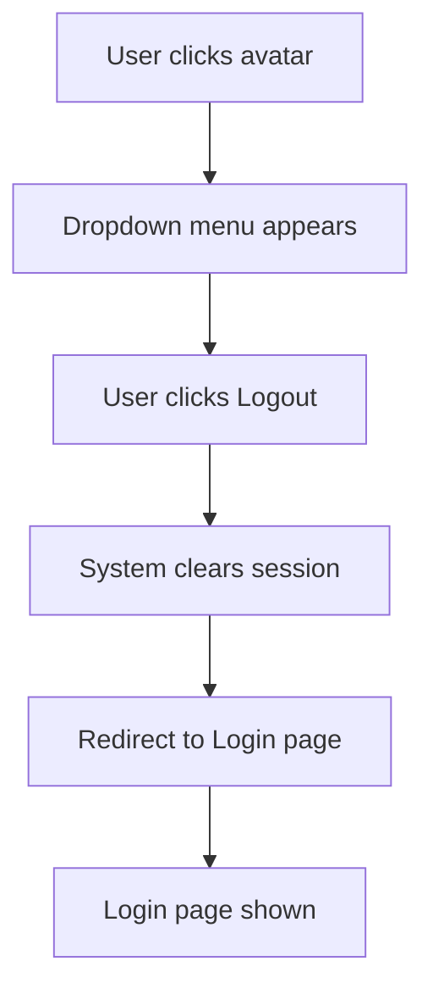
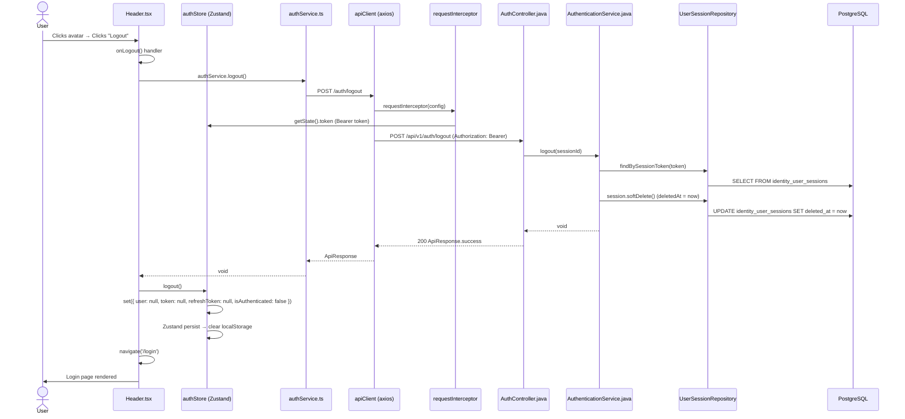

# Logout

## Simple Instructions *(for non-developers)*

### What happens here?
This is how you log out of the ERP system. When you click Logout, the system clears your session and returns you to the login page.

### Step-by-step *(what the user sees)*

1. You are on any page in the system.
2. Click your **user icon or avatar** in the top-right corner of the screen.
3. A dropdown menu appears — click **Logout**.
4. The screen clears and you are taken back to the **Login** page.
5. You can no longer access any pages until you log in again.

### Diagram *(overview for non-developers)*

### Common issues
| Problem | What to do |
|---------|-------------|
| Clicking Logout does nothing | Try refreshing the page and clicking again. |
| Still on the same page after logout | Clear your browser cache and localStorage manually. |
| Can still access pages after logout | This is a bug. Clear your browser storage and report it. |

---

## Sequence Diagram *(technical)*

## Trigger
User clicks the **Logout** option from the user avatar dropdown menu in the application header.

## Preconditions
- User is authenticated (`authStore.isAuthenticated === true`)
- User is on any protected page
- Backend session exists in `identity_user_sessions` table

## Flow Steps *(technical)*

### Step 1: User triggers logout
- **File:** `frontend/src/components/layouts/Header/Header.tsx` (onLogout handler)
- User clicks their avatar in the top-right header, then clicks **Logout** from the dropdown
- The `onLogout` handler calls `authService.logout()`

### Step 2: AuthService sends logout request
- **File:** `frontend/src/core/api/services/authService.ts:47-49`
- `apiClient.post(ENDPOINTS.auth.logout)` → `POST /auth/logout`
- Axios interceptor injects the Bearer token from authStore

### Step 3: Backend processes logout
- **File:** `backend/src/main/java/com/erp/platform/identity/controller/AuthController.java` (logout method)
- Calls `authenticationService.logout(sessionId)`
- Finds the session by token, calls `softDelete()` to set `deletedAt`
- Returns 200 OK

### Step 4: Frontend clears auth state
- **File:** `frontend/src/core/auth/authStore.ts:24-31`
- `logout()` action sets all fields to null and clears localStorage
- `Header.tsx` navigates to `/login`

## Postconditions
- `authStore` has `user: null, token: null, isAuthenticated: false`
- localStorage auth data is cleared
- User is redirected to `/login`
- Backend session record is soft-deleted (inactive)
- Any further API calls will return 401 until re-authentication

## Error Flows

### Network Failure
- **Condition:** Backend unreachable
- **Frontend behavior:** Axios error is caught but auth state is still cleared locally
- **Result:** User is logged out locally even if backend session persists

### Logout API Fails (401)
- **Condition:** Token already expired
- **Frontend behavior:** `responseErrorInterceptor` catches 401 → auto-logout
- **Result:** Auth state cleared, redirect to login

### No Token Available
- **Condition:** User is already logged out but triggers logout
- **Frontend behavior:** Header component checks auth state before showing Logout option
