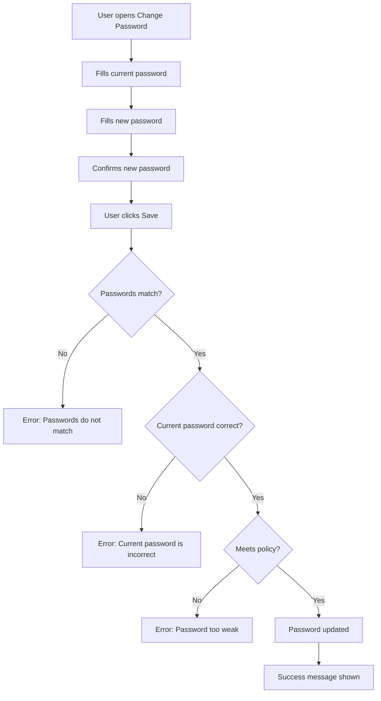

# Password Change

## Simple Instructions *(for non-developers)*

### What happens here?
This is how you change your password. You enter your current password and a new password. If the current password is correct and the new one meets the rules, your password is updated.

### Step-by-step *(what the user sees)*

1. Click your **avatar** in the top-right corner, then click **Change Password**.
2. You see a form with three fields: **Current Password**, **New Password**, **Confirm New Password**.
3. Type your current password.
4. Type your new password (must be at least 8 characters with letters and numbers).
5. Type the new password again to confirm.
6. Click **Save**.
7. If successful, you see a green success message.
8. If something is wrong, a red error message tells you what to fix.

### Diagram *(overview for non-developers)*



### Common issues
| Problem | What to do |
|---------|-------------|
| "Passwords do not match" | Make sure you type the new password the same way in both fields. |
| "Current password is incorrect" | You entered your existing password wrong. Try again carefully. |
| "Password must be at least 8 characters" | Your new password is too short. Make it longer. |
| "Password must contain a number" | Add at least one number (0-9) to your password. |

---

## Sequence Diagram *(technical)*

```mermaid
sequenceDiagram
  actor User
  participant Page as ChangePasswordPage.tsx
  participant AuthSvc as authService.ts
  participant ApiClient as apiClient (axios)
  participant AuthCtrl as AuthController.java
  participant AuthService as AuthenticationService.java
  participant PwdSvc as PasswordService
  participant UserRepo as UserAccountRepository
  participant DB as PostgreSQL

  User->>Page: Fills form and clicks Save
  Page->>Page: Validates newPassword === confirmPassword
  alt Passwords do not match
    Page->>User: Alert: "Passwords do not match"
    return
  end
  Page->>Page: Validates password policy (min length, complexity)
  alt Policy violation
    Page->>User: Alert: policy error
    return
  end
  Page->>AuthSvc: changePassword(currentPassword, newPassword)
  AuthSvc->>ApiClient: POST /auth/change-password { currentPassword, newPassword }
  ApiClient->>AuthCtrl: POST /api/v1/auth/change-password (Bearer token)
  AuthCtrl->>AuthService: changePassword(userId, currentPassword, newPassword)
  AuthService->>UserRepo: findById(userId)
  UserRepo->>DB: SELECT FROM identity_users
  DB-->>UserRepo: UserAccount row
  AuthService->>PwdSvc: matches(currentPassword, currentHash)
  alt Current password wrong
    PwdSvc-->>AuthService: false
    AuthService-->>AuthCtrl: throw IllegalArgumentException("Current password is incorrect")
    AuthCtrl-->>ApiClient: 400 ApiResponse.error
    ApiClient-->>AuthSvc: throws Error
    AuthSvc-->>Page: error
    Page->>User: Alert: "Current password is incorrect"
    return
  end
  AuthService->>PwdSvc: validatePolicy(newPassword)
  alt Policy violation
    PwdSvc-->>AuthService: throw IllegalArgumentException
    AuthService-->>AuthCtrl: 400 response
    Page->>User: Alert: policy error
    return
  end
  AuthService->>PwdSvc: encode(newPassword) → new hash
  AuthService->>UserRepo: save(user with new hash)
  UserRepo->>DB: UPDATE identity_users SET password_hash = ...
  AuthService-->>AuthCtrl: void
  AuthCtrl-->>ApiClient: 200 ApiResponse.success
  ApiClient-->>AuthSvc: ApiResponse
  AuthSvc-->>Page: void
  Page->>User: Success message: "Password changed successfully"
```

## Trigger
User navigates to **Change Password** page (from avatar dropdown menu or `/app/change-password` route).

## Preconditions
- User is authenticated
- User exists in `identity_users` table

## Flow Steps *(technical)*

### Step 1: Frontend form validation
- **File:** `frontend/src/routes/auth/change-password/ChangePasswordPage.tsx`
- Validates new password matches confirm password
- Validates password policy (min 8 chars, letter + number)

### Step 2: API call
- **File:** `frontend/src/core/api/services/authService.ts:71-79`
- `apiClient.post('/auth/change-password', { currentPassword, newPassword })`

### Step 3: Backend validates and updates
- **File:** `backend/src/main/java/com/erp/platform/identity/controller/AuthController.java` (changePassword method)
- `AuthenticationService.changePassword()` verifies current password via `PasswordService.matches()`
- Validates new password policy
- Encodes new password and saves to database

## Postconditions
- User's password hash is updated in `identity_users` table
- User remains logged in (session/token is not invalidated)
- Success message displayed

## Error Flows

### Current Password Wrong
- **Backend:** 400 "Current password is incorrect"
- **Frontend:** Red alert shown, form remains editable

### Weak Password
- **Backend:** 400 with specific policy violation message
- **Frontend:** Red alert with policy requirement details

### Passwords Do Not Match
- **Frontend-only validation:** Error shown before API call
- **No API call made**
