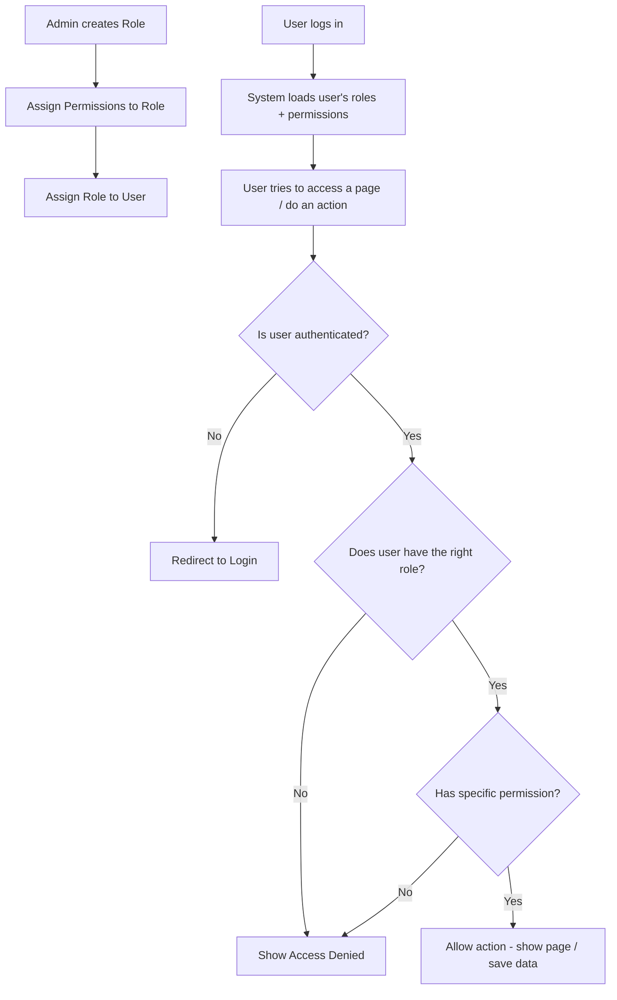
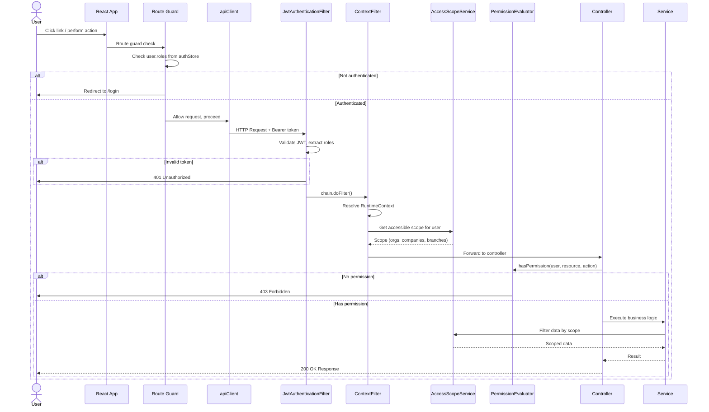
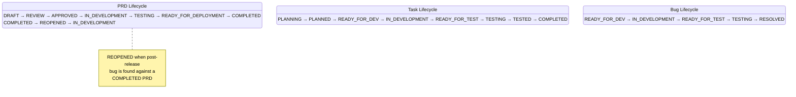

# Flow: Role-Based Access Control

## Simple Instructions *(for non-developers)*

### What happens here?
This is how the system decides what you can see and do based on your role. Every user is assigned one or more roles, and each role has a set of permissions. When you try to access something, the system checks your roles and permissions to decide if you are allowed.

### Step-by-step *(what the user sees)*

1. An **admin creates roles** (e.g., "Manager", "Accountant", "Viewer") and assigns permissions to each role.
2. The **admin assigns roles** to user accounts.
3. When you log in, the system loads your roles and permissions.
4. When you click a link or try to do an action, the system checks:
   - Are you logged in? (authentication)
   - Do you have the right role? (authorization)
   - Do you have permission for this specific action? (fine-grained permission)
5. If you are not allowed, you see an error or are redirected away.

### Diagram *(overview for non-developers)*



### Common issues
| Problem | What to do |
|---------|-------------|
| "Access Denied" on a page you need | Your role does not include permission for that page. Ask your admin to update your role. |
| You can see a page but buttons are missing | Your role may have "read-only" permission. Ask your admin about it. |
| You cannot log in at all | Your account may be deactivated. Contact your system administrator. |
| Admin pages are not visible | You need the `sys_admin` or `tnt_admin` role. Ask your admin to assign it. |

---

## Sequence Diagram *(technical)*



---

## Status Lifecycle



**Key changes from v1:**
- **REOPENED** status added to PRD lifecycle — enables post-release bug fixes
- Bugs cascade to **RESOLVED** (not COMPLETED) on PRD merge
- Default starting statuses: PRD→DRAFT, Task→PLANNING, Bug→READY_FOR_DEV

## Layer 1: JWT Token Claims

### Token Generation
- **File:** `backend/src/main/java/com/erp/platform/identity/security/JwtProvider.java:34-57`
- Access token includes `roles` claim (List of role codes)
- Refresh token does NOT include roles (minimal claims)

### Token Validation
- **File:** `backend/src/main/java/com/erp/platform/identity/security/JwtAuthenticationFilter.java:38-63`
- On each request, filter extracts `roles` from JWT claims
- Each role code is converted to `SimpleGrantedAuthority`
- Stored in `UsernamePasswordAuthenticationToken` → `SecurityContextHolder`

## Layer 2: Spring Security Endpoint Matchers

- **File:** `backend/src/main/java/com/erp/platform/identity/security/SecurityConfig.java:49-63`
- Public endpoints: `/auth/login`, `/auth/refresh`, `/auth/logout`
- Authenticated endpoints: `/auth/me`, `/context/**`, `/identity/**`, `/auth/permissions`
- `anyRequest().permitAll()` — catch-all allows unregistered paths

## Layer 3: JWT Principal + Context Filter

- **File:** `backend/src/main/java/com/erp/platform/identity/security/JwtPrincipal.java`
- Holds `userId`, `username`, and full `Claims` (including tenantId, orgId, etc.)

- **File:** `backend/src/main/java/com/erp/platform/identity/security/ContextFilter.java`
- After JWT filter, resolves `RuntimeContext` from principal's userId
- Stores in thread-local `RuntimeContextHolder` for downstream access

## Layer 4: AccessScopeService — Row-Level Filtering

- **File:** `backend/src/main/java/com/erp/platform/identity/service/AccessScopeService.java`
- Computes which organization/company/branch IDs a user can access based on:
  - `UserRole` assignments → `Role` → `RoleOrganization`/`RoleCompany`/`RoleBranch`
  - Each role can have `fullAccess=true` or a specific list of accessible IDs
- Used by `AdminService` to filter all list operations:
  ```java
  // AdminService.java:58
  List<UUID> ids = accessScopeService.getAccessibleOrganizationIds(userId);
  return organizationRepository.findByIdInWithTenant(ids);
  ```
- Applies to: `getAllOrganizations()`, `getAllCompanies()`, `getAllBranches()`, `getAllDepartments()`

## Layer 5: PermissionEvaluator & AuthorizationInterceptor

- **File:** `backend/src/main/java/com/erp/platform/identity/authorization/`
- `PermissionEvaluator` — evaluates `hasPermission()` expressions
- `RequirePermission` — custom annotation for method-level authorization
- `PermissionCache` — caches resolved permissions with TTL
- `PermissionResolver` — resolves `resourceType:resource:action` permission strings from user roles

## Layer 6: Frontend Route Guards

### GuestRoute — Blocks authenticated users from guest pages
- **File:** `frontend/src/core/router/guards/GuestRoute.tsx:32-34`
- If `isAuthenticated` → redirect to `/select-context`
- Used on: `/login`, `/forgot-password`, `/reset-password`

### AuthGuard — Blocks unauthenticated access
- **File:** `frontend/src/core/router/guards/AuthGuard.tsx:53-55`
- If NOT `isAuthenticated` → redirect to `/login`
- Used on: `/select-context`

### ProtectedRoute — Authenticated layout
- **File:** `frontend/src/core/router/guards/ProtectedRoute.tsx:31-33`
- Same auth check, but wraps with AppLayout
- Used on: `/app/*`

### ContextGuard — Ensures workspace context is selected
- **File:** `frontend/src/core/router/guards/ContextGuard.tsx:60-77`
- Checks current context has tenantId, appropriate org/company/branch, and roles
- If incomplete → redirect to `/select-context`

### AdminRoute — Restricts admin pages
- **File:** `frontend/src/core/router/guards/AdminRoute.tsx:5-12`
- Checks `user.roles.includes('sys_admin') || user.roles.includes('tnt_admin')`
- If not admin → redirect to `/app/dashboard`
- Used on: `/app/admin/*`

## Layer 7: 401/403 Backend Responses

- **File:** `backend/src/main/java/com/erp/platform/identity/security/SecurityConfig.java:76-99`
- **401 (AuthenticationEntryPoint):** `{"errorCode":"IDENTITY_AUTH_001","message":"Authentication required"}`
- **403 (AccessDeniedHandler):** `{"errorCode":"IDENTITY_AUTH_005","message":"Access denied"}`

## Frontend 401 Interceptor Cascade

- **File:** `frontend/src/core/api/interceptors.ts:24-40`
- Any API response with 401 → `authStore.logout()` → `window.location.href = '/login'`
- This clears localStorage and redirects the entire app

## Role Hierarchy

```
sys_admin    → Full access to all tenants, bypasses all row-level filters
tnt_admin    → Full access within assigned tenant(s)
org_admin    → Access limited to assigned organizations
co_admin     → Access limited to assigned companies
br_admin     → Access limited to assigned branches
dept_manager → Access limited to assigned departments
user         → Basic access, self-service only
```

## Permission Format

Permissions follow the pattern: `resourceType:resource:action`

Examples:
- `form:products:read` — Read access to products form
- `form:products:write` — Create/update product forms
- `module:inventory:access` — Access to inventory module
- `admin:users:manage` — Manage user accounts

## Error Flows

### Unauthenticated Request
1. No token or invalid token → JwtAuthenticationFilter passes through (no auth set)
2. SecurityConfig denies access → `AuthenticationEntryPoint` returns 401
3. Frontend 401 interceptor → logout → redirect to `/login`

### Unauthorized (Forbidden)
1. Token valid but lacks required role/permission
2. `@PreAuthorize` or security matcher blocks → `AccessDeniedHandler` returns 403
3. Frontend receives 403 — currently propagates as generic error (not treated like 401)

### Out-of-Scope Data Access
1. Admin controller → AdminService → AccessScopeService filters IDs
2. Non-admin user can only see records within their assigned scope
3. Direct ID access (`getById`) throws `SecurityException("Access denied")` if out of scope
