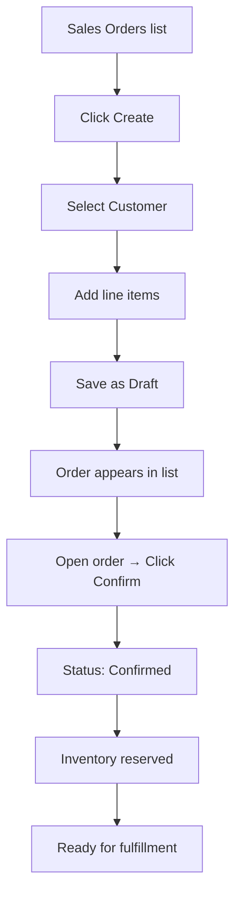
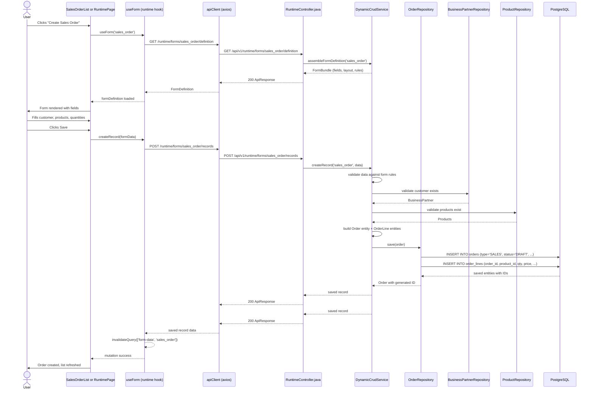

# Place Sales Order

## Simple Instructions *(for non-developers)*

### What happens here?
This is how you create a sales order for a customer. You select the customer, add the products they want, set quantities and prices, and save the order. Later you can confirm and ship it.

### Step-by-step *(what the user sees)*

1. Go to **Sales > Sales Orders** in the sidebar.
2. Click the **Create Sales Order** button.
3. A form opens with header fields:
   - Select the **Customer** from a dropdown.
   - The **Order Date** is pre-filled with today's date.
4. Add line items by clicking **Add Line**:
   - Select a **Product** from a dropdown.
   - Enter the **Quantity**.
   - The **Unit Price** is pre-filled from the price list.
5. You can edit the price or add a discount if needed.
6. Click **Save** — the order is created with status **Draft**.
7. The order appears in the list.
8. To proceed, open the order and click **Confirm**.

### Diagram *(overview for non-developers)*

### Common issues
| Problem | What to do |
|---------|-------------|
| Cannot find customer in dropdown | The customer must exist in Business Partners first. Create them first. |
| Product price is zero | No price list is set. Enter the price manually. |
| Cannot click Confirm | The order may have missing required fields. Check all fields are filled. |
| "Insufficient stock" error | The product does not have enough inventory. Check stock or reduce quantity. |

---

## Sequence Diagram *(technical)*

## Trigger
User clicks **Create Sales Order** button on the Sales Orders list page (or runtime form list page).

## Preconditions
- User is authenticated with `sales_order:create` permission
- At least one customer exists in Business Partners
- At least one product exists in Product catalog
- Sales order form is registered in the metadata system

## Flow Steps *(technical)*

### Step 1: Load form definition
- **File:** `frontend/src/core/runtime/hooks/useForm.ts:56-62`
- `useForm('sales_order')` fetches form definition via `GET /runtime/forms/sales_order/definition`
- Form definition is cached for 5 minutes (`staleTime: 300000`)

### Step 2: User fills and submits form
- **File:** `frontend/src/engine/forms/DynamicFormRenderer.tsx`
- DynamicFormRenderer renders fields based on form definition
- User fills in customer, products, quantities, prices
- Clicks Save which triggers `createRecord(formData)`

### Step 3: API call to create record
- **File:** `frontend/src/core/runtime/hooks/useForm.ts:94-97`
- `createMutation.mutateAsync(data)` → `apiCreateRecord('sales_order', data)`
- `POST /runtime/forms/sales_order/records`

### Step 4: Backend creates the order
- **File:** `backend/src/main/java/com/erp/core/runtime/service/DynamicCrudService.java`
- Validates data against form rules (required fields, data types)
- Validates foreign keys (customer, products)
- Builds Order entity with status=DRAFT and type=SALES
- Saves Order + OrderLines to database

### Step 5: Response and cache invalidation
- **File:** `frontend/src/core/runtime/hooks/useForm.ts:91-92`
- On success, invalidates `['form-data', 'sales_order']` query key
- List view refreshes showing the new order

## Postconditions
- New order exists in `orders` table with `type='SALES'` and `status='DRAFT'`
- Order lines exist in `order_lines` table
- Order appears in the Sales Orders list
- User can open the order to edit or confirm it

## Error Flows

### Validation Error
- **Condition:** Required field missing or invalid data type
- **Backend:** `RecordValidationService` returns validation errors
- **Frontend:** Form fields show inline validation errors

### Customer Not Found
- **Condition:** Customer ID does not match any Business Partner
- **Backend:** 400 "Customer not found"
- **Frontend:** Alert shown, customer field highlighted

### Product Not Found
- **Condition:** Product ID does not match any Product
- **Backend:** 400 "Product not found at line N"
- **Frontend:** Alert shown with line number

### Duplicate Reference
- **Condition:** Order with same external reference already exists
- **Backend:** 409 Conflict
- **Frontend:** Alert shown
