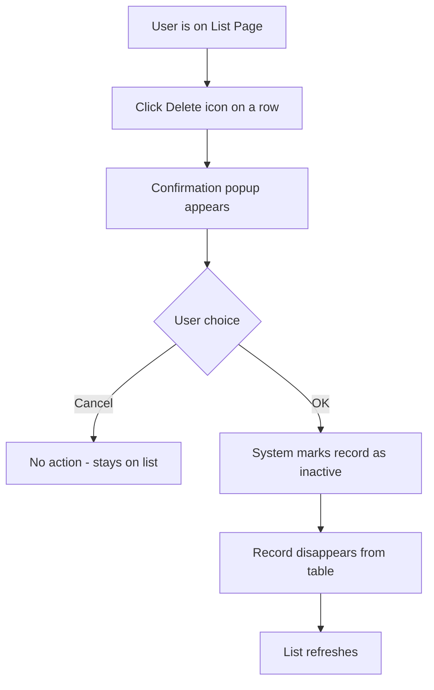
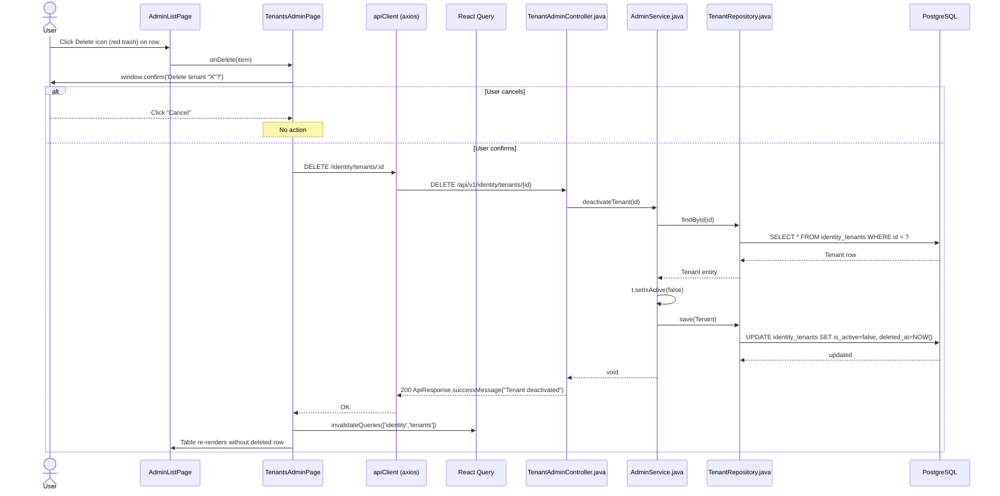

# Flow: Delete Record

## Simple Instructions *(for non-developers)*

### What happens here?
This is what happens when you delete a record (like a tenant, user, or product) from a list page. The system does not permanently remove it — it just marks it as inactive so it no longer shows up.

### Step-by-step *(what the user sees)*

1. You are on a **list page** with records displayed in a table.
2. You click the **Delete** icon (red trash can) on the row you want to remove.
3. A confirmation popup asks: *"Are you sure you want to delete this record?"*
4. If you click **Cancel**, nothing happens.
5. If you click **OK**, the record disappears from the table and the list refreshes.
6. The record is not truly gone — it is just marked as inactive in the database.

### Diagram *(overview for non-developers)*

### Common issues
| Problem | What to do |
|---------|-------------|
| The record is still there after deleting | The list may need a manual refresh. Click the browser refresh button. |
| You accidentally deleted a record | Contact your system administrator. Records are soft-deleted and can be restored. |
| Delete button is missing | You may not have permission to delete records. Contact your admin. |

---

## Sequence Diagram

## Trigger
User clicks the red Delete icon on a row in an admin list page.

## Preconditions
- User is on an admin list page with data loaded
- User has admin role
- The target record exists

## Flow Steps

### Step 1: User clicks Delete
- **File:** `frontend/src/modules/identity/admin/AdminListPage.tsx:122-129`
  - AdminListPage renders a red Delete `<IconButton>` per row
  - Click fires `onDelete(item)` passed from the parent page

### Step 2: Confirmation dialog
- **File:** `frontend/src/modules/identity/admin/tenants/TenantsAdminPage.tsx:76-84`
  - `window.confirm(\`Delete tenant "${item.name}"?\`)` — native browser confirm
  - If cancelled, returns early with no action

### Step 3: API call to deactivate
- **File:** `frontend/src/modules/identity/admin/tenants/TenantsAdminPage.tsx:78-83`
  - `apiClient.delete(ENDPOINTS.identity.tenant(item.id))`
  - Catches errors silently (handled by interceptor pattern)

### Step 4: Backend soft-deletes via `setIsActive(false)`
- **File:** `backend/src/main/java/com/erp/platform/identity/service/AdminService.java:53`
  - `deactivateTenant(id)` → loads entity → `t.setIsActive(false)` → `tenantRepository.save(t)`
  - This is a **soft delete**: row stays in DB, just marked inactive

### Step 5: JPA PreUpdate fires
- **File:** `backend/src/main/java/com/erp/common/base/BaseEntity.java:46-49`
  - `@PreUpdate` sets `updatedAt` to current timestamp
  - Note: `deletedAt` is NOT set by `deactivateTenant` (unlike `softDelete()` on BaseEntity)

### Step 6: Cache invalidation
- **File:** `frontend/src/modules/identity/admin/tenants/TenantsAdminPage.tsx:80`
  - `queryClient.invalidateQueries({ queryKey: ['identity', 'tenants'] })`
  - Table refetches, removed row disappears

## Postconditions
- Record remains in database with `is_active = false`
- React Query cache invalidated
- Table refreshed showing remaining records

## Error Flows

### Entity Not Found
- **Condition:** Record deleted concurrently
- **Backend:** `getTenant(id)` throws `IllegalArgumentException("Tenant not found")`
- **Frontend:** Error handling in catch block (silently handled currently)

### Network / Auth Error
- **Condition:** Token expired, network down
- **Frontend:** Axios error → `responseErrorInterceptor` may trigger logout if 401

## Note: Difference from BaseEntity.softDelete()
The admin controllers call `setIsActive(false)` directly on entities rather than using `BaseEntity.softDelete()`. The distinction:
- `BaseEntity.softDelete()`: sets `isActive=false` AND `deletedAt=now`
- Admin service `deactivateXxx()`: only sets `isActive=false`

The `BaseService.delete()` method calls `entity.softDelete()` which sets both fields.
