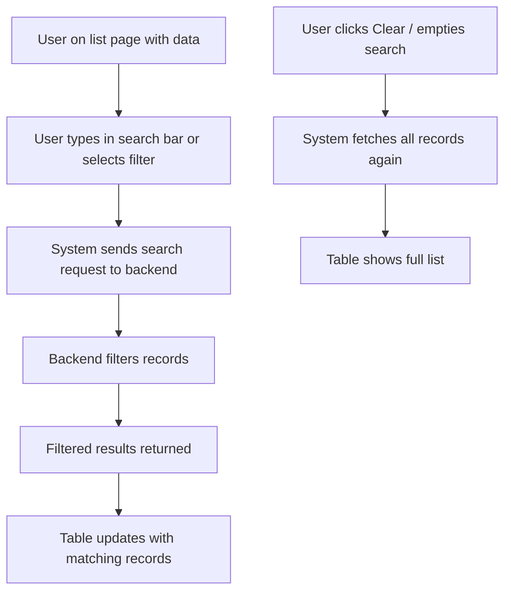
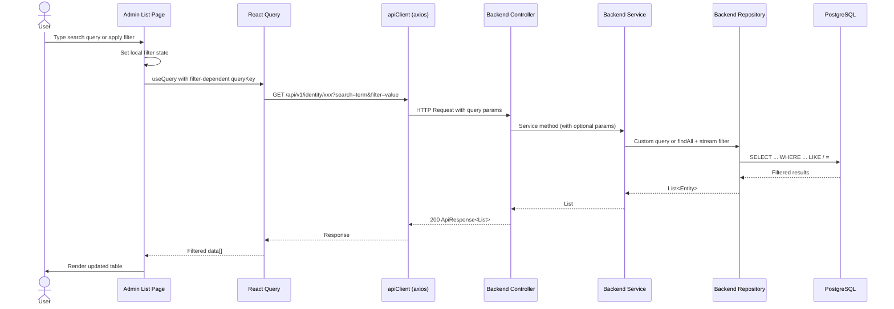
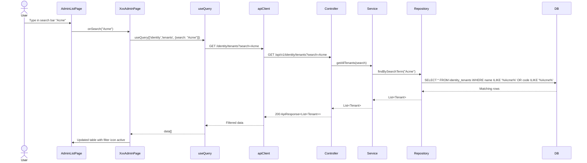

# Flow: Search & Filter (List View)

## Simple Instructions *(for non-developers)*

### What happens here?
This is how you find specific records in a list by searching or applying filters. You type in a search box or select from filter options, and the list narrows down to show only matching records.

### Step-by-step *(what the user sees)*

1. You are on a **list page** (e.g., Tenants, Users) with many records.
2. You type a **search term** in the search bar (e.g., a name or code).
3. As you type (or after clicking Search), the list updates to show only matching records.
4. You can also use **filter dropdowns** to narrow by status, date, or other criteria.
5. To clear the search, empty the search box or click a **Clear** button.

### Diagram *(overview for non-developers)*



### Common issues
| Problem | What to do |
|---------|-------------|
| Searching does nothing | The search feature may not be implemented yet for this list. Try refreshing the page. |
| Search results are slow | The search is querying the database. Try a more specific search term. |
| Filters reset when leaving the page | This is expected — filters are not saved between sessions. |

---

## Sequence Diagram



## Current Implementation Status

The current admin list pages (Tenants, Users, Roles, etc.) use **client-side filtering via React Query** rather than server-side search/filter. The architecture supports server-side filtering through query parameters, but the current implementation pattern is:

### Client-Side Pattern (Current)

1. All data is fetched once via `useQuery(['identity', 'tenants'])` for `GET /identity/tenants`
2. The `AdminListPage` component receives the full `data[]` array
3. No search bar or filter controls are currently implemented in `AdminListPage`
4. The backend controllers accept `@RequestParam` parameters for some endpoints but no search/filter UI is wired yet

### Backend Query Parameter Support

Some backend endpoints already support query parameters:

| Endpoint | Query Params | Purpose |
|----------|-------------|---------|
| `GET /identity/organizations` | (none currently) | Access scope filtered |
| `GET /identity/organizations/tree/{tenantId}` | `tenantId` path var | Tree by tenant |
| `GET /identity/companies/by-org/{orgId}` | `orgId` path var | Filter by org |
| `GET /identity/branches/by-company/{companyId}` | `companyId` path var | Filter by company |
| `GET /identity/departments/by-branch/{branchId}` | `branchId` path var | Filter by branch |

## Planned Architecture for Server-Side Search



## React Query Cache Strategy

When server-side search is implemented, query keys should include filter parameters:

```typescript
// Current
useQuery({ queryKey: ['identity', 'tenants'] })

// With search filter
useQuery({ queryKey: ['identity', 'tenants', { search: 'Acme', status: 'ACTIVE' }] })
```

This ensures:
- Different filter combinations get their own cache entries
- Changing filters triggers a new fetch
- `queryClient.invalidateQueries({ queryKey: ['identity', 'tenants'] })` clears all tenant-related caches

## Current Filtering Gaps

| Feature | Status |
|---------|--------|
| Search bar in AdminListPage | Not implemented |
| Column sorting (client-side) | Not implemented |
| Column sorting (server-side) | Not implemented |
| Pagination | Not implemented (all rows returned) |
| Date range filter | Not implemented |
| Status filter (Active/Inactive) | Not implemented |
| Multi-column search | Not implemented |

## Related Modules
- `frontend/modules/identity/admin/AdminListPage.tsx` — the shared list component where filters would be added
- `backend/*/controller/` — controllers where `@RequestParam` search parameters would be added
- `backend/*/repository/` — repositories where custom query methods would be added
- `frontend/core/query/queryKeys.ts` — centralized query key definitions
