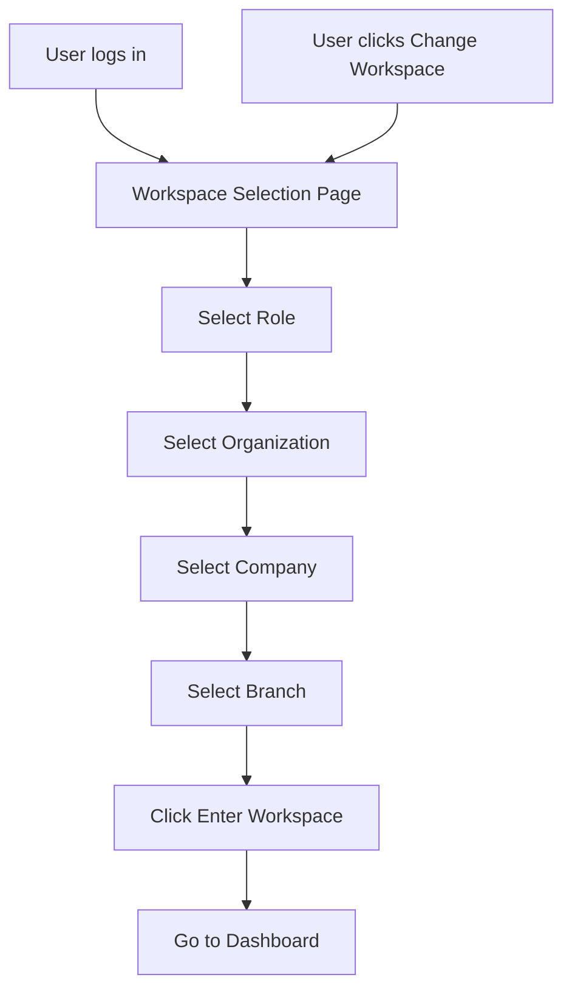
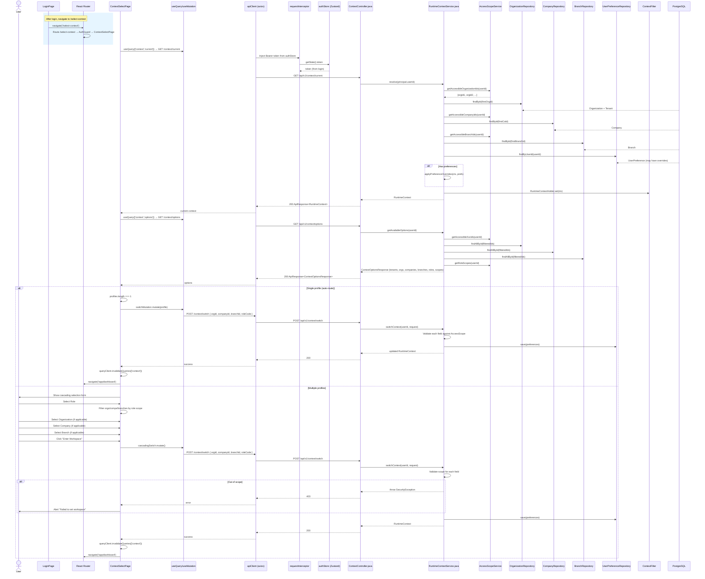

# Flow: Context Selection & Switching

## Simple Instructions *(for non-developers)*

### What happens here?
After you log in (or when you choose to switch workspaces), this flow lets you pick which role, organization, company, and branch you want to work in. The system remembers your choice so you don't have to select every time.

### Step-by-step *(what the user sees)*

1. After logging in, you are taken to the **Select Your Workspace** page.
2. You see a list of **Roles** you can choose from (pick one).
3. Then you pick from cascading dropdowns: **Organization** → **Company** → **Branch** (each choice limits the next one).
4. If there is only one option at any step, the system picks it automatically.
5. You click **Enter Workspace** to confirm.
6. You are taken to the **Dashboard** with your chosen workspace active.
7. To switch later, click your user icon in the top bar and select **Change Workspace**.

### Diagram *(overview for non-developers)*

### Common issues
| Problem | What to do |
|---------|-------------|
| No options in the dropdowns | You may not have any roles assigned. Contact your system administrator. |
| The system automatically picks the wrong options | If there is only one option, it is auto-selected. If multiple, make sure to pick the right ones manually. |
| "Failed to set workspace" error | You may have selected something outside your allowed scope. Try different options. |
| Can't find the "Change Workspace" option | Click your user icon (top-right corner) and look for it in the dropdown menu. |

---

## Sequence Diagram

## Trigger
After successful login, the system navigates to `/select-context`. Alternatively, the `ContextGuard` redirects here if no context is currently selected.

## Preconditions
- User is authenticated (has valid JWT)
- `AuthGuard` has verified `isAuthenticated === true`
- User has at least one role assignment in `identity_user_roles`

## Flow Steps

### Step 1: Page loads
- **File:** `frontend/src/modules/identity/context/ContextSelectPage.tsx:64`
- Component mounts, reads `user` from `useAuthStore((s) => s.user)`

### Step 2: Fetch current context
- **File:** `frontend/src/modules/identity/context/ContextSelectPage.tsx:76-82`
- `useQuery(['context', 'current'])` → `GET /context/current`
- Backend resolves default context from access scope + user preferences
- Returns `RuntimeContext` with tenant/org/company/branch IDs and role codes

### Step 3: Fetch available options
- **File:** `frontend/src/modules/identity/context/ContextSelectPage.tsx:86-97`
- `useQuery(['context', 'options-for-select'])` → `GET /context/options`
- Backend returns all accessible tenants, organizations, companies, branches, departments, roles, and per-role scope maps

### Step 4: Compute accessible scopes
- **File:** `frontend/src/modules/identity/context/ContextSelectPage.tsx:100-145`
- When user selects a role, `roleScope` is looked up from `options.roleScopes[selectedRole]`
- `RoleScope` contains: `fullAccess` (boolean), `organizationIds[]`, `companyIds[]`, `branchIds[]`
- Filtered orgs/companies/branches computed by intersecting available options with scoped IDs

### Step 5: Auto-route detection
- **File:** `frontend/src/modules/identity/context/ContextSelectPage.tsx:148-204`
- Profiles computed: cartesian product of accessible orgs × companies × branches × role
- If exactly 1 profile: auto-select all values, call `switchMutation.mutate(profile)`, skip the selection UI entirely
- `switchMutation` on success: invalidates context queries, navigates to `/app/dashboard`

### Step 6: Manual selection (multiple profiles)
- **File:** `frontend/src/modules/identity/context/ContextSelectPage.tsx:292-438`
- Cascading selects: Role → auto-filled Tenant → Organization → Company → Branch
- Each selection filters downstream options
- Auto-select when only one option available at any level
- "Enter Workspace" button triggers `cascadingSwitch.mutate()`

### Step 7: Context switch to backend
- **File:** `backend/src/main/java/com/erp/platform/identity/service/RuntimeContextService.java:254-332`
- `switchContext(userId, request)` resolves current context, overlays requested fields
- Each field validated against `AccessScopeService` — throws `SecurityException` if out of scope
- Persists selections to `UserPreference` (active tenant/org/company/branch/dept/role IDs)
- Sets updated context in `RuntimeContextHolder`

### Step 8: Navigate to dashboard
- **File:** `frontend/src/modules/identity/context/ContextSelectPage.tsx:218-221` and `184-187`
- On success: `queryClient.invalidateQueries({ queryKey: ['context'] })` → `navigate('/app/dashboard')`

## Postconditions
- `RuntimeContextHolder` has active context for the request thread
- `UserPreference` updated with active role and hierarchy IDs
- Frontend React Query cache invalidated for context queries
- User is on `/app/dashboard` within the AppLayout

## Error Flows

### Context Options Load Failure
- **Condition:** `GET /context/options` fails
- **Frontend:** `ContextSelectPage` renders error card with "Go to Dashboard" fallback button (line 264-284)

### Out-of-Scope Selection
- **Condition:** User attempts to select an org/company/branch not in their role scope
- **Backend:** `switchContext()` throws `SecurityException("Organization not in role scope")` etc.
- **Frontend:** `cascadingSwitch.onError` sets `switchError` → Alert displayed

### Invalid Role
- **Condition:** User selects a role they don't have
- **Backend:** Throws `SecurityException("User does not have this role")`
- **Frontend:** Error alert shown

### Auto-route Failure
- **Condition:** Single-profile auto-switch fails
- **Frontend:** `switchMutation.onError` sets `switchError` → falls back to manual selection UI
