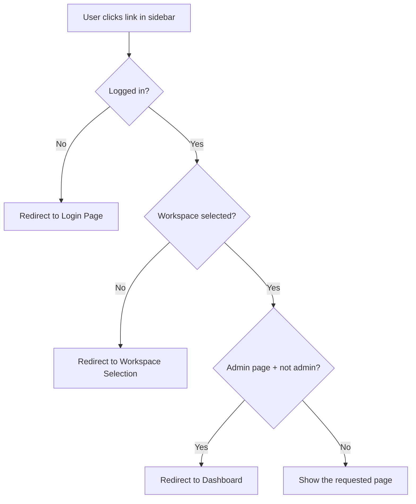
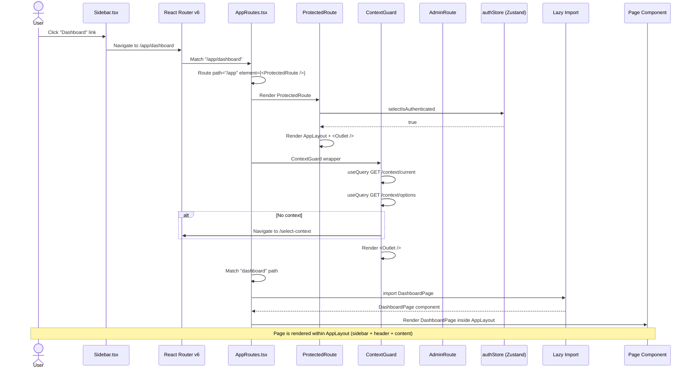
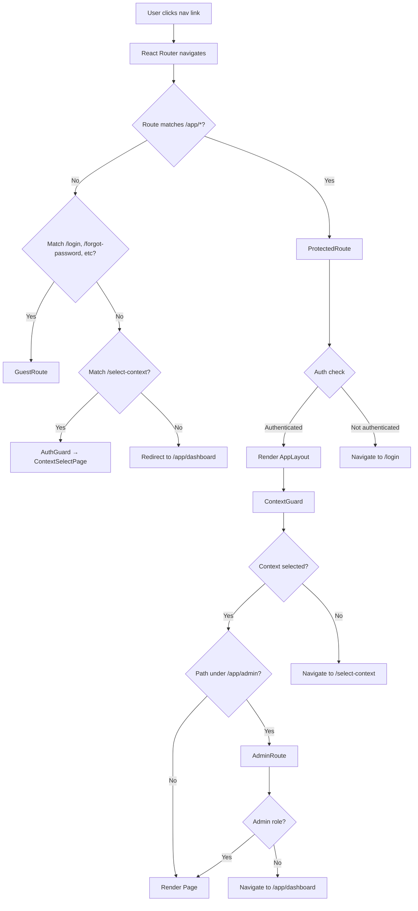

# Flow: Navigation

## Simple Instructions *(for non-developers)*

### What happens here?
This is what happens every time you click a link in the sidebar or type a URL. The system checks that you are logged in, that your workspace is selected, that you have permission to see the page, and then shows it to you.

### Step-by-step *(what the user sees)*

1. You click a **link** in the sidebar (e.g., "Dashboard", "Tenants", "Users").
2. If you are **not logged in**, you are sent to the **Login** page.
3. If you are logged in but **no workspace** is selected, you are sent to the **Workspace Selection** page.
4. If you try to visit an **admin page** without admin rights, you are redirected to the **Dashboard**.
5. If everything is fine, the **page loads** inside the main content area.
6. The sidebar and header stay visible the whole time.

### Diagram *(overview for non-developers)*



### Common issues
| Problem | What to do |
|---------|-------------|
| Clicking a link sends you to the login page | Your session expired. Log in again. |
| Clicking a link sends you to Workspace Selection | Your workspace context was lost. Just select it again. |
| Admin page shows Dashboard instead | You don't have admin permissions. Contact your system administrator. |
| Page never finishes loading (spinner keeps spinning) | Try refreshing the page. If it persists, the server may be down. |

---

## Sequence Diagram



## Route Resolution Flow



## Trigger
User clicks any navigation link in the sidebar, header, or performs programmatic navigation.

## Preconditions
- App is loaded and hydrated
- React Router v6 BrowserRouter is active

## Flow Steps

### Step 1: User clicks navigation link
- **File:** `frontend/src/components/layouts/Sidebar/`
- Sidebar renders `<Link to="/app/admin/tenants">Tenants</Link>` or similar
- Click triggers React Router navigation

### Step 2: React Router matches route
- **File:** `frontend/src/routes/AppRoutes.tsx:80-152`
- Route structure defined with nested `<Route>` components
- `/app` is the parent wrapped by `ProtectedRoute`
- Child routes use `index` for default redirects and named `path` for specific pages

### Step 3: ProtectedRoute guard
- **File:** `frontend/src/core/router/guards/ProtectedRoute.tsx:9-44`
- Waits for Zustand persistence hydration (spinner if not yet hydrated)
- Reads `isAuthenticated` — if false, redirects to `/login`
- If true, renders `AppLayout` with `<Outlet />` for nested child routes

### Step 4: ContextGuard check
- **File:** `frontend/src/core/router/guards/ContextGuard.tsx:28-80`
- Fires two React Query calls:
  - `GET /context/current` — current RuntimeContext
  - `GET /context/options` — available workspaces
- Checks if any required context level is missing (tenant, org, company, branch, role)
- If missing → redirect to `/select-context`
- If complete → render child routes

### Step 5: AdminRoute (if applicable)
- **File:** `frontend/src/core/router/guards/AdminRoute.tsx:5-12`
- Only fires for paths under `/app/admin`
- Checks if `user.roles` includes `sys_admin` or `tnt_admin`
- If not → redirect to `/app/dashboard`

### Step 6: Page component renders
- Component is imported at the top of `AppRoutes.tsx` (currently synchronous imports)
- Component renders inside `<AppLayout>` → `ContentArea` or `PageContainer`

## Error Flows

### Not Authenticated
- **Condition:** Token expired, session cleared
- **Guard:** `ProtectedRoute` → redirects to `/login`
- **AuthStore:** `isAuthenticated === false`

### No Context Selected
- **Condition:** Fresh login, or context was cleared
- **Guard:** `ContextGuard` → redirects to `/select-context`

### Insufficient Permissions
- **Condition:** Non-admin user tries `/app/admin/*`
- **Guard:** `AdminRoute` → redirects to `/app/dashboard`

### Unknown Route
- **Condition:** User navigates to non-existent path
- **Router:** `path="*"` fallback → redirects to `/app/dashboard`

## Component Hierarchy After Successful Navigation

```
<App>
  <AppRoutes>
    <ProtectedRoute>
      <AppLayout>
        <Sidebar />          ← left navigation (persistent)
        <Header />           ← top bar (persistent)
        <ContentArea>
          <Outlet>
            <ContextGuard>
              <RouteElement>
                <TenantsAdminPage />   ← requested page
              </RouteElement>
            </ContextGuard>
          </Outlet>
        </ContentArea>
      </AppLayout>
    </ProtectedRoute>
  </AppRoutes>
</App>
```
