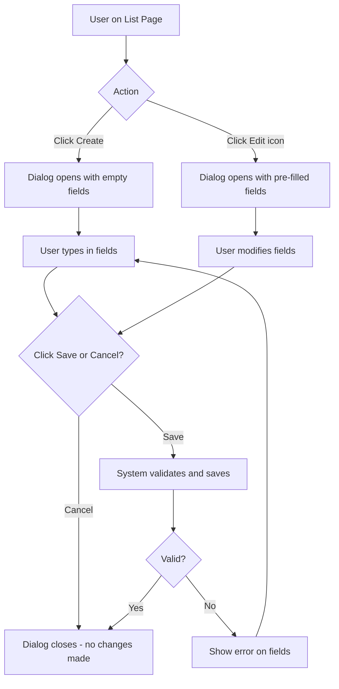
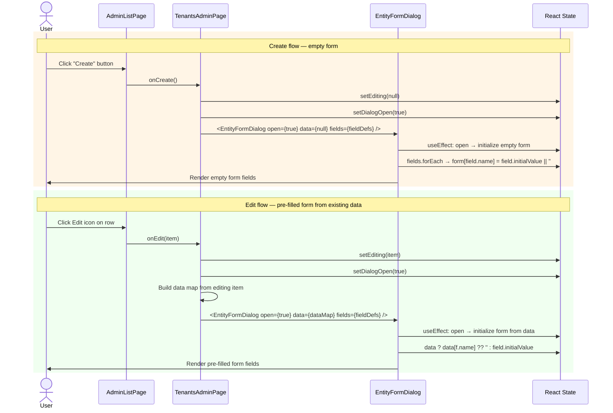

# Flow: Open Form (Create / Edit Dialog)

## Simple Instructions *(for non-developers)*

### What happens here?
This is what happens when you click "Create" or "Edit" on a list page. A form dialog pops up with fields for you to fill in. If you are editing, the fields are already filled with the existing data.

### Step-by-step *(what the user sees)*

1. You are on a **list page** (e.g., Tenants, Users).
2. You click the **Create** button to add a new record.
3. A **form dialog** pops up on top of the list, showing empty fields.
4. Alternatively, you click the **Edit** (pencil) icon on a row.
5. The same form dialog pops up, but this time the fields are **pre-filled** with the existing data.
6. You fill in or modify the fields.
7. Click **Save** to submit, or **Cancel** to close without saving.

### Diagram *(overview for non-developers)*



### Common issues
| Problem | What to do |
|---------|-------------|
| The dialog does not open when clicking Create/Edit | Try refreshing the page. If it persists, it may be a bug. |
| Pre-filled data looks wrong | The data was loaded from the database. If it is incorrect, edit and save the correct values. |
| Fields are grayed out or not editable | Those fields may be read-only. You cannot change them. |

---

## Sequence Diagram



## Form Field Rendering Flow

```mermaid
graph TD
  A[EntityFormDialog receives fields prop] --> B{field.type?}
  B -->|text| C[MUI TextField]
  B -->|email| D[MUI TextField type=email]
  B -->|password| E[MUI TextField type=password]
  B -->|select| F[TextField select + MenuItem options]
  B -->|checkbox| G[FormControlLabel + Checkbox]
  B -->|textarea| H[TextField multiline]
  B -->|number| I[TextField type=number]
  B -->|date| J[TextField type=date]
  B -->|url| K[TextField type=url]
  B -->|tel| L[TextField type=tel]

  F --> M{allowNone?}
  M -->|Yes| N[Add "<none>" empty option]
  M -->|No| O[Standard options only]

  G --> P{initialValue?}
  P -->|"true"| Q[checked=true]
  P -->|"false"| R[checked=false]

  C & D & E & H & I & J & K & L --> S{required?}
  S -->|Yes| T[required=true + validation]
  
  T --> U[FormHelperText on empty submit]
```

## Trigger
User clicks "Create" button (empty form) or "Edit" icon on a row (pre-filled form) on an admin list page.

## Preconditions
- User is on an admin list page
- For edit: a record exists and was selected
- User has admin role

## Flow Steps

### Step 1: Page opens dialog
- **File:** `frontend/src/modules/identity/admin/tenants/TenantsAdminPage.tsx:66-74`
- `handleCreate()`: `setEditing(null)`, `setDialogOpen(true)`
- `handleEdit(item)`: `setEditing(item)`, `setDialogOpen(true)`

### Step 2: EntityFormDialog receives props
- **File:** `frontend/src/components/dialogs/EntityFormDialog.tsx:50`
- Props: `open`, `title`, `fields: FieldDef[]`, `data: Record<string,string> | null`, `onClose`, `onSave`

### Step 3: Form initialization
- **File:** `frontend/src/components/dialogs/EntityFormDialog.tsx:56-68`
- `useEffect` triggers when `open` becomes true:
  - **Create mode** (`data === null`): builds empty form from `fields[].initialValue`
  - **Edit mode** (`data !== null`): pre-fills from existing data keys

### Step 4: Field rendering
- **File:** `frontend/src/components/dialogs/EntityFormDialog.tsx:80-170`
- Each `FieldDef` rendered based on its `type`:
  - `text`, `email`, `password`, `url`, `tel` → `<TextField>`
  - `textarea` → `<TextField multiline rows={}>`
  - `select` → `<TextField select>` with `<MenuItem>` children
  - `checkbox` → `<FormControlLabel control={<Checkbox />}>`
  - `date`, `datetime`, `time` → `<TextField type="date">`
  - `number` → `<TextField type="number">`

### Step 5: Validation
- **File:** `frontend/src/components/dialogs/EntityFormDialog.tsx:143-148`
- On submit, checks `required` fields are non-empty
- Shows `FormHelperText` error for each missing required field
- Prevents `onSave` call until validation passes

### Step 6: FieldDef structure
- **File:** `frontend/src/components/dialogs/EntityFormDialog.tsx:17-39`
```typescript
interface FieldDef {
  name: string;           // form field key
  label: string;          // display label
  type?: 'text'|'email'|'password'|'select'|'date'|'datetime'|'time'|'number'|'url'|'tel'|'textarea'|'checkbox';
  options?: { value: string; label: string }[];  // for 'select' type
  required?: boolean;
  initialValue?: string;
  allowNone?: boolean;    // adds "<none>" option to select
  rows?: number;          // for 'textarea'
  placeholder?: string;
}
```

### Step 7: Example — Tenant Form Fields
- **File:** `frontend/src/modules/identity/admin/tenants/TenantsAdminPage.tsx:37-51`
```typescript
const fields: FieldDef[] = [
  { name: 'code', label: 'Code', required: true },
  { name: 'name', label: 'Name', required: true },
  { name: 'domain', label: 'Domain' },
  { name: 'isActive', label: 'Status', type: 'select', initialValue: 'true',
    options: [{ value: 'true', label: 'Active' }, { value: 'false', label: 'Inactive' }] },
];
```

## Postconditions
- Form dialog is displayed with fields initialized
- User can fill/modify fields and submit (which triggers `flow-save-record`)

## Error Flows

### Field Validation
- **Condition:** Required field left empty on submit
- **Frontend:** `EntityFormDialog` checks required fields, shows `FormHelperText` below each invalid field
- Submit is blocked until all required fields have values
