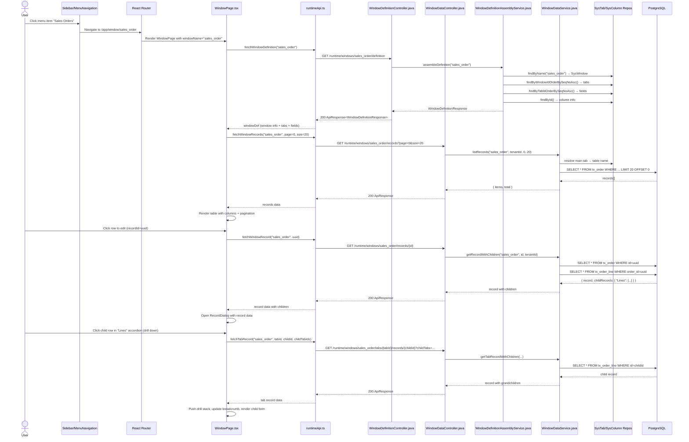

# Flow: Open Window (PRD-004 Window Page)

## Simple Instructions *(for non-developers)*

### What happens here?
This is what happens when you click a menu item in the sidebar to open a data management screen (like "Sales Orders" or "Products"). The system loads the window definition from the database, fetches the records, and shows them in a table. You can then create, edit, or delete records.

### Step-by-step *(what the user sees)*

1. You click a **menu item** in the sidebar (e.g., **Sales Orders**, **Products**).
2. The browser URL changes to `/app/window/{windowName}`.
3. A **loading spinner** appears while the system fetches the window structure and data.
4. The page shows a **table with records** and action buttons at the top (**New**, **Refresh**).
5. If the window has multiple top-level tabs (e.g., "Header" and "Lines"), they appear as **tab buttons** above the table.
6. Click a **row** to open a detail dialog for editing, or click **New** to create a record.
7. Inside the dialog, child records (if any) appear as **expandable accordion panels**. Click a child row to drill down.
8. A **breadcrumb trail** at the top shows your navigation path through the record hierarchy.

### Diagram *(overview for non-developers)*

```mermaid
graph TD
  A[User clicks menu item] --> B[URL: /app/window/{name}]
  B --> C{Load window definition}
  C -->|Loading| D[Show spinner]
  D --> C
  C -->|Success| E{Load records from API}
  C -->|Error| F[Show error: Window not found]
  E -->|Loading| G[Show spinner]
  G --> E
  E -->|Success| H[Render table with records]
  E -->|Error| I[Show error + Retry button]
  
  H --> J{User action}
  J -->|Click New| K[Open empty RecordDialog]
  J -->|Click row| L[Open prefilled RecordDialog]
  J -->|Click Delete| M[Confirm and delete]
  J -->|Click Refresh| N[Reload window + records]
  
  K --> O[Fill fields + Save]
  L --> O
  O --> P[Record saved, list refreshes]
  
  L --> Q{Has child tabs?}
  Q -->|Yes| R[Expand accordion panels]
  R --> S[Click child row → Drill down]
  S --> T[Breadcrumb updates]
  T --> U[Edit child fields + Save]
  U --> V[Child record saved]
```

### Common issues
| Problem | What to do |
|---------|-------------|
| "Window not found" error | The window may not exist, or the URL is wrong. Check the menu item configuration. |
| Table shows no records | Try clicking **Refresh**. If still empty, no records exist yet. |
| Dropdown field has no options | The related table may have no records. Create records in the referenced table first. |
| Drill-down breadcrumb is wrong | Each drill level shows `TabName (DisplayValue)`. Click any breadcrumb part to go back. |
| Cannot edit child records inline | Toggle **Quick Update** mode in the child grid to enable inline editing. |

---

## Sequence Diagram *(technical)*



---

## Trigger
User clicks a menu item in the sidebar that is configured to link to a window.

---

## Preconditions
- User is authenticated and has a workspace context selected
- The window is registered in `sys_window` with name matching the menu link
- The user's role has access to the window (via `sys_window_access`)
- The window's assigned table (`sys_table`) and its columns (`sys_column`) exist
- The window has at least one top-level tab (no `parentColumn`)

---

## Flow Steps *(technical)*

### Step 1: Menu Click and Navigation
- **File:** `frontend/src/core/runtime/components/MenuNavigation.tsx:40-80`
- User clicks a menu item that has `type=WINDOW` and `windowName` set
- React Router navigates to `/app/window/{windowName}`

### Step 2: WindowPage Mounts
- **File:** `frontend/src/routes/window/WindowPage.tsx:737-935`
- Extracts `windowName` from `useParams`
- Fires two React Query calls in parallel:
  - `fetchWindowDefinition(windowName)` — gets the window structure
  - `fetchWindowRecords(windowName, page, size)` — gets the paginated record list

### Step 3: Window Definition Request
- **HTTP:** `GET /api/v1/runtime/windows/{windowName}/definition`
- **Called from:** `frontend/src/core/runtime/api/runtimeApi.ts:10-25`
- **Backend:** `WindowDefinitionController.getWindowDefinition()` (file: `WindowDefinitionController.java:75-110`)
- **Service:** `WindowDefinitionAssemblyService.assembleDefinition(windowName)` (file: `WindowDefinitionAssemblyService.java:62-84`)
- **Response:** `WindowDefinitionResponse { window: {id, name, tableId, description}, tabs: [{id, name, table, seqNo, whereClause, parentColumn, fields: [...]}] }`
- **Cache:** ETag-based caching (`If-None-Match` → 304 Not Modified); `Cache-Control: max-age=300`

### Step 4: Record List Request
- **HTTP:** `GET /api/v1/runtime/windows/{windowName}/records?page=0&size=20`
- **Called from:** `frontend/src/core/runtime/api/runtimeApi.ts:27-40`
- **Backend:** `WindowDataController.listRecords()` (file: `WindowDataController.java:62-85`)
- **Service:** `WindowDataService.listRecords()` — resolves main tab's table name, builds and executes dynamic SQL with pagination
- **Tables hit:** The main tab's table (e.g., `tx_order` for Sales Orders)
- **Response:** `{ items: [...], total: N }`

### Step 5: Render Record List
- **File:** `frontend/src/routes/window/WindowPage.tsx:793-924`
- Displays top-level tabs as MUI `<Tabs>` if multiple exist
- Renders records in a table with columns from the active tab's displayed fields
- Pagination at bottom (20 rows per page)
- New/Refresh buttons in toolbar

### Step 6: Open Record for Edit
- **HTTP:** `GET /api/v1/runtime/windows/{windowName}/records/{id}`
- **Backend:** `WindowDataController.getRecord()` (file: `WindowDataController.java:90-111`)
- **Service:** `WindowDataService.getRecordWithChildren()` — fetches the main record from the main tab's table + child records from all child tab tables
- **Tables hit:** Main tab table + all child tab tables (e.g., `tx_order` + `tx_order_line`)

### Step 7: Record Dialog — Drill Down
- **File:** `frontend/src/routes/window/WindowPage.tsx:69-549`
- When user clicks a child record row, `handleDrillDown()` pushes a new `DrillLevel` onto the `drillStack`
- A new React Query fetches the child record via `fetchTabRecord()` → `WindowDataController.getTabRecord()`
- Breadcrumb updates to show the navigation path: `WindowName > TabName (DisplayValue)`

### Step 8: Save (Create/Update)
- **HTTP:** `POST /api/v1/runtime/windows/{windowName}/records` or `PUT /.../records/{id}`
- **Backend:** `WindowDataController.createRecord()` or `updateRecord()` (file: `WindowDataController.java:164-215`)
- **Service:** `WindowDataService.createRecord()` / `updateRecord()` — validates, sets tenant_id, executes INSERT/UPDATE
- **Post-save:** Frontend invalidates all window caches (`['window-records', windowName]`, `['window-record', windowName]`, `['window-definition', windowName]`)

---

## Postconditions
- Record list is refreshed with the latest data after save/delete
- Window definition is cached (5 min, ETag-based) on the backend
- For drill-down: breadcrumb stack is reset when opening a different root record

---

## Error Flows

### Window Not Found
- **Condition:** Window name does not match any `sys_window` entry
- **Backend response:** 404 `{ errorCode: "NOT_FOUND", message: "Window not found: {name}" }`
- **Frontend behavior:** `WindowPage` renders error message "Could not load '{windowName}'"

### Unauthenticated
- **Condition:** No valid JWT token or no RuntimeContext
- **Backend response:** 401 `{ errorCode: "UNAUTHORIZED", message: "Authentication required." }`
- **Frontend behavior:** API interceptor calls `authStore.logout()` and redirects to `/login`

### Record Not Found (when editing)
- **Condition:** Record ID does not exist or has been soft-deleted
- **Backend response:** 404 `{ errorCode: "NOT_FOUND", message: "Record not found." }`
- **Frontend behavior:** Record dialog shows error message "Failed to load record: ..."

### Validation Error on Save
- **Condition:** Required fields missing or type mismatch
- **Backend response:** 400 `{ errorCode: "VALIDATION_ERROR", message: "..." }`
- **Frontend behavior:** Record dialog shows save error in a red banner at the top
