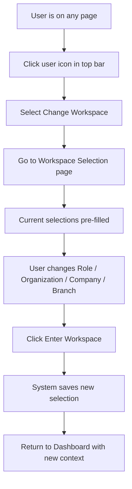
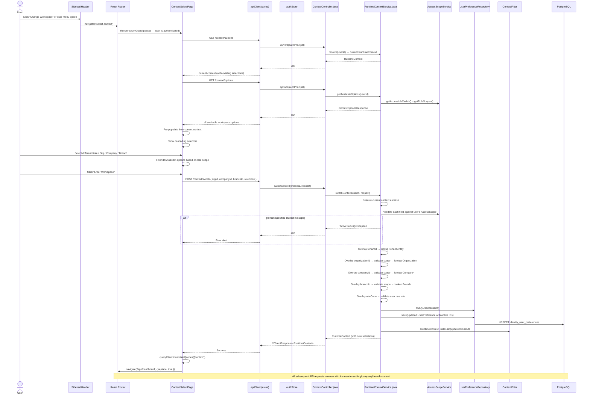

# Flow: Tenant Switch (Workspace Context Change)

## Simple Instructions *(for non-developers)*

### What happens here?
This is what happens when you decide to switch to a different workspace — for example, changing from one company to another, or taking on a different role within the same company. It lets you change your active context without logging out.

### Step-by-step *(what the user sees)*

1. You are working in the system and want to **switch to a different workspace**.
2. You click your **user icon** in the top-right corner.
3. From the dropdown menu, you select **Change Workspace**.
4. You are taken back to the **Select Your Workspace** page.
5. The page shows your **current selections** pre-filled.
6. You pick a different **Role**, **Organization**, **Company**, or **Branch** from the dropdowns.
7. You click **Enter Workspace**.
8. The system saves your new choice and takes you back to the **Dashboard**.
9. From now on, all the data you see will be scoped to the new workspace.

### Diagram *(overview for non-developers)*

### Common issues
| Problem | What to do |
|---------|-------------|
| "Change Workspace" option is missing | Click your user icon in the top-right corner. If it is still missing, contact your admin. |
| After switching, the same data shows | Try refreshing the page. The system should now show data scoped to the new workspace. |
| You cannot select a specific company/branch | Your role may not have access to that company or branch. |
| The switch did not take effect | Try switching again. If it persists, log out and log back in. |

---

## Sequence Diagram

## Trigger
User clicks "Change Workspace" in the sidebar/header, or the ContextGuard redirects to `/select-context` because the current context is incomplete.

## Preconditions
- User is authenticated
- User has at least one role assigned
- The workspace options endpoint is accessible

## Flow Steps

### Step 1: Navigate to context selection
- **File:** `frontend/src/components/layouts/Header/`
- User triggers "Change Workspace" or similar action
- Navigates to `/select-context`

### Step 2: Load current context
- **File:** `frontend/src/modules/identity/context/ContextSelectPage.tsx:76-82`
- `GET /context/current` → shows existing tenant/org/company/branch/role if any
- Used to pre-populate the selection form

### Step 3: Load available options
- **File:** `frontend/src/modules/identity/context/ContextSelectPage.tsx:86-97`
- `GET /context/options` → all accessible workspaces and role scopes

### Step 4: User selects new context
- **File:** `frontend/src/modules/identity/context/ContextSelectPage.tsx:340-414`
- **Role selector** — dropdown of assigned roles
- **Tenant** — auto-populated from role scope (no dropdown needed, displayed as disabled field)
- **Organization** — filtered by tenant + role scope
- **Company** — filtered by selected organization + role scope
- **Branch** — filtered by selected company + role scope
- Cascading: changing any selector resets downstream selectors
- Auto-select: if only one option at any level, auto-selects it

### Step 5: Submit context switch
- **File:** `frontend/src/modules/identity/context/ContextSelectPage.tsx:207-225`
- `POST /context/switch` with `{ organizationId, companyId, branchId, roleCode }`
- Backend validates ALL fields against `AccessScopeService`

### Step 6: Backend validates and persists
- **File:** `backend/src/main/java/com/erp/platform/identity/service/RuntimeContextService.java:254-332`
- Each field (org, company, branch) validated against user's accessible IDs from `AccessScopeService`
- Role validated against `UserRoleRepository` assignments
- On success: writes to `UserPreference` (active tenant, org, company, branch, department, role)
- Updates `RuntimeContextHolder` (thread-local)

### Step 7: Return to dashboard
- **File:** `frontend/src/modules/identity/context/ContextSelectPage.tsx:218-221`
- Invalidate all React Query `['context']` cache entries
- Navigate to `/app/dashboard`
- ContextGuard on dashboard will now see the new context and allow access

### Step 8: Subsequent requests use new context
- Backend `ContextFilter` resolves `RuntimeContext` from `UserPreference` on each request
- All data queries are scoped to the new tenant/org/company/branch

## Postconditions
- `UserPreference` updated with new active context IDs
- `RuntimeContextHolder` has new context for current thread
- Frontend React Query context cache invalidated
- All subsequent API calls run under the new tenant/org/company/branch scope
- Data in admin pages reflects the new context

## Error Flows

### Out-of-Scope Selection
- **Condition:** User tries to select an organization outside their role scope
- **Backend:** `SecurityException("Organization not in role scope")` → 403
- **Frontend:** Error alert displayed

### Role Not Assigned
- **Condition:** User tries to switch to a role they don't have
- **Backend:** `SecurityException("User does not have this role")` → 403
- **Frontend:** Error alert displayed

### Tenant Not Found
- **Condition:** Invalid tenantId in request
- **Backend:** `IllegalArgumentException("Tenant not found")` → 400
- **Frontend:** Error alert displayed

### Options Load Failure
- **Condition:** `GET /context/options` fails (network, auth)
- **Frontend:** `ContextSelectPage` line 264-284 — error card with "Go to Dashboard" fallback

## Relationship with ContextGuard

After tenant switch, when user navigates to any `/app/*` page:
1. `ContextGuard` fires `GET /context/current` and `GET /context/options`
2. Current context now has the newly-selected tenant/org/company/branch/role
3. `needsContext` check passes → user proceeds to the requested page
4. If any required level is missing after switch, they're redirected back to `/select-context`
