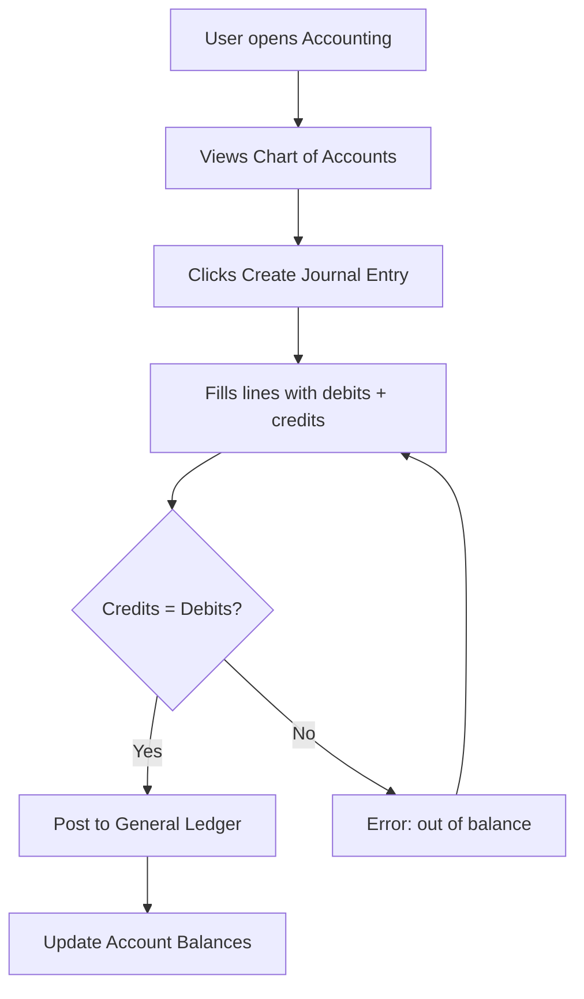

# Accounting

## Purpose
Manages the general ledger chart of accounts, journal entries, account balances, and the double-entry posting engine. Provides the financial accounting backbone for all monetary transactions in the ERP.

---

## Simple Instructions *(for non-developers)*

### What is this?
This is the accounting system. It keeps track of all financial transactions — money coming in and going out. Every sale, purchase, or payment creates entries in the general ledger using double-entry bookkeeping.

### What can you do here?
- View the **Chart of Accounts** (list of all account codes and names)
- Create **Journal Entries** to record financial transactions
- View **Account Balances** to see how much money is in each account
- Generate financial reports from the ledger

### How to use it
1. Go to **Accounting > Chart of Accounts** to see all accounts.
2. To record a transaction, go to **Accounting > Journal Entry** and click **Create**.
3. Enter the **Debit** and **Credit** amounts for each line — they must balance.
4. Click **Post** to commit the entry to the general ledger.
5. View **Account Balances** to see updated totals.

### Diagram

### Common issues
| Problem | Solution |
|---------|----------|
| "Journal entry is out of balance" | The total debits must equal total credits. Check all line amounts. |
| Cannot find an account | Accounts are organized by code. Use the search or filter by account type. |
| Cannot delete a posted entry | Posted entries are locked. Create a reversing entry instead. |

---

## Key Classes *(developers)*

| Class | Role |
|-------|------|
| `AccountController` | REST CRUD for chart of accounts |
| `JournalEntryController` | REST endpoints for journal entry creation, posting, and listing |
| `AccountService` | Business logic for account CRUD, hierarchy management |
| `JournalEntryService` | Journal entry creation, validation, and posting |
| `GeneralLedgerService` | General ledger querying and reporting |
| `PostingEngine` | Double-entry posting engine — validates balance, creates ledger entries, updates account balances |

## API Endpoints

| Method | Path | Handler | Auth |
|--------|------|---------|------|
| GET | `/api/v1/accounts` | `AccountController.list()` | JWT |
| POST | `/api/v1/accounts` | `AccountController.create()` | JWT |
| GET | `/api/v1/journal-entries` | `JournalEntryController.list()` | JWT |
| POST | `/api/v1/journal-entries` | `JournalEntryController.create()` | JWT |
| POST | `/api/v1/journal-entries/{id}/post` | `JournalEntryController.post()` | JWT |

## Dependencies
- `BaseService<T>` — generic CRUD with lifecycle hooks
- `BaseEntity` — UUID id, tenant_id, soft-delete, timestamps
- `AccountRepository`, `JournalEntryRepository`, `JournalEntryLineRepository`, `AccountBalanceRepository`

## Related Frontend
- N/A — Accounting is served as a backend API; frontend modules consume via runtime form definitions
