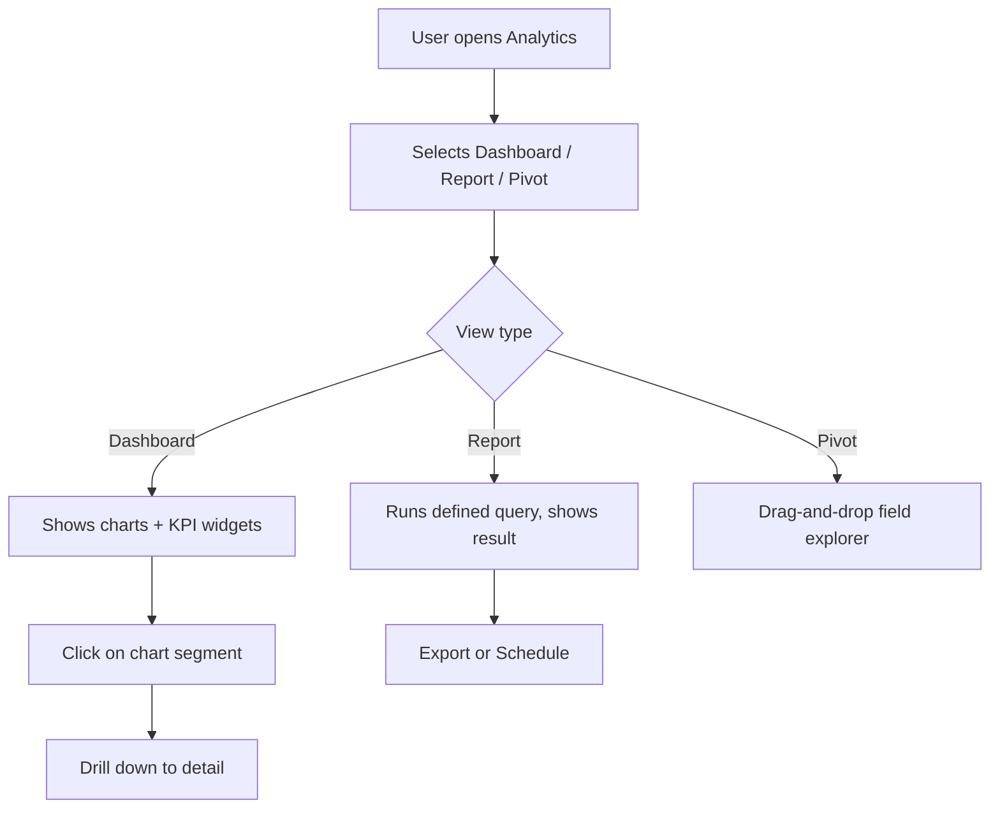

# Analytics

## Purpose
Reporting and business intelligence engine. Provides dashboards, KPI tracking, chart rendering, pivot tables, drill-down analysis, scheduled reports, and an ad-hoc query builder.

---

## Simple Instructions *(for non-developers)*

### What is this?
This is the reporting and analytics system. You can create dashboards that show charts and KPIs, run reports, explore data with pivot tables, and drill down into details. Reports can also be scheduled for automatic delivery.

### What can you do here?
- View **Dashboards** with charts and KPI widgets
- Create and customize **Report Definitions**
- Explore data with **Pivot Tables**
- **Drill Down** from summary data into transaction details
- Schedule reports to run automatically
- Build custom queries with the **Query Builder**

### How to use it
1. Go to **Analytics > Dashboard** to see your saved dashboards.
2. Click **Create Dashboard** to add a new one with charts and KPIs.
3. Use **Reports** to define what data you want and how it is displayed.
4. Use **Pivot** to drag and drop fields for ad-hoc analysis.
5. Click on any chart segment to drill down into detailed data.

### Diagram

### Common issues
| Problem | Solution |
|---------|----------|
| Dashboard shows no data | Check that the source tables have records and data is not filtered out. |
| Report is slow | The query may be scanning many records. Add filters or reduce the date range. |
| Scheduled report did not run | Check the schedule configuration. The scheduler service must be running. |

---

## Key Classes *(developers)*

| Class | Role |
|-------|------|
| `DashboardController` | REST CRUD for dashboards and dashboard widgets |
| `ReportController` | REST CRUD for report definitions and execution |
| `KPIController` | REST endpoints for KPI definitions and values |
| `ChartController` | Chart data generation from report definitions |
| `PivotController` | Pivot table data generation |
| `QueryController` | Ad-hoc query execution |
| `DrillDownController` | Drill-down navigation from summary to detail |
| `ScheduleController` | Report scheduling management |
| `DashboardService` | Dashboard assembly from widgets |
| `ReportEngine` | Report definition compilation and execution |
| `KPIEngine` | KPI value calculation from source data |
| `ChartEngine` | Chart data transformation |
| `PivotEngine` | Pivot table aggregation engine |
| `DrillDownEngine` | Drill-down path resolution |
| `QueryBuilderService` | Dynamic SQL query construction |
| `ReportScheduler` | Scheduled report execution and delivery |

## API Endpoints

| Method | Path | Handler | Auth |
|--------|------|---------|------|
| GET | `/api/v1/dashboards` | `DashboardController.list()` | JWT |
| POST | `/api/v1/dashboards` | `DashboardController.create()` | JWT |
| GET | `/api/v1/reports` | `ReportController.list()` | JWT |
| POST | `/api/v1/reports` | `ReportController.create()` | JWT |
| GET | `/api/v1/reports/{id}/execute` | `ReportController.execute()` | JWT |
| GET | `/api/v1/kpis` | `KPIController.list()` | JWT |
| GET | `/api/v1/kpis/{id}/value` | `KPIController.getValue()` | JWT |
| GET | `/api/v1/pivot` | `PivotController.query()` | JWT |
| GET | `/api/v1/drill-down` | `DrillDownController.drill()` | JWT |
| POST | `/api/v1/schedules` | `ScheduleController.create()` | JWT |
| POST | `/api/v1/query` | `QueryController.execute()` | JWT |

## Dependencies
- `DashboardRepository`, `DashboardWidgetRepository`, `ReportDefinitionRepository`
- `KPIDefinitionRepository`, `ScheduledReportRepository`
- `BaseEntity` — UUID id, tenant_id, soft-delete, timestamps

## Related Frontend
- N/A — Analytics is served as a backend API; consumed via runtime form definitions or dedicated chart components
