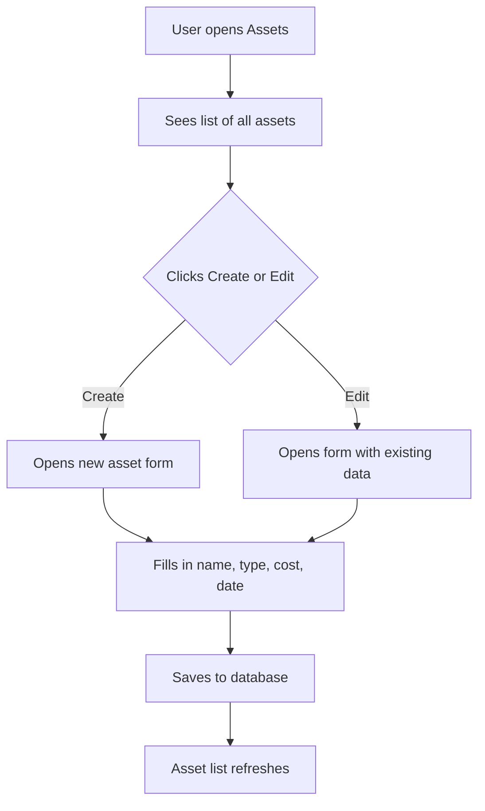

# Assets

## Purpose
Fixed asset management — tracks company-owned assets (equipment, vehicles, property, IT hardware) with acquisition cost, depreciation, location, and status tracking.

---

## Simple Instructions *(for non-developers)*

### What is this?
This is the fixed asset register. Every physical item your company owns that has lasting value — computers, machinery, vehicles, furniture — is recorded here. You can track where it is, what it is worth, and its condition.

### What can you do here?
- Register new assets with purchase details and cost
- Track asset location, condition, and assignment
- View asset history and depreciation
- Decommission or dispose of assets when no longer needed

### How to use it
1. Go to **Assets** in the sidebar.
2. Click **Create Asset** to register a new item.
3. Fill in the **Name**, **Asset Type**, **Purchase Date**, and **Cost**.
4. Assign it to a **Location** or **Employee** if applicable.
5. View the asset list to see all registered items and their status.

### Diagram

### Common issues
| Problem | Solution |
|---------|----------|
| Cannot find an asset | Use the search or filter by status (Active/Disposed). |
| Wrong purchase cost entered | Edit the asset record to correct the cost before depreciation runs. |
| Asset is assigned to wrong person | Update the "Assigned To" field on the asset record. |

---

## Key Classes *(developers)*

| Class | Role |
|-------|------|
| `AssetController` | REST CRUD endpoints for asset management |
| `AssetService` | Business logic for asset registration, updates, decommissioning |
| `Asset` | JPA entity — tracks name, type, purchase date, cost, location, status |
| `AssetRepository` | Spring Data JPA repository with filters for status and type |

## API Endpoints

| Method | Path | Handler | Auth |
|--------|------|---------|------|
| GET | `/api/v1/assets` | `AssetController.list()` | JWT |
| GET | `/api/v1/assets/{id}` | `AssetController.get()` | JWT |
| POST | `/api/v1/assets` | `AssetController.create()` | JWT |
| PUT | `/api/v1/assets/{id}` | `AssetController.update()` | JWT |
| DELETE | `/api/v1/assets/{id}` | `AssetController.delete()` | JWT |

## Dependencies
- `BaseService<T>` — generic CRUD with lifecycle hooks
- `BaseEntity` — UUID id, tenant_id, soft-delete, timestamps
- `AssetRepository`

## Related Frontend
- N/A — Assets is served as a backend API; consumed via runtime form definitions
