# Business Partner

## Purpose
Central party registry for all customers, suppliers, and other business contacts. Stores company details, addresses, and contact persons. Used by sales, purchasing, and accounting modules.

---

## Simple Instructions *(for non-developers)*

### What is this?
This is your company's address book for all the other companies you do business with — customers you sell to, suppliers you buy from, and other contacts. Each business partner can have multiple addresses and contact people.

### What can you do here?
- Create new business partners (customers, suppliers, or both)
- Add multiple addresses (billing, shipping, etc.)
- Store contact persons with phone and email
- Search and filter the partner list
- Link partners to sales orders, purchase orders, and invoices

### How to use it
1. Go to **Business Partners** in the sidebar.
2. Click **Create** to add a new partner.
3. Fill in the **Name**, **Tax ID**, and select the **Type** (Customer, Supplier, or Both).
4. Add **Addresses** and **Contacts** as needed.
5. Click **Save** — the partner is now available for use in orders and invoices.

### Diagram

```mermaid
graph TD
  A[User opens Business Partners] --> B[Sees list of all partners]
  B --> C{Clicks Create or Edit}
  C -->|Create| D[Opens new partner form]
  C -->|Edit| E[Opens form with existing data]
  D --> F[Fills name, type, tax info]
  E --> F
  F --> G[Adds addresses and contacts]
  G --> H[Saves to database]
  H --> I[List refreshes]
```

### Common issues
| Problem | Solution |
|---------|----------|
| Cannot find a partner | Use the search bar or filter by type (Customer/Supplier). |
| "Tax ID already exists" | Each Tax ID must be unique. Verify you are not creating a duplicate. |
| Partner has no addresses | Add at least one address — it is required for shipping and billing. |

---

## Key Classes *(developers)*

| Class | Role |
|-------|------|
| `BusinessPartnerController` | REST CRUD for business partner records |
| `AddressController` | REST CRUD for addresses linked to a partner |
| `BusinessPartnerService` | Business logic — partner creation with address/contact validation |
| `BusinessPartner` | JPA entity — name, tax ID, type (customer/supplier/both), status |
| `Address` | JPA entity — address lines, city, state, postal code, country, type (billing/shipping) |
| `Contact` | JPA entity — name, phone, email, department, linked to a partner |
| `BusinessPartnerRepository` | Spring Data JPA repository with search/filter support |

## API Endpoints

| Method | Path | Handler | Auth |
|--------|------|---------|------|
| GET | `/api/v1/business-partners` | `BusinessPartnerController.list()` | JWT |
| POST | `/api/v1/business-partners` | `BusinessPartnerController.create()` | JWT |
| GET | `/api/v1/business-partners/{id}` | `BusinessPartnerController.get()` | JWT |
| PUT | `/api/v1/business-partners/{id}` | `BusinessPartnerController.update()` | JWT |
| DELETE | `/api/v1/business-partners/{id}` | `BusinessPartnerController.delete()` | JWT |
| GET | `/api/v1/business-partners/{partnerId}/addresses` | `AddressController.list()` | JWT |
| POST | `/api/v1/addresses` | `AddressController.create()` | JWT |

## Dependencies
- `BaseService<T>` — generic CRUD with lifecycle hooks
- `BaseEntity` — UUID id, tenant_id, soft-delete, timestamps
- `BusinessPartnerRepository`, `AddressRepository`, `ContactRepository`

## Related Frontend
- N/A — Business Partner is served as a backend API; consumed via runtime form definitions
