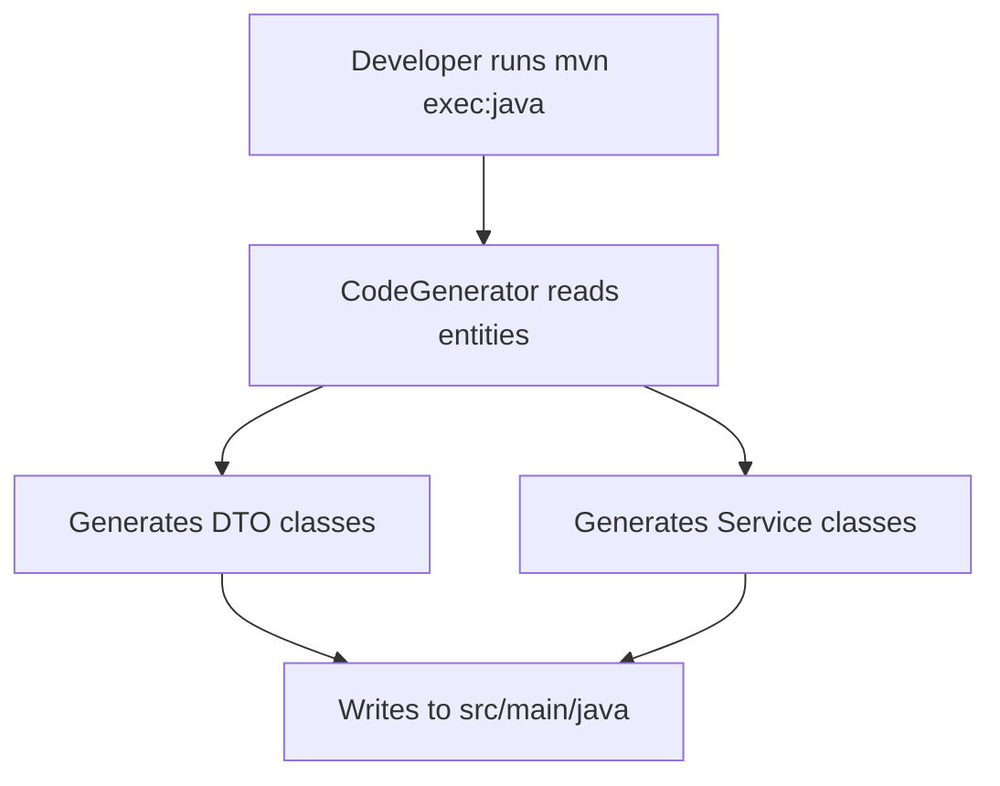

# Code Generator

## Purpose
Standalone code generation tool that scaffolds DTO and Service classes for ERP entities. Currently hardcoded to generate code for Product, Warehouse, Order, OrderLine, and StockMovement.

---

## Simple Instructions *(for non-developers)*

### What is this?
This is a developer tool that automatically writes boilerplate code. Instead of manually creating DTOs (data objects) and service classes for each entity, this tool generates them. It helps developers work faster.

### What can you do here?
- As a regular user, you do not interact with this tool.
- Developers run it via `mvn exec:java` to regenerate DTOs and services.

### How to use it
1. This is only for developers. Run `mvn exec:java` from the `backend/` directory.
2. The generator reads 5 hardcoded entities and outputs DTO + Service files.
3. To add more entities, edit the `main()` method in `CodeGenerator.java`.

### Diagram

### Common issues
| Problem | Solution |
|---------|----------|
| Generated code has compilation errors | The entity model may have changed. Verify the generated output. |
| New entity not generating | Add the entity class to the hardcoded list in `main()`. |

---

## Key Classes *(developers)*

| Class | Role |
|-------|------|
| `CodeGenerator` | Main executable — reads entity classes, generates DTO + Service via JavaPoet |

## API Endpoints
N/A — This is a standalone tool, not a web service.

## Dependencies
- JavaPoet library for code generation
- Entity classes in `backend/src/main/java/com/erp/modules/`

## Related Frontend
- N/A — Developer tool only
