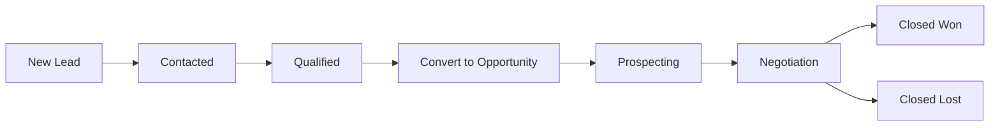

# CRM

## Purpose
Customer Relationship Management — lead tracking and opportunity management. Manages the sales pipeline from initial contact (lead) through qualification to deal closure (opportunity).

---

## Simple Instructions *(for non-developers)*

### What is this?
This is the CRM system. It tracks potential customers (leads) and active sales deals (opportunities). Sales teams use it to manage their pipeline and forecast revenue.

### What can you do here?
- Capture new **Leads** from website, phone calls, or events
- Qualify leads into **Opportunities** with expected deal value
- Track opportunity stages (Prospecting → Negotiation → Closed Won/Lost)
- View the sales pipeline and forecast totals

### How to use it
1. Go to **CRM > Leads** to see all incoming leads.
2. Click **Create Lead** to add a new prospect.
3. Fill in contact info, source, and notes.
4. When a lead is ready, **Convert to Opportunity**.
5. Update the opportunity stage as the deal progresses.

### Diagram

### Common issues
| Problem | Solution |
|---------|----------|
| Cannot find a lead | Use the search or filter by status (New/Contacted/Qualified/Converted). |
| Lead already exists | Check for duplicates by email or phone before creating. |
| Cannot convert to opportunity | The lead must be in "Qualified" status first. |

---

## Key Classes *(developers)*

| Class | Role |
|-------|------|
| `LeadController` | REST CRUD for lead management |
| `OpportunityController` | REST CRUD for opportunity management |
| `LeadService` | Lead creation, qualification, conversion to opportunity |
| `OpportunityService` | Opportunity pipeline stage tracking and forecast |
| `Lead` | JPA entity — name, contact info, source, status, score |
| `Opportunity` | JPA entity — expected value, stage, probability, close date |

## API Endpoints

| Method | Path | Handler | Auth |
|--------|------|---------|------|
| GET | `/api/v1/leads` | `LeadController.list()` | JWT |
| POST | `/api/v1/leads` | `LeadController.create()` | JWT |
| PUT | `/api/v1/leads/{id}/convert` | `LeadController.convert()` | JWT |
| GET | `/api/v1/opportunities` | `OpportunityController.list()` | JWT |
| POST | `/api/v1/opportunities` | `OpportunityController.create()` | JWT |

## Dependencies
- `BaseService<T>` — generic CRUD with lifecycle hooks
- `BaseEntity` — UUID id, tenant_id, soft-delete, timestamps
- `LeadRepository`, `OpportunityRepository`

## Related Frontend
- N/A — CRM is served as a backend API; consumed via runtime form definitions
