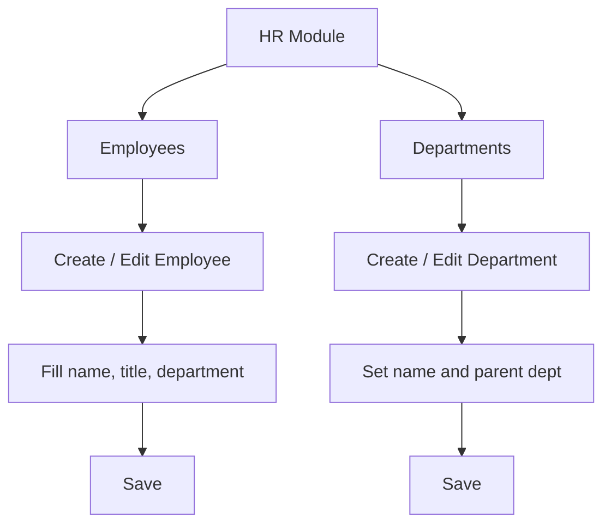

# HR

## Purpose
Human Resources — employee records and department hierarchy. Manages employee profiles, contact information, job details, and the organizational chart through departments.

---

## Simple Instructions *(for non-developers)*

### What is this?
This is the HR module. It stores information about all employees in your company — their names, contact details, job titles, and which department they belong to. Departments are organized in a tree structure.

### What can you do here?
- Create and manage **Employee** records
- Organize employees into **Departments**
- View the organizational hierarchy
- Track employee status (Active, On Leave, Terminated)

### How to use it
1. Go to **HR > Employees** to see all employees.
2. Click **Create Employee** to add a new person.
3. Fill in name, contact info, job title, and select a department.
4. Go to **HR > Departments** to manage the organizational structure.
5. Click **Create Department** and set a parent department for the hierarchy.

### Diagram

### Common issues
| Problem | Solution |
|---------|----------|
| Cannot find an employee | Use the search bar or filter by department. |
| Employee is in the wrong department | Edit the employee record and select the correct department. |
| Department tree looks wrong | Check that each department has the correct parent set. |

---

## Key Classes *(developers)*

| Class | Role |
|-------|------|
| `EmployeeController` | REST CRUD for employee records |
| `DepartmentController` | REST CRUD for department hierarchy |
| `EmployeeService` | Employee CRUD with department assignment |
| `DepartmentService` | Department hierarchy management |
| `Employee` | JPA entity — name, email, phone, job title, department, status |
| `Department` | JPA entity — name, parent department reference for hierarchy |

## API Endpoints

| Method | Path | Handler | Auth |
|--------|------|---------|------|
| GET | `/api/v1/employees` | `EmployeeController.list()` | JWT |
| POST | `/api/v1/employees` | `EmployeeController.create()` | JWT |
| GET | `/api/v1/employees/{id}` | `EmployeeController.get()` | JWT |
| PUT | `/api/v1/employees/{id}` | `EmployeeController.update()` | JWT |
| DELETE | `/api/v1/employees/{id}` | `EmployeeController.delete()` | JWT |
| GET | `/api/v1/departments` | `DepartmentController.list()` | JWT |
| POST | `/api/v1/departments` | `DepartmentController.create()` | JWT |
| PUT | `/api/v1/departments/{id}` | `DepartmentController.update()` | JWT |

## Dependencies
- `BaseService<T>` — generic CRUD with lifecycle hooks
- `BaseEntity` — UUID id, tenant_id, soft-delete, timestamps
- `EmployeeRepository`, `DepartmentRepository`

## Related Frontend
- N/A — HR is served as a backend API; consumed via runtime form definitions
