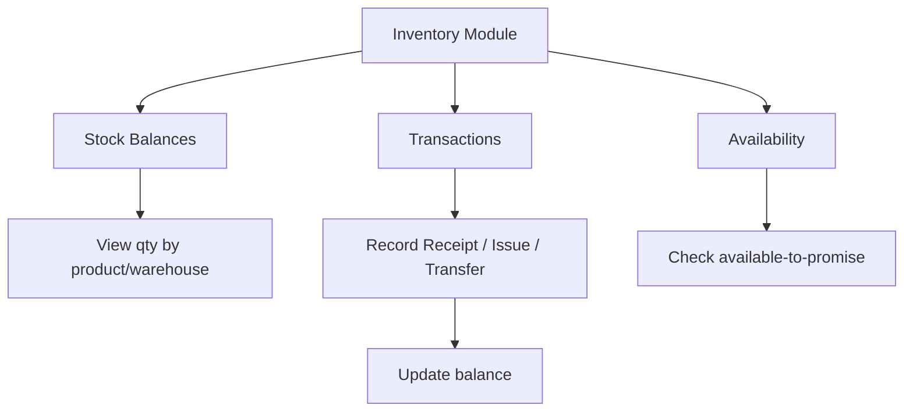

# Inventory

## Purpose
Stock and warehouse inventory management. Tracks inventory balances across warehouses and locations, manages stock movements (receipts, issues, transfers), inventory transactions, and stock allocations.

---

## Simple Instructions *(for non-developers)*

### What is this?
This is the inventory system. It tracks how much stock you have, where it is stored, and when items move in or out. Every time a product is received from a supplier, shipped to a customer, or moved between warehouses, it is recorded here.

### What can you do here?
- View current **Stock Balances** by product and warehouse
- Record stock movements: **Receipt** (goods in), **Issue** (goods out), **Transfer** (between locations)
- View **Inventory Transactions** — the full history of every stock change
- Check **Availability** — how much stock is available to promise
- Manage **Allocations** — reserve stock for specific orders

### How to use it
1. Go to **Inventory > Stock Balances** to see current quantities by product and warehouse.
2. To record a stock receipt, go to **Inventory > Transactions** and click **New Receipt**.
3. Select the product, warehouse, quantity, and reference document (e.g., purchase order).
4. Click **Save** — the stock balance is updated automatically.
5. Use **Transfers** to move stock between warehouses.

### Diagram

### Common issues
| Problem | Solution |
|---------|----------|
| Stock balance is negative | A shipping was recorded without sufficient stock. Check the transaction history. |
| Cannot find a product in inventory | The product may not have been received yet. Create a receipt transaction first. |
| Stock movement wrong location | Edit the transaction or create a transfer to correct the location. |

---

## Key Classes *(developers)*

| Class | Role |
|-------|------|
| `InventoryController` | REST endpoints for stock balance queries and inventory adjustments |
| `InventoryTransactionController` | REST CRUD for inventory transactions (receipts, issues, transfers) |
| `InventoryService` | Core inventory logic — balance queries, adjustments |
| `InventoryTransactionService` | Transaction creation, validation, balance updates |
| `StockMovementService` | Inter-warehouse stock transfers |
| `InventoryAvailabilityService` | Available-to-promise calculations |
| `AllocationService` | Stock reservation and allocation to orders |
| `InventoryBalance` | JPA entity — product/warehouse/location quantity snapshot |
| `InventoryTransaction` | JPA entity — records every stock movement with reference |
| `StockMovement` | JPA entity — inter-warehouse transfer tracking |

## API Endpoints

| Method | Path | Handler | Auth |
|--------|------|---------|------|
| GET | `/api/v1/inventory/balances` | `InventoryController.getBalances()` | JWT |
| GET | `/api/v1/inventory/transactions` | `InventoryTransactionController.list()` | JWT |
| POST | `/api/v1/inventory/transactions` | `InventoryTransactionController.create()` | JWT |
| GET | `/api/v1/inventory/availability` | `InventoryAvailabilityService` | JWT |
| POST | `/api/v1/inventory/allocate` | `AllocationService` | JWT |

## Dependencies
- `BaseService<T>` — generic CRUD with lifecycle hooks
- `BaseEntity` — UUID id, tenant_id, soft-delete, timestamps
- `InventoryBalanceRepository`, `InventoryTransactionRepository`, `InventoryTransactionLineRepository`
- `StockMovementRepository`
- `ProductRepository` — product lookup
- `WarehouseRepository` — warehouse/location lookup

## Related Frontend
- N/A — Inventory is served as a backend API; consumed via runtime form definitions
