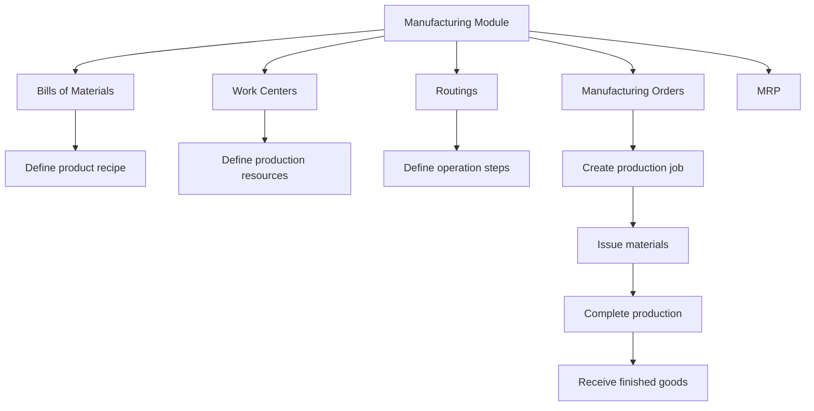

# Manufacturing

## Purpose
Production and manufacturing management. Handles bills of materials (BOM), work centers, routings, manufacturing orders, work orders, and MRP (Material Requirements Planning).

---

## Simple Instructions *(for non-developers)*

### What is this?
This is the manufacturing module. It manages how products are made — what raw materials are needed (BOM), what machines/workstations are used (work centers), what steps are followed (routing), and the actual production orders.

### What can you do here?
- Create **Bills of Materials** — lists of raw materials and quantities needed to make a product
- Manage **Work Centers** — production lines, machines, or workstations
- Define **Routings** — the sequence of operations to make a product
- Create **Manufacturing Orders** — production jobs that consume materials and output finished goods
- Run **MRP** — calculate material requirements based on demand

### How to use it
1. Go to **Manufacturing > BOM** to create a Bill of Materials for a product.
2. Add raw material lines with quantities.
3. Go to **Manufacturing Orders** to create a new production order.
4. Select the product, BOM, quantity, and scheduled dates.
5. When production starts, issue raw materials and receive finished goods.

### Diagram

### Common issues
| Problem | Solution |
|---------|----------|
| BOM total cost is zero | Ensure all raw material lines have cost per unit entered. |
| Cannot create manufacturing order | The product must have a BOM defined first. |
| Work center is not available | Check that the work center is active and not overloaded. |

---

## Key Classes *(developers)*

| Class | Role |
|-------|------|
| `BOMController` | REST CRUD for bills of materials and BOM lines |
| `ManufacturingOrderController` | REST CRUD for manufacturing orders |
| `WorkCenterController` | REST CRUD for work centers |
| `RoutingController` | REST CRUD for routings and routing operations |
| `WorkOrderController` | REST CRUD for detailed work orders |
| `MRPController` | REST endpoint for MRP calculation |
| `BOMService` | BOM creation, validation, cost roll-up |
| `ManufacturingOrderService` | Production order lifecycle management |
| `WorkCenterService` | Work center capacity and scheduling |
| `RoutingService` | Routing definition and operation sequencing |
| `WorkOrderService` | Detailed work order execution |
| `MRPService` | Material requirements planning calculations |
| `BillOfMaterial` | JPA entity — BOM header with product, quantity, validity dates |
| `BOMLine` | JPA entity — component product and quantity |
| `ManufacturingOrder` | JPA entity — production order with dates, status, quantities |
| `WorkCenter` | JPA entity — production resource with capacity |
| `Routing` | JPA entity — sequence of operations |
| `RoutingOperation` | JPA entity — individual operation in a routing |
| `WorkOrder` | JPA entity — detailed work assignment |

## API Endpoints

| Method | Path | Handler | Auth |
|--------|------|---------|------|
| GET | `/api/v1/boms` | `BOMController.list()` | JWT |
| POST | `/api/v1/boms` | `BOMController.create()` | JWT |
| GET | `/api/v1/manufacturing-orders` | `ManufacturingOrderController.list()` | JWT |
| POST | `/api/v1/manufacturing-orders` | `ManufacturingOrderController.create()` | JWT |
| GET | `/api/v1/work-centers` | `WorkCenterController.list()` | JWT |
| POST | `/api/v1/work-centers` | `WorkCenterController.create()` | JWT |
| GET | `/api/v1/routings` | `RoutingController.list()` | JWT |
| POST | `/api/v1/routings` | `RoutingController.create()` | JWT |
| GET | `/api/v1/work-orders` | `WorkOrderController.list()` | JWT |
| POST | `/api/v1/mrp/calculate` | `MRPController.calculate()` | JWT |

## Dependencies
- `BaseService<T>` — generic CRUD with lifecycle hooks
- `BaseEntity` — UUID id, tenant_id, soft-delete, timestamps
- `BOMRepository`, `BOMLineRepository`, `ManufacturingOrderRepository`
- `WorkCenterRepository`, `RoutingRepository`, `RoutingOperationRepository`, `WorkOrderRepository`
- `ProductRepository`, `InventoryTransactionRepository`

## Related Frontend
- N/A — Manufacturing is served as a backend API; consumed via runtime form definitions
