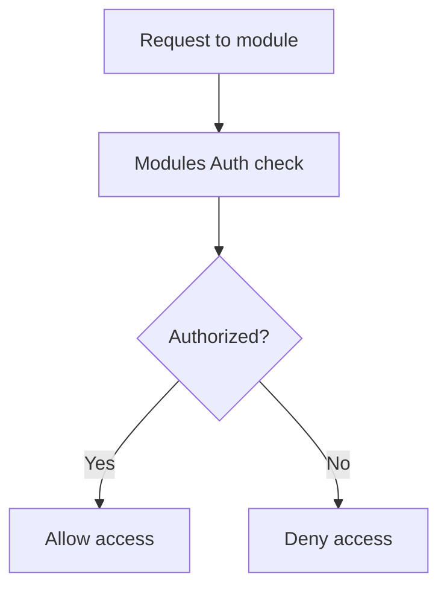

# Modules Auth

## Purpose
Secondary authentication module — provides an additional auth layer for business module access. Separate from the platform identity auth system.

---

## Simple Instructions *(for non-developers)*

### What is this?
This is an additional authentication module that supports business module-level access control. It works alongside the main identity system to provide fine-grained auth for specific modules.

### What can you do here?
- Business module authentication checks
- Module-level access verification

### How to use it
This module operates automatically in the background. No direct user interaction is needed.

### Diagram

### Common issues
| Problem | Solution |
|---------|----------|
| "Access denied" from a module | Check that your role includes permission for that module. |

---

## Key Classes *(developers)*

| Class | Role |
|-------|------|
| `AuthController` | REST endpoints for module-level auth operations |
| `AuthService` | Module-level authentication and authorization logic |
| `AuthEntity` | JPA entity — auth configuration records |
| `AuthRepository` | Spring Data JPA repository |

## API Endpoints

| Method | Path | Handler | Auth |
|--------|------|---------|------|
| POST | `/api/v1/auth/check` | `AuthController.check()` | JWT |
| GET | `/api/v1/auth/modules` | `AuthController.listModules()` | JWT |

## Dependencies
- `BaseService<T>` — generic CRUD with lifecycle hooks
- `BaseEntity` — UUID id, tenant_id, soft-delete, timestamps
- `AuthRepository`

## Related Frontend
- N/A — Operates as backend service
