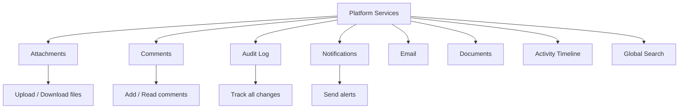

# Platform Services

## Purpose
Shared platform services used across business modules — activity timeline, attachments, audit logging, comments, document generation, email notifications, global search, and event publishing.

---

## Simple Instructions *(for non-developers)*

### What is this?
These are common tools shared by all parts of the ERP. They handle things like attaching files to any record, recording who did what and when (audit log), sending email notifications, and letting users search across the entire system.

### What can you do here?
- **Attachments** — upload and download files attached to any record
- **Comments** — add notes and discussions to records
- **Audit Log** — see who changed what and when
- **Activity Timeline** — view a chronological history of events on a record
- **Notifications** — receive alerts about system events
- **Documents** — generate PDF or document outputs
- **Email** — send emails from the system
- **Global Search** — search across all modules from one place

### How to use it
1. **Attachments:** Open any record, go to the Attachments tab, and click **Upload**.
2. **Comments:** Open any record, scroll to the Comments section, and type your message.
3. **Audit Log:** Go to **Admin > Audit Log** to see all system changes.
4. **Global Search:** Use the search bar in the header to find any record across all modules.

### Diagram

### Common issues
| Problem | Solution |
|---------|----------|
| Cannot upload a file | Check the file size limit and allowed file types. |
| Audit log is empty | Ensure the audit service is configured and enabled. |
| Email not sent | Check the SMTP configuration in system settings. |

---

## Key Classes *(developers)*

| Class | Role |
|-------|------|
| `AttachmentController` | REST CRUD for file attachments |
| `CommentController` | REST CRUD for record comments |
| `AuditController` | REST endpoints for audit log queries |
| `NotificationController` | REST endpoints for user notifications |
| `EmailController` | REST endpoints for email sending |
| `DocumentController` | REST endpoints for document generation |
| `ActivityController` | REST endpoints for activity timeline |
| `SearchController` | REST endpoint for global search |
| `EventController` | REST endpoints for platform events |
| `AttachmentService` | File storage and retrieval |
| `CommentService` | Comment CRUD with threading |
| `AuditService` | Audit record creation and querying |
| `NotificationService` | Notification creation and delivery |
| `EmailService` | SMTP email sending with templates |
| `DocumentService` | Document generation |
| `ActivityTimelineService` | Activity timeline assembly |
| `GlobalSearchService` | Cross-module search indexing and querying |
| `PlatformEventService` | Event publishing and subscription |

## API Endpoints

| Method | Path | Handler | Auth |
|--------|------|---------|------|
| POST | `/api/v1/attachments/upload` | `AttachmentController.upload()` | JWT |
| GET | `/api/v1/attachments/{entityType}/{entityId}` | `AttachmentController.list()` | JWT |
| GET | `/api/v1/comments/{entityType}/{entityId}` | `CommentController.list()` | JWT |
| POST | `/api/v1/comments` | `CommentController.create()` | JWT |
| GET | `/api/v1/audit` | `AuditController.query()` | JWT (Admin) |
| GET | `/api/v1/notifications` | `NotificationController.list()` | JWT |
| GET | `/api/v1/activity/{entityType}/{entityId}` | `ActivityController.getTimeline()` | JWT |
| GET | `/api/v1/search?q=` | `SearchController.search()` | JWT |

## Dependencies
- `BaseEntity` — UUID id, tenant_id, soft-delete, timestamps
- `AttachmentRepository`, `CommentRepository`, `AuditLogRepository`
- `NotificationRepository`, `EmailTemplateRepository`, `DocumentRepository`
- `ActivityEventRepository`, `PlatformEventRepository`

## Related Frontend
- N/A — Platform services are consumed via dedicated UI components or runtime form definitions
