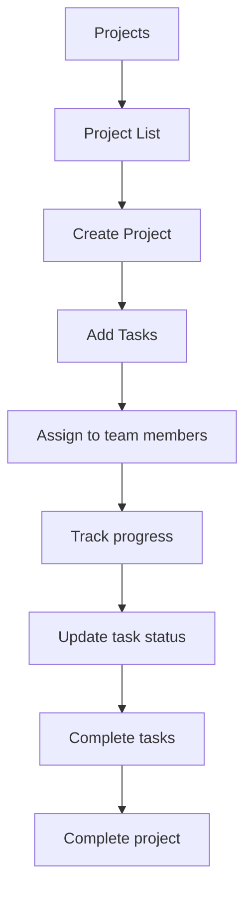

# Projects

## Purpose
Project and task management. Organizes work into projects with tasks, assignments, deadlines, and status tracking.

---

## Simple Instructions *(for non-developers)*

### What is this?
This is the project management module. You can create projects to organize work, break them down into tasks, assign them to team members, and track progress.

### What can you do here?
- Create **Projects** with name, description, and dates
- Break projects into **Tasks** with assignees and due dates
- Track task **Status** (To Do, In Progress, Done)
- View all tasks assigned to you across projects

### How to use it
1. Go to **Projects** to see all projects.
2. Click **Create Project** to start a new one.
3. Add tasks by clicking **Add Task** within a project.
4. Assign each task to a team member and set a due date.
5. Update task status as work progresses.

### Diagram

### Common issues
| Problem | Solution |
|---------|----------|
| Cannot find a task | Use the search or filter by project or assignee. |
| Task due date is wrong | Edit the task and update the due date. |
| Project shows no tasks | Create tasks inside the project using the Add Task button. |

---

## Key Classes *(developers)*

| Class | Role |
|-------|------|
| `ProjectController` | REST CRUD for projects |
| `TaskController` | REST CRUD for project tasks |
| `ProjectService` | Project lifecycle management |
| `TaskService` | Task CRUD and assignment |
| `Project` | JPA entity — name, description, start/end dates, status |
| `Task` | JPA entity — title, description, assignee, due date, status, project FK |

## API Endpoints

| Method | Path | Handler | Auth |
|--------|------|---------|------|
| GET | `/api/v1/projects` | `ProjectController.list()` | JWT |
| POST | `/api/v1/projects` | `ProjectController.create()` | JWT |
| GET | `/api/v1/projects/{id}` | `ProjectController.get()` | JWT |
| PUT | `/api/v1/projects/{id}` | `ProjectController.update()` | JWT |
| DELETE | `/api/v1/projects/{id}` | `ProjectController.delete()` | JWT |
| GET | `/api/v1/tasks` | `TaskController.list()` | JWT |
| POST | `/api/v1/tasks` | `TaskController.create()` | JWT |
| PUT | `/api/v1/tasks/{id}` | `TaskController.update()` | JWT |

## Dependencies
- `BaseService<T>` — generic CRUD with lifecycle hooks
- `BaseEntity` — UUID id, tenant_id, soft-delete, timestamps
- `ProjectRepository`, `TaskRepository`

## Related Frontend
- N/A — Projects is served as a backend API; consumed via runtime form definitions
