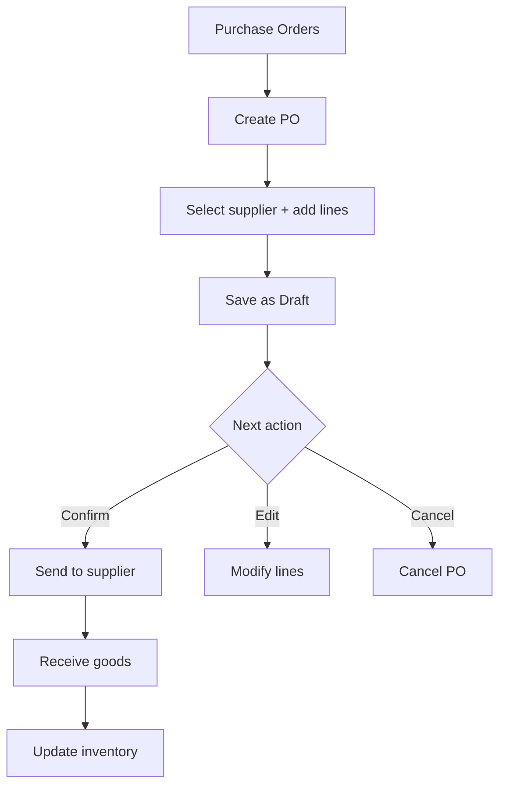

# Purchase

## Purpose
Purchase order management — procuring goods and services from suppliers. Manages the purchase order lifecycle from requisition through ordering to receiving.

---

## Simple Instructions *(for non-developers)*

### What is this?
This is the purchasing module. When your company needs to buy something from a supplier — raw materials, office supplies, services — you create a purchase order here. It tracks what was ordered, from whom, at what price, and whether it has been received.

### What can you do here?
- Create **Purchase Orders** to order from suppliers
- Add line items with products, quantities, and prices
- Track order **Status** (Draft, Sent, Confirmed, Received, Cancelled)
- Record goods receipt when items arrive
- View purchase history by supplier or product

### How to use it
1. Go to **Purchasing > Purchase Orders**.
2. Click **Create Purchase Order**.
3. Select the **Supplier** and enter order date.
4. Add line items — pick products and enter quantities and prices.
5. Click **Save** (Draft status).
6. When ready, click **Confirm** to send to supplier.
7. When goods arrive, click **Receive** to record receipt.

### Diagram

### Common issues
| Problem | Solution |
|---------|----------|
| Cannot select a supplier | The supplier must exist in Business Partners first. |
| Purchase order total is zero | Make sure line items have quantity and price. |
| Cannot receive more than ordered | Received quantity cannot exceed ordered quantity. |

---

## Key Classes *(developers)*

| Class | Role |
|-------|------|
| `PurchaseOrderController` | REST CRUD for purchase orders with status transitions |
| `PurchaseOrderService` | Business logic — PO creation, confirmation, receiving |
| `PurchaseOrder` | JPA entity — supplier, order date, status, total amount |
| `PurchaseOrderLine` | JPA entity — product, quantity, price, received quantity |

## API Endpoints

| Method | Path | Handler | Auth |
|--------|------|---------|------|
| GET | `/api/v1/purchase-orders` | `PurchaseOrderController.list()` | JWT |
| POST | `/api/v1/purchase-orders` | `PurchaseOrderController.create()` | JWT |
| PUT | `/api/v1/purchase-orders/{id}` | `PurchaseOrderController.update()` | JWT |
| PUT | `/api/v1/purchase-orders/{id}/confirm` | `PurchaseOrderController.confirm()` | JWT |
| PUT | `/api/v1/purchase-orders/{id}/receive` | `PurchaseOrderController.receive()` | JWT |
| PUT | `/api/v1/purchase-orders/{id}/cancel` | `PurchaseOrderController.cancel()` | JWT |

## Dependencies
- `BaseService<T>` — generic CRUD with lifecycle hooks
- `BaseEntity` — UUID id, tenant_id, soft-delete, timestamps
- `PurchaseOrderRepository`, `PurchaseOrderLineRepository`
- `BusinessPartnerRepository` — supplier lookup
- `ProductRepository` — product lookup
- `InventoryTransactionService` — updates stock on receipt

## Related Frontend
- N/A — Purchase is served as a backend API; consumed via runtime form definitions
