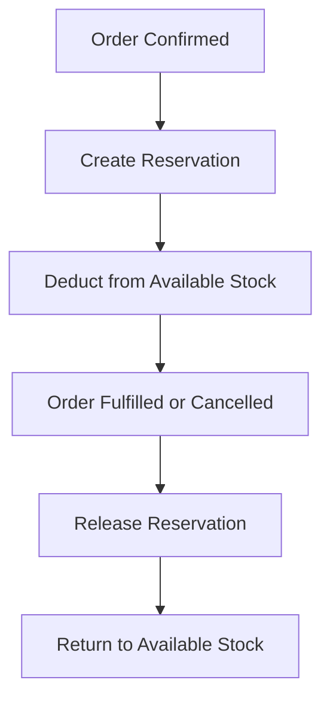

# Reservation

## Purpose
Inventory reservation system — temporarily reserves stock for sales orders, manufacturing orders, or other commitments. Prevents overselling by earmarking available quantities.

---

## Simple Instructions *(for non-developers)*

### What is this?
This module handles stock reservations. When a customer places an order, the system can "reserve" the products so they are not sold to someone else. It helps prevent overselling by tracking committed stock.

### What can you do here?
- Reserve stock for a specific order or purpose
- View all active reservations
- Release reservations when orders are cancelled or fulfilled
- Check how much stock is reserved vs. available

### How to use it
1. Reserving happens automatically when an order is confirmed.
2. Go to **Inventory > Reservations** to view all active reservations.
3. To manually reserve stock, click **Create Reservation**.
4. Select the product, warehouse, quantity, and reference.
5. Click **Save** — the quantity is deducted from available stock.

### Diagram

### Common issues
| Problem | Solution |
|---------|----------|
| Cannot reserve more than available | The available quantity in the warehouse is insufficient. |
| Reservation stuck on cancelled order | Release the reservation manually from the reservation list. |
| Available stock seems wrong | Check active reservations — they reduce what appears available. |

---

## Key Classes *(developers)*

| Class | Role |
|-------|------|
| `ReservationController` | REST CRUD for reservations |
| `ReservationService` | Reservation creation, release, and availability checks |
| `ReservationRepository` | Spring Data JPA repository for reservation queries |

## API Endpoints

| Method | Path | Handler | Auth |
|--------|------|---------|------|
| GET | `/api/v1/reservations` | `ReservationController.list()` | JWT |
| POST | `/api/v1/reservations` | `ReservationController.create()` | JWT |
| PUT | `/api/v1/reservations/{id}/release` | `ReservationController.release()` | JWT |
| DELETE | `/api/v1/reservations/{id}` | `ReservationController.delete()` | JWT |

## Dependencies
- `BaseService<T>` — generic CRUD with lifecycle hooks
- `BaseEntity` — UUID id, tenant_id, soft-delete, timestamps
- `ReservationRepository`
- `InventoryBalanceRepository` — updates available quantities
- `ProductRepository` — product lookup

## Related Frontend
- N/A — Reservation is served as a backend API; consumed via runtime form definitions
