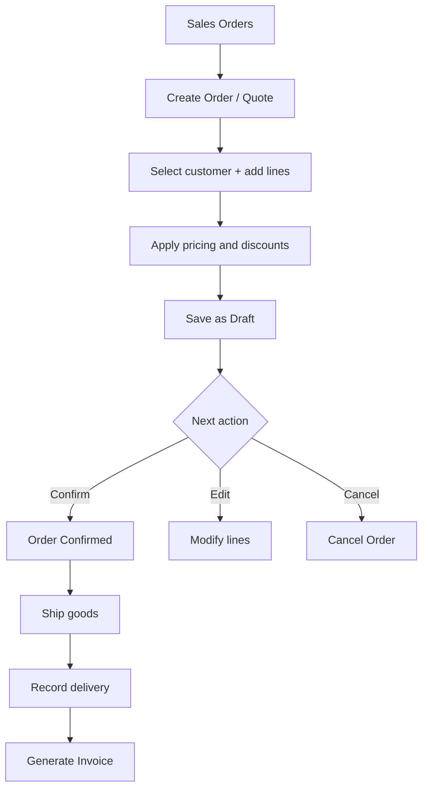

# Sales

## Purpose
Sales order management — managing customer orders from quotation through invoicing. Handles the complete sales order lifecycle with pricing, discounts, and status tracking.

---

## Simple Instructions *(for non-developers)*

### What is this?
This is the sales module. When a customer wants to buy something, you create a sales order. It tracks what the customer ordered, the prices agreed, and the order status from quotation to delivery and invoicing.

### What can you do here?
- Create **Sales Orders** for customers
- Add products with quantities and negotiated prices
- Apply **Discounts** at header or line level
- Track order **Status** (Draft, Confirmed, Shipped, Invoiced, Cancelled)
- Generate **Quotations** and convert to orders

### How to use it
1. Go to **Sales > Sales Orders**.
2. Click **Create Sales Order**.
3. Select the **Customer** and enter order date.
4. Add line items — pick products, enter quantities and prices.
5. Click **Save** (Draft status).
6. When customer confirms, click **Confirm**.
7. When shipped, click **Ship** to record dispatch.
8. Generate an **Invoice** from the order.

### Diagram

### Common issues
| Problem | Solution |
|---------|----------|
| Cannot select a customer | The customer must exist in Business Partners first. |
| Price is zero | Enter a unit price or select a price list for the product. |
| Cannot ship more than ordered | Shipped quantity cannot exceed the ordered quantity. |

---

## Key Classes *(developers)*

| Class | Role |
|-------|------|
| `SalesOrderController` | REST CRUD for sales orders with status transitions |
| `SalesOrderService` | Business logic — order creation, pricing, status flow |
| `SalesOrder` | JPA entity — customer, order date, status, totals |
| `SalesOrderLine` | JPA entity — product, quantity, price, discount |

## API Endpoints

| Method | Path | Handler | Auth |
|--------|------|---------|------|
| GET | `/api/v1/sales-orders` | `SalesOrderController.list()` | JWT |
| POST | `/api/v1/sales-orders` | `SalesOrderController.create()` | JWT |
| PUT | `/api/v1/sales-orders/{id}` | `SalesOrderController.update()` | JWT |
| PUT | `/api/v1/sales-orders/{id}/confirm` | `SalesOrderController.confirm()` | JWT |
| PUT | `/api/v1/sales-orders/{id}/ship` | `SalesOrderController.ship()` | JWT |
| PUT | `/api/v1/sales-orders/{id}/cancel` | `SalesOrderController.cancel()` | JWT |

## Dependencies
- `BaseService<T>` — generic CRUD with lifecycle hooks
- `BaseEntity` — UUID id, tenant_id, soft-delete, timestamps
- `SalesOrderRepository`, `SalesOrderLineRepository`
- `BusinessPartnerRepository` — customer lookup
- `ProductRepository` — product lookup
- `InventoryAvailabilityService` — stock check before confirmation
- `ReservationService` — reserve stock on confirmation

## Related Frontend
- N/A — Sales is served as a backend API; consumed via runtime form definitions
