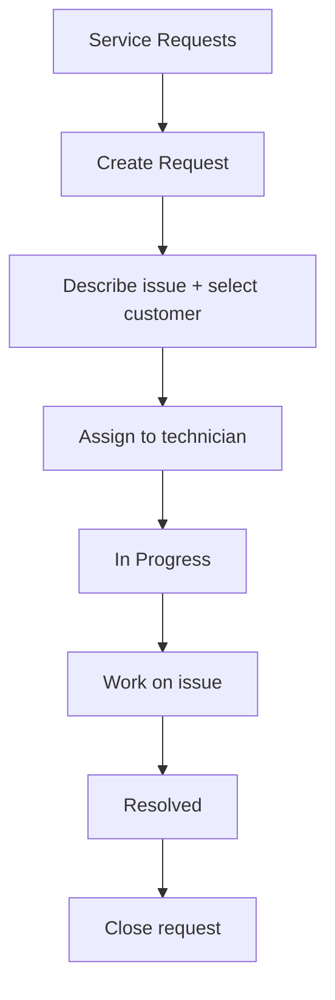

# Service Management

## Purpose
Service request management — tracks customer service requests, support tickets, and field service operations from creation through resolution.

---

## Simple Instructions *(for non-developers)*

### What is this?
This is the service management module. When a customer needs help — a support question, a repair, or on-site service — a service request is created. It tracks the issue from reporting through assignment to resolution.

### What can you do here?
- Create **Service Requests** for customer issues
- Assign requests to service technicians
- Track request **Status** (New, Assigned, In Progress, Resolved, Closed)
- Log time and work performed
- Link requests to customer accounts and products

### How to use it
1. Go to **Service > Service Requests**.
2. Click **Create Service Request**.
3. Select the **Customer** and describe the issue.
4. Assign a **Technician** and set a **Priority**.
5. The technician updates the status as work progresses.
6. When resolved, mark as **Resolved** and then **Close**.

### Diagram

### Common issues
| Problem | Solution |
|---------|----------|
| Cannot find a service request | Use the search or filter by status (New/In Progress/Closed). |
| Wrong customer selected | Update the customer field if the request has not been started yet. |
| Request stuck in "New" status | Assign it to a technician to move it to "In Progress". |

---

## Key Classes *(developers)*

| Class | Role |
|-------|------|
| `ServiceRequestController` | REST CRUD for service requests with status transitions |
| `ServiceRequestService` | Business logic — request creation, assignment, resolution |
| `ServiceRequest` | JPA entity — customer, description, status, priority, technician assignment |

## API Endpoints

| Method | Path | Handler | Auth |
|--------|------|---------|------|
| GET | `/api/v1/service-requests` | `ServiceRequestController.list()` | JWT |
| POST | `/api/v1/service-requests` | `ServiceRequestController.create()` | JWT |
| PUT | `/api/v1/service-requests/{id}` | `ServiceRequestController.update()` | JWT |
| PUT | `/api/v1/service-requests/{id}/assign` | `ServiceRequestController.assign()` | JWT |
| PUT | `/api/v1/service-requests/{id}/resolve` | `ServiceRequestController.resolve()` | JWT |
| PUT | `/api/v1/service-requests/{id}/close` | `ServiceRequestController.close()` | JWT |

## Dependencies
- `BaseService<T>` — generic CRUD with lifecycle hooks
- `BaseEntity` — UUID id, tenant_id, soft-delete, timestamps
- `ServiceRequestRepository`
- `BusinessPartnerRepository` — customer lookup

## Related Frontend
- N/A — Service is served as a backend API; consumed via runtime form definitions
