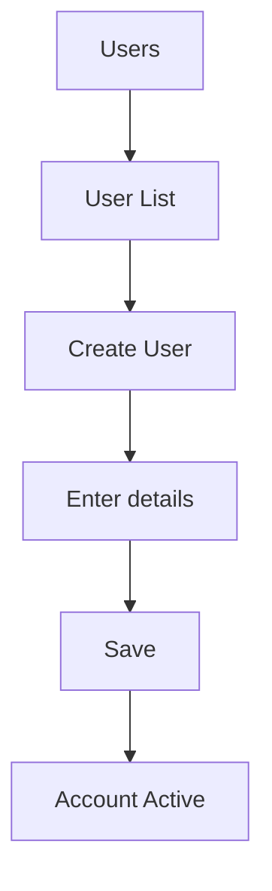

# Users Management

## Purpose
Basic user management module — provides standard CRUD operations for application user accounts, separate from the identity platform's more advanced user administration.

---

## Simple Instructions *(for non-developers)*

### What is this?
This is a simple user management module. It allows creating and managing basic user accounts for the ERP system — setting usernames, emails, and account status.

### What can you do here?
- Create **User Accounts** with username and email
- Activate or deactivate user accounts
- View the list of all registered users

### How to use it
1. Go to **Users** in the sidebar.
2. Click **Create User** to add a new account.
3. Fill in **Username**, **Email**, and other details.
4. Click **Save** — the user account is created.
5. Use the **Active/Inactive** toggle to enable or disable access.

### Diagram

### Common issues
| Problem | Solution |
|---------|----------|
| Username already exists | Each username must be unique. Try a different username. |
| Cannot find a user | Use the search or filter by active/inactive status. |

---

## Key Classes *(developers)*

| Class | Role |
|-------|------|
| `UserController` | REST CRUD for user accounts |
| `UserService` | User account creation and management |
| `UserEntity` | JPA entity — username, email, status |

## API Endpoints

| Method | Path | Handler | Auth |
|--------|------|---------|------|
| GET | `/api/v1/users` | `UserController.list()` | JWT |
| POST | `/api/v1/users` | `UserController.create()` | JWT |
| GET | `/api/v1/users/{id}` | `UserController.get()` | JWT |
| PUT | `/api/v1/users/{id}` | `UserController.update()` | JWT |
| DELETE | `/api/v1/users/{id}` | `UserController.delete()` | JWT |

## Dependencies
- `BaseService<T>` — generic CRUD with lifecycle hooks
- `BaseEntity` — UUID id, tenant_id, soft-delete, timestamps
- `UserRepository`

## Related Frontend
- N/A — Users management is served as a backend API; consumed via runtime form definitions
