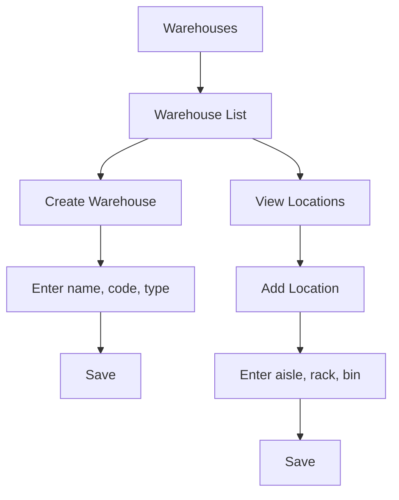

# Warehouse

## Purpose
Warehouse and location management — defines physical storage locations where inventory is kept. Warehouses can have sub-locations (aisles, racks, bins) for granular stock tracking.

---

## Simple Instructions *(for non-developers)*

### What is this?
This is the warehouse management module. It defines where your stock is stored — which warehouses exist and where exactly within each warehouse (aisle, shelf, bin) items are located.

### What can you do here?
- Create **Warehouses** (e.g., "Main Warehouse", "Returns Warehouse")
- Define **Locations** within each warehouse (e.g., "Aisle A, Shelf 3, Bin B2")
- View stock quantities by warehouse and location
- Organize warehouses by type and status

### How to use it
1. Go to **Warehouse > Warehouses** to see all storage facilities.
2. Click **Create Warehouse** to add a new one.
3. Fill in the **Name**, **Code**, and **Type**.
4. Within a warehouse, click **Locations** to add sub-locations.
5. Stock movements can now reference these locations.

### Diagram

### Common issues
| Problem | Solution |
|---------|----------|
| Cannot delete a warehouse | Warehouses with stock cannot be deleted. Transfer stock out first. |
| Location code already exists | Location codes must be unique within a warehouse. |
| Cannot find a location | Locations are organized by warehouse. Select the correct warehouse first. |

---

## Key Classes *(developers)*

| Class | Role |
|-------|------|
| `WarehouseController` | REST CRUD for warehouses |
| `LocationController` | REST CRUD for warehouse locations |
| `WarehouseService` | Warehouse creation and management |
| `Warehouse` | JPA entity — name, code, type, status |
| `Location` | JPA entity — warehouse FK, location code, aisle, rack, bin |

## API Endpoints

| Method | Path | Handler | Auth |
|--------|------|---------|------|
| GET | `/api/v1/warehouses` | `WarehouseController.list()` | JWT |
| POST | `/api/v1/warehouses` | `WarehouseController.create()` | JWT |
| GET | `/api/v1/warehouses/{id}` | `WarehouseController.get()` | JWT |
| PUT | `/api/v1/warehouses/{id}` | `WarehouseController.update()` | JWT |
| DELETE | `/api/v1/warehouses/{id}` | `WarehouseController.delete()` | JWT |
| GET | `/api/v1/locations` | `LocationController.list()` | JWT |
| POST | `/api/v1/locations` | `LocationController.create()` | JWT |

## Dependencies
- `BaseService<T>` — generic CRUD with lifecycle hooks
- `BaseEntity` — UUID id, tenant_id, soft-delete, timestamps
- `WarehouseRepository`, `LocationRepository`
- `InventoryBalanceRepository` — stock quantities by warehouse/location

## Related Frontend
- N/A — Warehouse is served as a backend API; consumed via runtime form definitions
