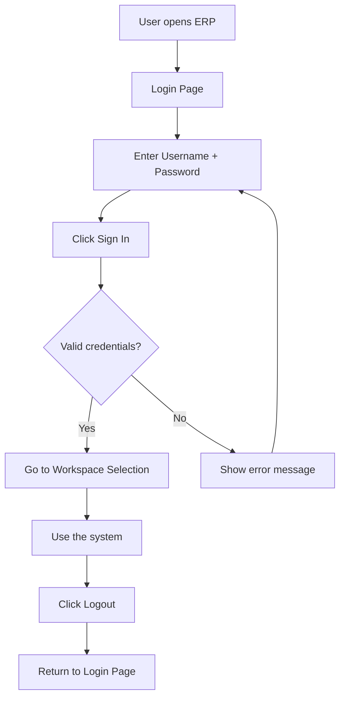

# Backend Auth

## Purpose
Handles all authentication endpoints — login, token refresh, logout, current-user retrieval, and password change. Validates credentials against bcrypt hashes, enforces account lockout policy, creates sessions, and returns JWT tokens with resolved roles and permissions.

---

## Simple Instructions *(for non-developers)*

### What is this?
This is the part of the system that handles logging in and out. When you type your username and password on the login screen, this module checks if they are correct and gives you a digital key (JWT token) to access the rest of the system.

### What can you do here?
- **Log in** with your username and password
- **Log out** when you are done
- **Refresh your session** so you do not get logged out automatically
- **Check who you are** — the system can tell you your user info
- **Change your password**

### How to use it
1. Go to the **Login** page in your browser.
2. Type your **Username** and **Password** into the fields.
3. Click the **Sign In** button.
4. If your credentials are correct, you go to the workspace selection page.
5. To log out later, click your user icon in the top-right and choose **Logout**.

### Diagram

### Common issues
| Problem | What to do |
|---------|-------------|
| "Invalid username or password" | Check that your username and password are typed correctly. Passwords are case-sensitive. |
| "Account is temporarily locked" | You entered the wrong password too many times. Wait a few minutes and try again, or contact your admin. |
| Page says "Authenticating..." forever | The server may be down. Check your internet connection or contact your system administrator. |
| You get logged out suddenly | Your session may have expired. Just log in again. |

---

## Key Classes *(developers)*

| Class | Role |
|-------|------|
| `AuthController` | REST endpoints for login, refresh, logout, me, change-password |
| `AuthenticationService` | Core login logic — validates credentials, checks account lockout, resolves roles/permissions, creates session, generates JWT, delegates password changes |
| `PasswordService` | bcrypt password matching, account lockout tracking (failed attempts), password policy validation |

## API Endpoints

| Method | Path | Handler | Auth |
|--------|------|---------|------|
| POST | `/api/v1/auth/login` | `AuthController.login()` | Public |
| POST | `/api/v1/auth/refresh` | `AuthController.refresh()` | Public |
| POST | `/api/v1/auth/logout` | `AuthController.logout()` | Public (reads Bearer) |
| GET | `/api/v1/auth/me` | `AuthController.me()` | Authenticated |
| POST | `/api/v1/auth/change-password` | `AuthController.changePassword()` | Authenticated |

## Dependencies

| Dependency | Purpose |
|------------|---------|
| `UserAccountRepository` | Lookup user by username, save login timestamps/attempts |
| `UserSessionRepository` | Create and soft-delete user sessions |
| `JwtProvider` | Generate access + refresh tokens |
| `PasswordService` | Password verification + lockout handling |
| `UserRoleRepository` | Resolve user-to-role assignments |
| `PermissionResolver` | Resolve effective permissions from roles |

## Error Flows

| Condition | Error |
|-----------|-------|
| Invalid username/password | `IllegalArgumentException("Invalid username or password")` → 400 |
| Account inactive | `IllegalStateException("Invalid username or password")` → 400 |
| Account locked | `IllegalStateException("Account is temporarily locked")` → 400 |
| Invalid/expired refresh token | `IllegalArgumentException("Invalid or expired refresh token")` → 400 |
| Current password wrong (change) | `IllegalArgumentException("Current password is incorrect")` → 400 |

## Related Frontend
- `frontend/src/routes/auth/LoginPage.tsx` — Login form that calls `authService.login()`
- `frontend/src/core/auth/authStore.ts` — Zustand store persisting token/user on login
- `frontend/src/core/api/interceptors.ts` — Injects Bearer token, handles 401 → logout redirect
