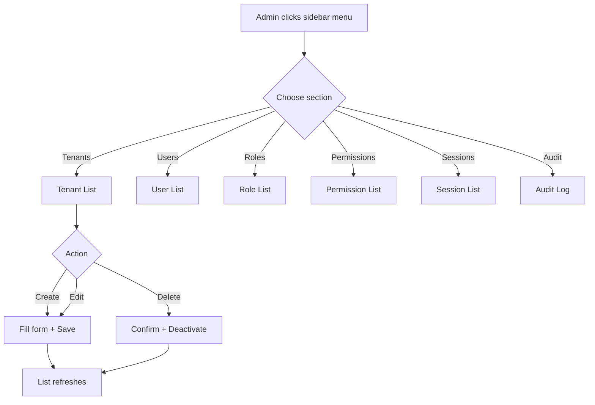
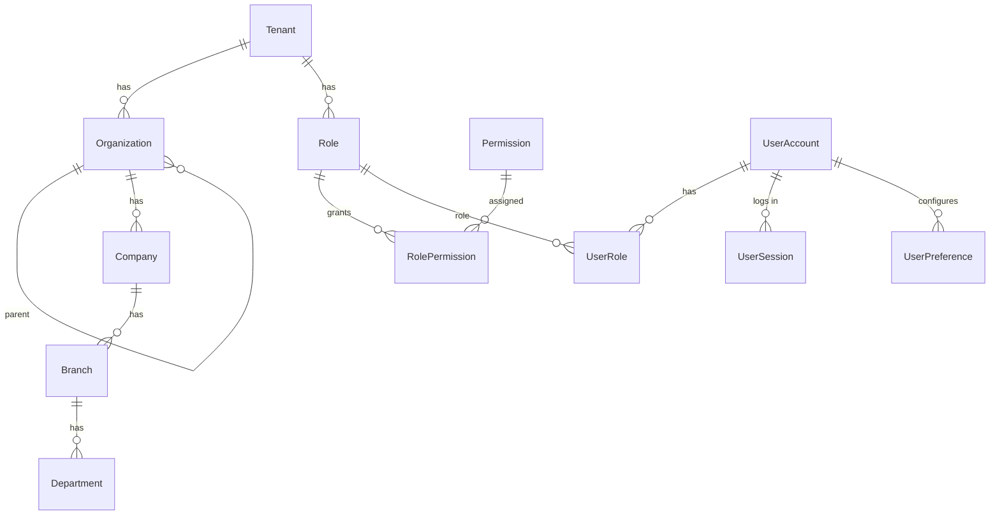

# Backend Identity Admin

## Purpose
CRUD management of the multi-tenant identity hierarchy: Tenants, Organizations, Companies, Branches, Departments, Users, Roles, Permissions, Sessions, and Audit records. All endpoints require authentication; admin operations are additionally gated by `sys_admin` / `tnt_admin` roles.

---

## Simple Instructions *(for non-developers)*

### What is this?
This is the admin panel for managing everything about who can use the system and how the company is structured. It lets admins create and manage tenants (separate customer instances), organizations, companies, branches, departments, users, roles, and permissions.

### What can you do here?
- **Tenants** — Create and manage separate customer accounts (each tenant is its own isolated ERP instance)
- **Organizations / Companies / Branches / Departments** — Build your company hierarchy structure
- **Users** — Create user accounts, activate/deactivate them, assign roles, reset passwords
- **Roles** — Define roles (like "Manager", "Accountant") and what permissions they have
- **Permissions** — Define fine-grained access rules for system features
- **Sessions** — View active user sessions and force-logout users
- **Audit** — See a log of all admin actions

### How to use it

1. Click **Admin** in the sidebar to expand the admin menu.
2. Click on the section you want to manage (e.g., **Tenants**, **Users**, **Roles**).
3. You will see a list of existing records.
4. To add a new record, click the **Create** button and fill in the form.
5. To edit a record, click the **Edit** (pencil) icon on the row.
6. To deactivate a record, click the **Delete** (trash) icon on the row.

### Diagram

### Common issues
| Problem | What to do |
|---------|-------------|
| Admin menu is not visible | You need the `sys_admin` or `tnt_admin` role. Contact your system administrator. |
| "Tenant code already exists" | Each tenant needs a unique code. Try a different code. |
| Cannot delete a record | Records are soft-deleted (deactivated). If you need to restore one, contact your admin. |
| User cannot log in after creation | Make sure the user account is set to "Active" and they have at least one role assigned. |
| No data shows in a list | You may not have permission to view records in the selected workspace context. |

---

## API Endpoints

### Tenant Admin (`/api/v1/identity/tenants`)

| Method | Path | Handler |
|--------|------|---------|
| GET | `/` | getAll — list all tenants |
| GET | `/{id}` | getById |
| POST | `/` | create |
| PUT | `/{id}` | update |
| DELETE | `/{id}` | deactivate (sets isActive=false) |

### Organization Admin (`/api/v1/identity/organizations`)

| Method | Path | Handler |
|--------|------|---------|
| GET | `/` | getAll — filtered by AccessScope |
| GET | `/tree/{tenantId}` | getTree — hierarchical org tree |
| POST | `/` | create (auto-sets level/path) |
| PUT | `/{id}` | update |
| DELETE | `/{id}` | delete |

### Company Admin (`/api/v1/identity/companies`)

| Method | Path | Handler |
|--------|------|---------|
| GET | `/` | getAll — filtered by AccessScope |
| GET | `/by-org/{orgId}` | getByOrganization |
| POST | `/` | create |
| PUT | `/{id}` | update |
| DELETE | `/{id}` | delete |

### Branch Admin (`/api/v1/identity/branches`)

| Method | Path | Handler |
|--------|------|---------|
| GET | `/` | getAll — filtered by AccessScope |
| GET | `/by-company/{companyId}` | getByCompany |
| POST | `/` | create |
| PUT | `/{id}` | update |
| DELETE | `/{id}` | delete |

### Department Admin (`/api/v1/identity/departments`)

| Method | Path | Handler |
|--------|------|---------|
| GET | `/` | getAll — filtered by AccessScope |
| GET | `/by-branch/{branchId}` | getByBranch |
| POST | `/` | create (auto-sets level from parent) |
| PUT | `/{id}` | update |
| DELETE | `/{id}` | delete |

### User Admin (`/api/v1/identity/users`)

| Method | Path | Handler |
|--------|------|---------|
| GET | `/` | getAll |
| GET | `/{id}` | getById |
| POST | `/` | create |
| PUT | `/{id}` | update |
| POST | `/{id}/deactivate` | deactivate |
| POST | `/{id}/activate` | activate |
| POST | `/{id}/reset-password` | reset password |
| POST | `/{id}/unlock` | unlock (reset failed attempts) |
| POST | `/{id}/roles` | assign role `{roleId}` |
| DELETE | `/{id}/roles/{roleId}` | remove role |
| GET | `/{id}/roles` | getUserRoles |
| GET | `/{id}/preferences` | getUserPreferences |
| PUT | `/{id}/preferences` | update preferences |

### Role Admin (`/api/v1/identity/roles`)

| Method | Path | Handler |
|--------|------|---------|
| GET | `/` | getAll |
| GET | `/{id}` | getById |
| POST | `/` | create |
| PUT | `/{id}` | update |
| DELETE | `/{id}` | delete |
| POST | `/clone` | clone `{sourceId, newCode, newName}` |
| GET | `/{id}/permissions` | getRolePermissions |
| POST | `/{id}/permissions` | assign permission |
| DELETE | `/{id}/permissions/{permId}` | remove permission |

### Permission Admin (`/api/v1/identity/permissions`)

| Method | Path | Handler |
|--------|------|---------|
| GET | `/` | getAll |
| GET | `/{id}` | getById |
| POST | `/` | create |
| PUT | `/{id}` | update |
| DELETE | `/{id}` | delete |

### Session Admin (`/api/v1/identity/sessions`)

| Method | Path | Handler |
|--------|------|---------|
| GET | `/` | getAll |
| GET | `/{id}` | getById |
| DELETE | `/{id}` | force kill session |
| DELETE | `/user/{userId}` | kill all sessions for user |

### Audit (`/api/v1/identity/audit`)

| Method | Path | Handler |
|--------|------|---------|
| GET | `/` | getAll audit records |

## Key Services

| Service | Role |
|---------|------|
| `AdminService` | CRUD for Tenant, Organization, Company, Branch, Department. All list operations are access-scope filtered. Creates auto-set tenant inheritance up the hierarchy. |
| `UserAdminService` | CRUD for UserAccount; activate/deactivate; reset password; account unlock; role assignment/removal; preferences management |
| `RoleAdminService` | CRUD for Role; permission assignment/removal; role cloning |
| `SessionAdminService` | Session listing and forced termination |
| `AccessScopeService` | Computes `{organizationIds, companyIds, branchIds}` per user from role assignments |

## Entity Hierarchy ER Diagram

All entities extend `BaseEntity` → UUID primary key, soft-delete via `isActive`/`deletedAt`, timestamps.

## Related Frontend
- `modules/identity/admin/` — admin pages for each entity type (TenantsAdminPage, OrganizationsAdminPage, CompaniesAdminPage, etc.)
- `modules/identity/admin/AdminListPage.tsx` — shared table component with create/edit/delete actions
- `components/dialogs/EntityFormDialog.tsx` — generic form dialog for create/edit
- `components/dialogs/UserFormDialog.tsx` — specialized user form with role assignment
- `core/router/guards/AdminRoute.tsx` — gates admin routes by checking for `sys_admin` or `tnt_admin` role
