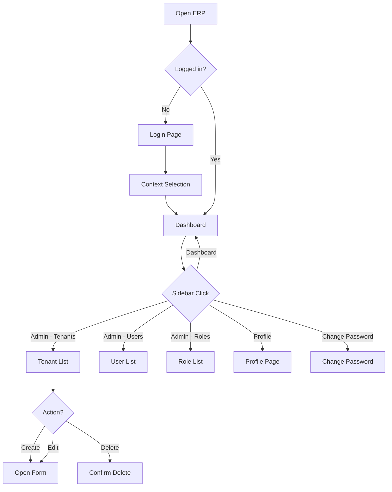
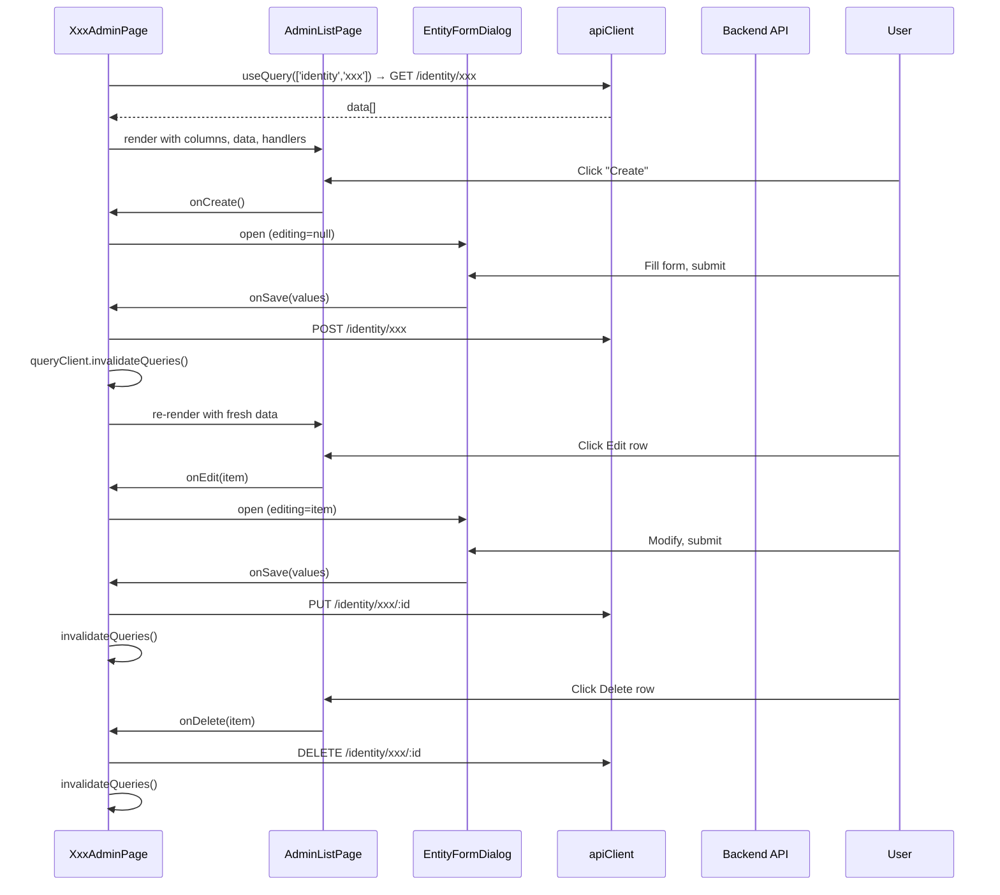

# Frontend Pages

## Purpose
All page-level components organized by domain: authentication (login, forgot/reset password), context selection, dashboard, identity admin CRUD pages, and metadata admin (table/forms).

---

## Simple Instructions

### What is this?
These are all the screens (pages) you see when using the ERP system. Every page in the sidebar navigation is part of this module — from the login screen to the admin panels where you manage tenants, users, and roles.

### What can you do here?

| Section | What you can do |
|---------|-----------------|
| **Login** | Sign into your account with username and password |
| **Context Selection** | Pick your workspace — choose which role, organization, company, and branch to work in |
| **Dashboard** | See an overview of the system |
| **Admin — Tenants** | Create, edit, or deactivate tenant organizations |
| **Admin — Users** | Manage user accounts — create, edit, activate/deactivate, assign roles, reset passwords |
| **Admin — Roles** | Create and manage roles, assign permissions to roles |
| **Admin — Permissions** | Define access rules for different parts of the system |
| **Admin — Organizations / Companies / Branches / Departments** | Manage the company hierarchy structure |
| **Admin — Tables & Forms** | Design custom data tables and forms using the metadata engine |

### How to use it

1. Open the ERP system in your browser.
2. If not logged in, you will see the **Login** page — enter your username and password, click **Sign In**.
3. After login, pick your workspace on the **Context Selection** page — select your role, organization, company, and branch, then click **Enter Workspace**.
4. You are now on the **Dashboard**.
5. Use the **sidebar** on the left to navigate — click any section to open it.
6. Admin users can find management pages under **Admin** in the sidebar (Tenants, Users, Roles, etc.).

### Diagram

### Common issues

| Problem | What to do |
|---------|-------------|
| "Authentication failed" on login | Check username and password are correct. If locked out, ask admin to unlock your account. |
| Stuck on "Select Your Workspace" page | You need to pick a role and workspace. If dropdowns are empty, contact your admin to assign roles. |
| Admin menu not visible | You need the `sys_admin` or `tnt_admin` role. Ask your system administrator. |
| Page shows "Coming Soon" | That module is not yet built — it is a placeholder for future development. |
| Table shows no records | Try clicking the **Refresh** button. If still empty, no records have been created yet. |

---

## Auth Pages

| Page | Route | Description |
|------|-------|-------------|
| `LoginPage.tsx` | `/login` | Username/password form with visibility toggle. Calls `authService.login()` via React Query `useMutation`, stores result in `authStore`, navigates to `/select-context`. Renders themed card with gradient header. |
| `ChangePasswordPage.tsx` | `/app/change-password` | Password change form (current + new) |
| `ForgotPasswordPage.tsx` | `/forgot-password` | Placeholder for password reset request |
| `ResetPasswordPage.tsx` | `/reset-password` | Placeholder for password reset |

## Context Selection

| Page | Route | Description |
|------|-------|-------------|
| `ContextSelectPage.tsx` | `/select-context` | Cascading selectors for Role → (auto-filled Tenant) → Organization → Company → Branch. Auto-routes when only one profile is available. Fetches options from `GET /context/options`, switches via `POST /context/switch`. |

## Dashboard

| Page | Route | Description |
|------|-------|-------------|
| `DashboardPage.tsx` | `/app/dashboard` | Main dashboard page |
| `RuntimePage.tsx` | `/app/runtime` | Legacy metadata-driven runtime page (PRD-001) |
| `WindowPage.tsx` | `/app/window/:windowName` | New window-based data management screen (PRD-004) — loads window definition, shows record list with pagination, opens RecordDialog for create/edit with drill-down breadcrumb navigation |

## Identity Admin Pages

All admin pages follow the same pattern: a page component wraps `AdminListPage` (shared table UI) and `EntityFormDialog` (shared create/edit dialog).

| Page | Route | Backend Endpoint |
|------|-------|-----------------|
| `AdminDashboardPage.tsx` | `/app/admin` | — |
| `TenantsAdminPage.tsx` | `/app/admin/tenants` | `GET/POST /identity/tenants`, `PUT/DELETE /identity/tenants/:id` |
| `OrganizationsAdminPage.tsx` | `/app/admin/organizations` | `GET/POST /identity/organizations`, `PUT/DELETE /identity/organizations/:id` |
| `CompaniesAdminPage.tsx` | `/app/admin/companies` | `GET/POST /identity/companies`, `PUT/DELETE /identity/companies/:id` |
| `BranchesAdminPage.tsx` | `/app/admin/branches` | `GET/POST /identity/branches`, `PUT/DELETE /identity/branches/:id` |
| `DepartmentsAdminPage.tsx` | `/app/admin/departments` | `GET/POST /identity/departments`, `PUT/DELETE /identity/departments/:id` |
| `UsersAdminPage.tsx` | `/app/admin/users` | `GET/POST /identity/users`, `PUT/DELETE /identity/users/:id` + role mgmt |
| `RolesAdminPage.tsx` | `/app/admin/roles` | `GET/POST /identity/roles`, `PUT/DELETE /identity/roles/:id` + permissions |
| `PermissionsAdminPage.tsx` | `/app/admin/permissions` | `GET/POST /identity/permissions`, `PUT/DELETE /identity/permissions/:id` |
| `SessionsAdminPage.tsx` | `/app/admin/sessions` | `GET/DELETE /identity/sessions` |
| `AuditPage.tsx` | `/app/admin/audit` | `GET /identity/audit` |
| `TableListPage.tsx` | `/app/admin/tables` | `GET/POST /metadata/tables` |
| `CreateTablePage.tsx` | `/app/admin/tables/create` | `POST /metadata/tables` |
| `TableDetailPage.tsx` | `/app/admin/tables/:id` | `GET/PUT /metadata/tables/:id` |
| `FormListPage.tsx` | `/app/admin/forms` | Form designer list |
| `FormDesignerPage.tsx` | `/app/admin/forms/:id` | Form designer editor |
| `PreferencesPage.tsx` | `/app/preferences` | User preferences |
| `ProfilePage.tsx` | `/app/profile` | User profile |
| `SessionsPage.tsx` | `/app/sessions` | User sessions |

## Admin List Page Pattern

Every admin page follows this architecture:

## Shared Admin Components

| Component | File | Description |
|-----------|------|-------------|
| `AdminListPage<T>` | `modules/identity/admin/AdminListPage.tsx` | Generic table with columns definition, loading/empty/error states, create/edit/delete action buttons |
| `EntityFormDialog` | `components/dialogs/EntityFormDialog.tsx` | Generic form dialog; takes `FieldDef[]` array defining field name, label, type, options, validation. Supports text, email, password, select, date, number, textarea, checkbox types. |
| `UserFormDialog` | `components/dialogs/UserFormDialog.tsx` | Specialized dialog for user creation/editing with role assignment |
| `EmptyState` | `components/ui/EmptyState.tsx` | Empty table state display |
| `ErrorState` | `components/ui/ErrorState.tsx` | Error state with retry button |

## Related Backend
- `backend-auth` — login endpoint
- `backend-context` — context options and switch endpoints
- `backend-identity-admin` — all CRUD endpoints for identity entities
