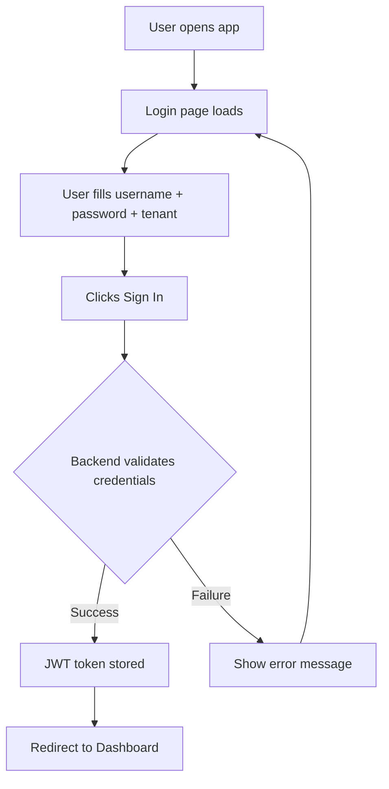

# Pages Login

## Purpose
The login page handles user authentication. Users enter their username, password, and select a tenant. On success, the frontend stores the JWT token and navigates to the dashboard. On failure, error messages are displayed.

---

## Simple Instructions *(for non-developers)*

### What is this?
This is the login screen — the first page you see when you open the application. You enter your username, password, and choose which company (tenant) you belong to. If everything is correct, you are taken to the main dashboard.

### What can you do here?
- Enter your username and password
- Select your tenant (company) from a dropdown
- Click **Sign In** to log in
- See error messages if your credentials are wrong
- Be redirected to the dashboard upon successful login

### How to use it
1. Open the application in your browser — you will see the login page.
2. Type your **Username** in the first field.
3. Type your **Password** in the second field.
4. Select your **Tenant** from the dropdown (e.g., "ACME" or "Globex").
5. Click the **Sign In** button.
6. If successful, you are taken to the **Dashboard**.
7. If not, you will see a red error message explaining what went wrong.

### Diagram

### Common issues
| Problem | Solution |
|---------|----------|
| "Invalid username or password" | Check that your Caps Lock is off and your credentials are correct. |
| "Tenant not found" | Select the correct tenant from the dropdown. Contact your admin if your tenant is missing. |
| Page keeps loading after clicking Sign In | Check that the backend server is running on port 8081. |
| Redirected back to login | Your session may have expired. Log in again. |

---

## Key Classes *(developers)*

| Class/File | Role |
|-----------|------|
| `LoginPage.tsx` | React component — renders login form with username, password, tenant selector |
| `authStore.ts` | Zustand store — manages JWT tokens, user info, login/logout actions, localStorage persistence |
| `apiClient.ts` | Axios instance — interceptor injects Bearer token; 401 triggers auto-logout |

---

## API Endpoints

| Method | Path | Called By |
|--------|------|-----------|
| POST | `/api/v1/auth/login` | `LoginPage.tsx` → `authStore.login()` |
| POST | `/api/v1/auth/refresh` | `authStore` token refresh logic |

---

## Dependencies
- `AuthController.java` (backend) — login endpoint
- `AuthenticationService.java` (backend) — credential validation, JWT generation
- `authStore.ts` — Zustand store with `login()`, `logout()`, `refreshToken()` actions
- `apiClient.ts` — Axios interceptor auto-injects Authorization header

---

## Related Backend
- `backend-auth.md` — Auth controller and service
- `backend-security.md` — JWT provider, security filter chain
