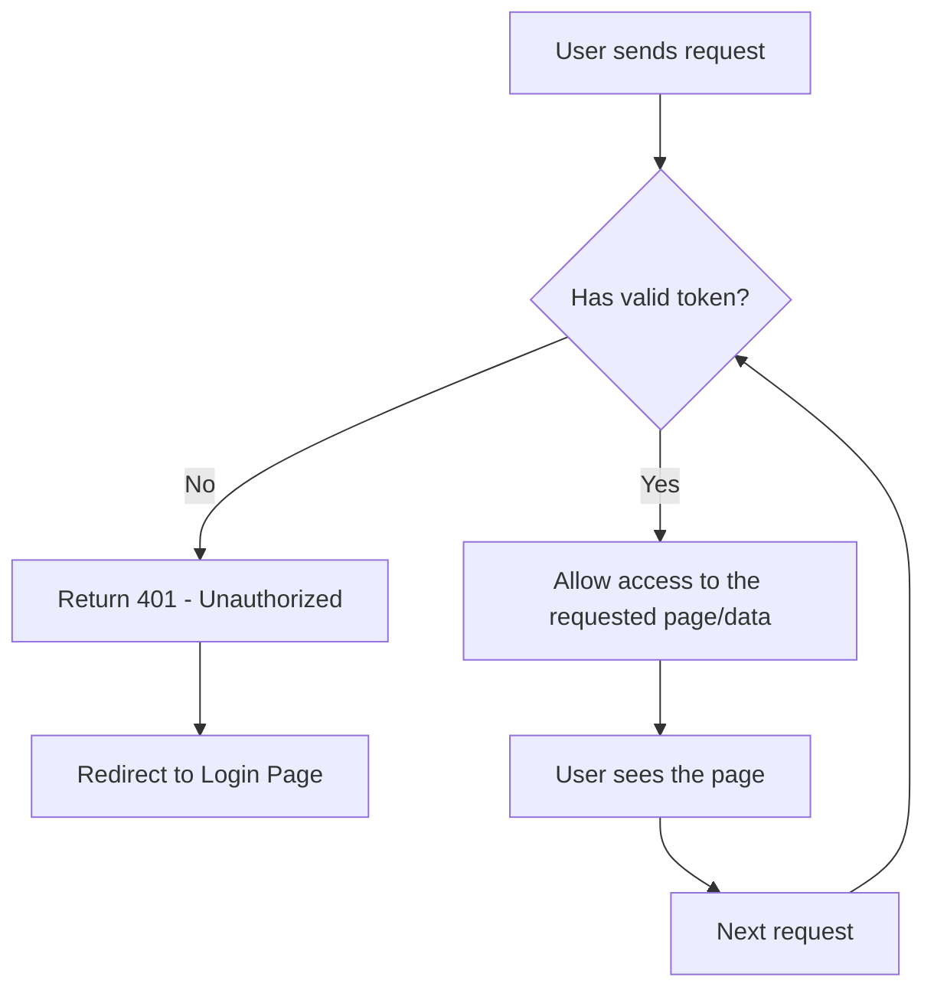
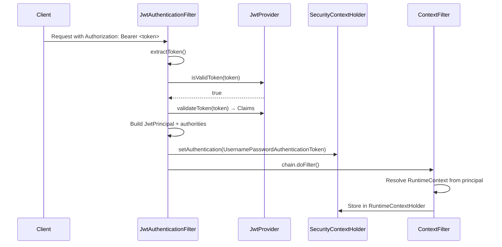

# Backend Security

## Purpose
JWT-based stateless authentication and authorization. Provides token generation/validation, a servlet filter that extracts Bearer tokens and populates the Spring Security context, and a thread-local `RuntimeContext` filter.

---

## Simple Instructions *(for non-developers)*

### What is this?
This is the invisible security layer that protects the ERP system. When you log in, it gives you a digital "key" (JWT token) that your browser sends with every request to prove who you are. Without this, nobody could access the system securely.

### What can you do here?
As a regular user, you do not interact with this module directly. It works automatically in the background:
- When you log in, it creates your access key.
- When you make a request, it checks that your key is valid.
- If your key is expired, it asks you to log in again.

### How to use it

1. Simply **log in** through the login page — the security system handles the rest automatically.
2. Your browser automatically sends your key with every page or action you take.
3. If your key expires, you will be sent back to the login page.
4. There is nothing you need to configure.

### Diagram



### Common issues
| Problem | What to do |
|---------|-------------|
| You keep being sent to the login page | Your session may have expired. Just log in again. |
| Pages won't load and show "401" error | You are not authenticated. Go back to the login page and sign in. |
| "Access denied" or "403" error | Your account does not have permission to view that page. Contact your admin. |

---

## Key Classes

| Class | Role |
|-------|------|
| `JwtProvider` | Generates access tokens (15 min default) and refresh tokens (7 day default) using HMAC-SHA; validates and parses tokens via jjwt library |
| `JwtAuthenticationFilter` | `OncePerRequestFilter` — extracts Bearer token from `Authorization` header, validates via `JwtProvider`, builds `JwtPrincipal` + `UsernamePasswordAuthenticationToken`, sets `SecurityContextHolder` |
| `JwtPrincipal` | Implements `Principal` — holds `userId`, `username`, and the full JWT `Claims` map |
| `ContextFilter` | Runs after JWT filter — resolves `RuntimeContext` (tenant/org/company/branch/roles) from the authenticated principal and stores in `RuntimeContextHolder` (thread-local) |
| `SecurityConfig` | `SecurityFilterChain` bean — disables CSRF, stateless sessions, CORS for `localhost:5173`, defines public paths (`/auth/login`, `/auth/refresh`, `/auth/logout`) vs. authenticated paths |

## JWT Token Structure

**Access token claims:**
```
sub: userId, username, email, tenantId, tenantCode,
organizationId, companyId, branchId, sessionId, roles[]
```
**Refresh token claims:**
```
sub: userId, sessionId, type: "refresh"
```

## Auth Flow



## Error Handling

| Scenario | Response |
|----------|----------|
| No token / invalid token | Filter passes through (no auth set) → `AuthenticationEntryPoint` returns `401` + `{"errorCode":"IDENTITY_AUTH_001","message":"Authentication required"}` |
| Valid token but insufficient permissions | `AccessDeniedHandler` returns `403` + `{"errorCode":"IDENTITY_AUTH_005","message":"Access denied"}` |

## Configuration Properties

| Property | Default | Description |
|----------|---------|-------------|
| `app.jwt.secret` | `CHANGE_ME_IN_PROD...` | HMAC signing key (≥256 bits) |
| `app.jwt.access-token-expiration-ms` | `900000` | 15 minutes |
| `app.jwt.refresh-token-expiration-ms` | `604800000` | 7 days |

## Related Frontend
- `core-api/interceptors.ts` — injects Bearer token into every request, handles 401 → auto-logout
- `core-auth/authStore.ts` — persists `token`/`refreshToken` in Zustand (localStorage-backed)
- `core-api/services/authService.ts` — calls `/auth/login`, `/auth/refresh`, `/auth/logout`
