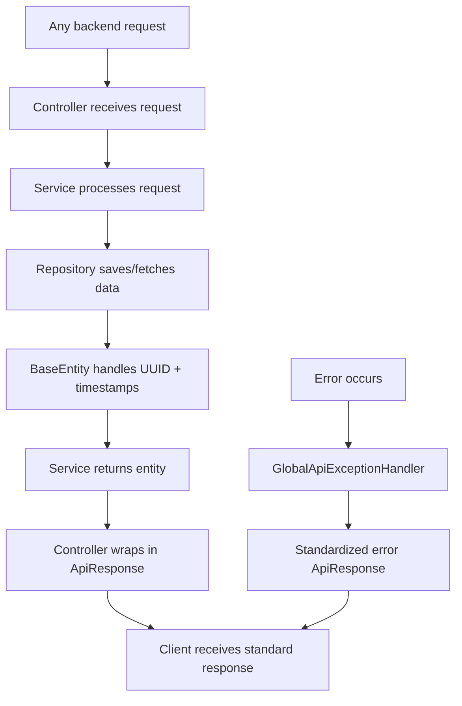

# Backend Common

## Purpose
Foundational classes shared across all backend modules: the API response envelope (`ApiResponse<T>`), the base entity superclass with UUID ids, soft-delete, and timestamps (`BaseEntity`), a generic CRUD service template (`BaseService<T>`), and global config (CORS, exception handling, Jackson).

---

## Simple Instructions *(for non-developers)*

### What is this?
This is the shared foundation that every other part of the backend relies on. It provides the common building blocks — like how every record gets a unique ID, how the system responds to requests, and how errors are reported consistently.

### What can you do here?
You do not interact with this module directly as a user. It works behind the scenes to make sure:
- All records have a unique ID and track when they were created/updated.
- Every response from the system has the same format (so the frontend can handle it consistently).
- When something goes wrong, the error is reported in a standard way.
- Global settings like CORS (which allows the frontend to talk to the backend) are configured.

### How to use it

1. This module has no direct user interface — it is infrastructure.
2. When you create a record (like a new tenant or user), the **BaseEntity** automatically gives it a UUID, sets the creation timestamp, and marks it as active.
3. When you delete a record, the **BaseEntity** performs a "soft delete" — it marks it as inactive rather than permanently removing it.
4. When the frontend talks to the backend, **ApiResponse** wraps every reply in a standard envelope so errors are handled predictably.

### Diagram



### Common issues
| Problem | What to do |
|---------|-------------|
| A deleted record still appears in the database | That is expected — the system uses "soft delete." Records are marked inactive, not removed. |
| The API returns a strange error format | This should not happen. If it does, it is a bug in the exception handler. |
| New records have no creation date | This should not happen. The BaseEntity `@PrePersist` auto-sets timestamps. |

---

## Key Classes

| Class | Role |
|-------|------|
| `BaseEntity` | Abstract mapped superclass — UUID `id`, `createdAt`, `updatedAt`, `createdBy`, `updatedBy`, `isActive`, `deletedAt`; provides `softDelete()`/`restore()` |
| `BaseService<T>` | Generic CRUD: `findAll()`, `findById()`, `create()`, `update()`, `delete()` (soft-delete) with lifecycle hooks (`beforeCreate`, `afterCreate`, etc.) |
| `ApiResponse<T>` | Unified response wrapper `{ success, data, message, errorCode, details }`; static factories `success()`, `error()` |
| `ApiErrorDetail` | Field-level error detail for validation responses |
| `UuidUtils` | UUID helper utilities |

## Global Config

| Class | Role |
|-------|------|
| `SecurityConfig` | Spring Security filter chain: JWT stateless sessions, CORS, public/authenticated endpoint matchers, custom 401/403 JSON responses |
| `ApiVersionConfig` | API version prefix configuration |
| `GlobalApiExceptionHandler` | `@ControllerAdvice` for standardized error responses |
| `JacksonConfig` | Jackson ObjectMapper customizations |
| `CacheConfig` | Spring Cache configuration |

## JPA Lifecycle

All entities extend `BaseEntity`, which hooks `@PrePersist` and `@PreUpdate`:
- **On persist:** `id` auto-generated via Hibernate `@UuidGenerator`, `createdAt`/`updatedAt` set to now, `isActive` = true.
- **On update:** `updatedAt` refreshed.
- **Soft-delete:** `softDelete()` sets `isActive=false`, `deletedAt=now`. `BaseService.delete()` calls this.
- **Restore:** `restore()` reverts the soft-delete.

## API Response Format

Every controller returns `ResponseEntity<ApiResponse<T>>`:
```json
{ "success": true, "data": {...}, "message": "Operation successful", "errorCode": null, "details": [] }
```

## Related Frontend
- `core-api` — `apiClient.ts` (axios instance), `interceptors.ts` (Bearer token injection, 401 handling), `apiConfig.ts`
- `core-auth` — consumes `ApiResponse<LoginResponse>` shape
- All API services under `core/api/services/`
