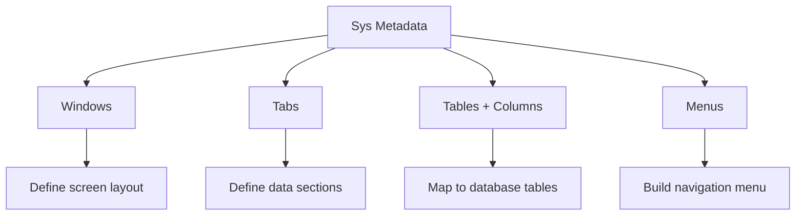

# Sys Tables Metadata

## Purpose
Window and menu metadata module — manages the `sys_window`, `sys_tab`, `sys_table`, `sys_column`, `sys_menu`, and `sys_window_field` tables that define the window hierarchy for PRD-004. Used by the runtime window system.

---

## Simple Instructions *(for non-developers)*

### What is this?
This module stores the definitions for windows, tabs, tables, columns, and menus. Think of it as the blueprint that tells the system how to display screens and organize navigation menus.

### What can you do here?
- Define **Windows** — screens that show data in list and detail views
- Define **Tabs** — sections within a window
- Map **Tables** and **Columns** to data sources
- Configure **Menus** for navigation
- Set **Window Access** rules by role

### How to use it
1. Go to **Admin > Window Designer** to create or edit window definitions.
2. Define the **Table** that provides the data.
3. Add **Tabs** for different sections of the window.
4. Configure **Fields** for each tab.
5. Set up **Menu** entries to navigate to windows.

### Diagram

### Common issues
| Problem | Solution |
|---------|----------|
| Window shows no data | Check that the table and column mappings are correct. |
| Menu item missing | Verify the menu entry is defined and the user has access. |

---

## Key Classes *(developers)*

| Class | Role |
|-------|------|
| `SysWindowService` | CRUD for window definitions |
| `SysTabService` | CRUD for window tabs |
| `SysTableService` | CRUD for table definitions |
| `SysColumnService` | CRUD for column definitions |
| `SysMenuService` | CRUD for menu entries |
| `SysWindowFieldService` | CRUD for window field mappings |
| `SysWindowAccessService` | Role-based window access configuration |
| `SysWindow` | Entity — window definition (name, description, table) |
| `SysTab` | Entity — tab within a window |
| `SysTable` | Entity — metadata table definition |
| `SysColumn` | Entity — column definition (name, type, length) |
| `SysMenu` | Entity — navigation menu entry |
| `SysWindowField` | Entity — field-to-column mapping in a window |

## API Endpoints
N/A — These services are consumed internally by the window assembly service and admin UI.

## Dependencies
- `BaseEntity` — UUID id, tenant_id, soft-delete, timestamps
- `SysWindowRepository`, `SysTabRepository`, `SysTableRepository`
- `SysColumnRepository`, `SysMenuRepository`, `SysWindowFieldRepository`, `SysWindowAccessRepository`

## Related Frontend
- `frontend/src/routes/window/WindowPage.tsx` — Window runtime rendering
- `frontend/src/routes/runtime/RuntimePage.tsx` — Legacy runtime page
