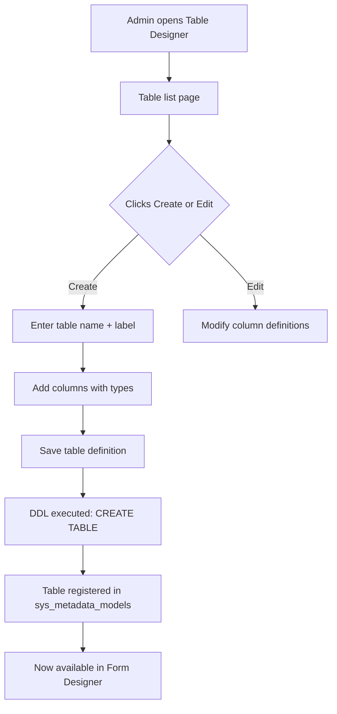

# Core Metadata Table Designer

## Purpose
Backend APIs for the Table Designer admin UI. Enables System Admins to register database tables in the metadata registry, define columns with types and constraints, and execute DDL to create physical PostgreSQL tables. This is the foundation for the metadata-driven form system — tables must exist before forms can be configured for them.

---

## Simple Instructions *(for non-developers)*

### What is this?
This tool lets administrators register new database tables without writing SQL code. You define the table name, description, and columns (with their types), and the system creates the physical database table. Once a table is registered, the Form Designer can create forms for it.

### What can you do here?
- Create new tables by specifying a name, label, and description
- Add columns with types (text, number, date, dropdown, reference to another table)
- Set column properties (required, unique, max length, default value)
- View the list of all registered tables and their columns
- See the schema change history

### How to use it
1. Go to **Admin > Table Designer** in the sidebar.
2. Click **Create Table**.
3. Enter a **Table Name** (internal, e.g., "md_my_table") and **Label** (user-facing, e.g., "My Table").
4. Add **Columns**: choose a name, type, and any constraints.
5. Click **Save** — the physical table is created in the database.
6. The table is now available in the **Form Designer** to create forms for it.

### Diagram

### Common issues
| Problem | Solution |
|---------|----------|
| Table name must be unique | Choose a different name. Table names are used as database identifiers. Use a prefix like `md_` for business tables. |
| Cannot delete a table with forms | Tables that have forms associated cannot be deleted. Remove the forms first. |
| Column type cannot be changed | Physical columns cannot be altered after creation. Delete the column and create a new one (data loss warning). |

---

## Key Classes *(developers)*

| Class | Role |
|-------|------|
| `TableDesignerController` | REST CRUD endpoints: GET/POST/PUT/DELETE `/api/v1/metadata/tables` |
| `TableDesignerService` | Business logic for table metadata CRUD, DDL generation |
| `DdlExecutorService` | Executes dynamic DDL (CREATE TABLE, ALTER TABLE, DROP TABLE) against PostgreSQL |
| `MetadataRegistryService` | Manages the metadata model registry — relationships between tables, views, permissions, workflows |
| `SchemaHistoryService` | Tracks schema changes in `sys_metadata_versions` for audit and rollback |

---

## API Endpoints

| Method | Path | Handler | Auth |
|--------|------|---------|------|
| GET | `/api/v1/metadata/tables` | `TableDesignerController.listTables()` | JWT |
| GET | `/api/v1/metadata/tables/{id}` | `TableDesignerController.getTable()` | JWT |
| POST | `/api/v1/metadata/tables` | `TableDesignerController.createTable()` | JWT (sys_admin) |
| PUT | `/api/v1/metadata/tables/{id}` | `TableDesignerController.updateTable()` | JWT |
| DELETE | `/api/v1/metadata/tables/{id}` | `TableDesignerController.deleteTable()` | JWT |
| GET | `/api/v1/metadata/tables/{id}/columns` | `TableDesignerController.listColumns()` | JWT |
| POST | `/api/v1/metadata/tables/{id}/columns` | `TableDesignerController.addColumn()` | JWT |
| DELETE | `/api/v1/metadata/tables/{id}/columns/{colId}` | `TableDesignerController.removeColumn()` | JWT |

---

## Dependencies
- `MetadataModelRepository` — CRUD for `sys_metadata_models` (table definitions)
- `TableColumnRepository` — CRUD for `sys_table_columns` (column definitions)
- `DataSource` — direct JDBC for DDL execution
- `SchemaHistoryService` — audit trail of schema changes
- `MetadataVersionRepository` — version management for metadata

---

## Related Frontend
- `frontend/src/modules/admin/tables/TableListPage.tsx` — Lists all registered tables
- `frontend/src/modules/admin/tables/CreateTablePage.tsx` — Create new table form
- `frontend/src/modules/admin/tables/TableDetailPage.tsx` — Table detail with column management
- `frontend/src/modules/admin/tables/hooks/useTables.ts` — Hook for table list operations
- `frontend/src/modules/admin/tables/hooks/useColumns.ts` — Hook for column management

---

## Related Module Docs
- `core-metadata-form-designer.md` — Forms are created on top of tables registered here
- `core-metadata-runtime.md` — Runtime engine reads table + column metadata to serve dynamic data
